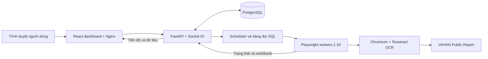

# VAHAN Automation

VAHAN Automation là hệ thống thu thập và quản lý báo cáo từ trang **VAHAN Public Report**. Dashboard cho phép quản trị viên định nghĩa bộ lọc và lịch chạy; API tạo, theo dõi hàng đợi; các worker Playwright điều khiển Chromium để lấy báo cáo; PostgreSQL lưu tiến độ và dữ liệu đã thu thập.

## Bài toán hệ thống giải quyết

Một báo cáo VAHAN được tạo theo nhiều lựa chọn như năm, State, RTO, loại xe, Maker và các thuộc tính xe. Khi cần thu thập dữ liệu cho nhiều State/RTO hoặc nhiều tổ hợp bộ lọc, người vận hành phải lặp lại thao tác trên trang, chờ kết quả, tải workbook và tổng hợp dữ liệu. Việc này tốn thời gian, dễ bỏ sót tổ hợp hoặc khó xác định vì sao một lượt không hoàn tất.

Hệ thống tự động hóa phần lặp lại đó: lưu bộ lọc thành profile, biến profile thành các case cụ thể, phân phối case cho browser workers, kiểm tra kết quả và lưu dữ liệu vào một bảng dùng chung. Người dùng theo dõi tiến độ, tra cứu dữ liệu và xuất Excel từ dashboard.

### Phạm vi báo cáo

- Loại báo cáo hiện được hỗ trợ là **Calendar Year / Maker / Month Wise**: một năm báo cáo cho mỗi profile/lượt chạy, với dữ liệu theo 12 tháng.
- Mỗi dòng dữ liệu được xác định bởi năm, State, RTO và Maker; các cột tháng lưu số liệu tương ứng. `0` là giá trị dữ liệu hợp lệ, khác với tháng chưa có dữ liệu.
- Một **profile** chứa năm báo cáo, lựa chọn bộ lọc, quy tắc kết hợp và cách áp dụng giá trị cố định hoặc lặp qua các lựa chọn. Các lựa chọn phụ thuộc nhau, như State → RTO, được lấy từ VAHAN và áp dụng theo thứ tự.
- Các nhóm bộ lọc gồm vùng Delhi NCR, State/RTO, nhóm/sub-category/class xe, EV/fuel, active/archive, emission, Maker, status, owner type, vehicle type và fitness.
- Profile giới hạn tối đa 3.000 case để tránh tạo hàng đợi vượt phạm vi dự kiến. Số case thực tế thay đổi theo profile và options VAHAN tại thời điểm chạy.

### Một lượt chạy xử lý như thế nào

1. Admin tạo hoặc chọn profile, năm báo cáo, múi giờ, lịch và số worker (1–10).
2. Hệ thống tải options cần thiết từ VAHAN, preview các case và kiểm tra profile.
3. Trước khi tạo hàng đợi, UI Health kiểm tra giao diện VAHAN trên các worker được chọn. Nếu selector hoặc cấu trúc trang không xác minh được, hệ thống chặn lượt chạy mới và lưu diagnostics.
4. Scheduler/API lưu kế hoạch và trạng thái vào PostgreSQL rồi phân phối từng case cho worker rảnh.
5. Worker mở trang báo cáo, điền các bộ lọc phụ thuộc, xác minh giá trị trên DOM rồi mới bấm Apply.
6. Worker dùng Tesseract OCR để thử đọc CAPTCHA; VAHAN vẫn là nơi xác nhận mã và trả kết quả.
7. Nếu VAHAN báo **No record found**, case hoàn tất ở trạng thái `NO_DATA`. Nếu có workbook, API đọc dữ liệu và ghi vào bảng chính trong transaction SQL.
8. Dashboard nhận tiến độ và cập nhật báo cáo. Case lỗi được giữ nguyên nguyên nhân để retry và kiểm tra; dữ liệu đã commit không cần chạy lại để xem trong bảng.

Các lỗi được xử lý theo checkpoint: lượt ban đầu, retry tại checkpoint và một lượt phục hồi cuối theo chính sách hiện tại. Kết quả `NO_DATA` hợp lệ không bị retry. Chi tiết ở [tài liệu retry và phục hồi](docs/batch-error-recovery.md).

## Chức năng

- **Filter profiles:** lưu profile có revision, cố định hoặc lặp qua giá trị, áp dụng include/exclude và quy tắc kết hợp, preview số case.
- **Chạy tự động:** lịch một lần, hằng ngày hoặc hằng tháng; theo dõi trạng thái, worker, tiến độ, pause/resume và tiếp tục cùng hàng đợi.
- **Browser workers:** tối đa 10 worker Chromium trên một host Docker Compose. Mỗi worker giữ browser context riêng và xử lý một job tại một thời điểm.
- **UI Health:** kiểm tra trang và selector trước khi tải Maker hoặc bắt đầu/tiếp tục hàng đợi; chặn thao tác mới nếu không thể xác minh trang.
- **OCR CAPTCHA:** browser runner gửi ảnh trong bộ nhớ trực tiếp vào Tesseract. Nếu OCR không đọc được mã hoặc VAHAN từ chối mã, worker làm mới CAPTCHA và thử lại. OCR không đảm bảo mọi challenge sẽ được chấp nhận.
- **Exported Reports:** bảng tổng hợp dùng chung cho tài khoản đăng nhập, tìm kiếm State/RTO, phân trang, xem coverage và xuất Excel.
- **Tài khoản:** admin quản lý tài khoản và quyền; thành viên chỉ truy cập Exported Reports.
- **Phục hồi:** session, queue, case, lỗi, lịch và kết quả lưu trong SQL; ngắt kết nối VAHAN có thể tạm dừng lịch và khôi phục theo trạng thái pause sau khi kết nối ổn định.

## Kiến trúc



| Thành phần | Trách nhiệm |
| --- | --- |
| `apps/web-ui` | Dashboard React/TypeScript; Nginx phục vụ giao diện và chuyển tiếp API/Socket.IO. |
| `apps/api-server` | FastAPI, xác thực/phân quyền, Socket.IO, scheduler, queue, migration và đọc/ghi báo cáo. |
| `apps/browser-runner` | Worker Node.js, Playwright, Chromium, thao tác DOM VAHAN, tải workbook và OCR CAPTCHA. |
| `postgres` | PostgreSQL 17.7; volume `postgres_data` giữ dữ liệu qua restart container. |
| `docker` | Compose, cấu hình Nginx, seccomp và CA nội bộ tùy chọn. |

Các container nằm trên cùng một host; đây không phải cụm HA hay hệ thống phân tán nhiều máy. Compose khởi động 10 worker, còn cấu hình worker pool giới hạn số worker nhận việc từ 1 đến 10.

## Chạy toàn bộ hệ thống bằng Docker với một lệnh

### Điều kiện trên máy

- Windows 10/11: Docker Desktop đã cài và đang chạy với backend WSL 2, chế độ **Linux containers**.
- Docker Compose v2.
- Python 3 hoặc Python Launcher `py` trên Windows. Python chỉ dùng để tạo cấu hình local và gọi Docker Compose; API, dashboard, PostgreSQL, Chromium và Tesseract chạy trong container.
- Kết nối Internet để tải image nền và cài dependency khi build lần đầu; kết nối tới VAHAN để thu thập báo cáo.

Clone repository vào thư mục bất kỳ, mở PowerShell tại thư mục gốc (nơi có `compose.yaml`) và chạy đúng một lệnh:

```powershell
.\run-vahan-rpa.ps1
```

Lệnh này tạo `.docker.env` nếu chưa có, chuẩn bị thư mục chứng chỉ tùy chọn, kiểm tra Compose, build các image API/web/runner rồi khởi động PostgreSQL, API, dashboard và 10 browser workers. Compose chạy nền (`-d`), nên có thể đóng cửa sổ PowerShell sau khi lệnh hoàn tất; Docker Desktop phải tiếp tục hoạt động.

Lần build đầu có thể mất thời gian vì cần tải Chromium và dependency. Docker dùng cache cho các lần build sau. Script giữ nguyên `.docker.env` hiện có và không in giá trị bí mật ra log. Trên Ubuntu/macOS, tại thư mục repository chạy một lệnh tương đương:

```bash
./run-vahan-rpa.sh
```

### Truy cập sau khi khởi động

| Thành phần | Địa chỉ mặc định |
| --- | --- |
| Dashboard | <http://127.0.0.1:5173> |
| API readiness | <http://127.0.0.1:8000/api/ready> |
| API health | <http://127.0.0.1:8000/api/health> |
| API OpenAPI | <http://127.0.0.1:8000/docs> |

Tài khoản bootstrap nằm trong `.docker.env` ở các khóa `VAHAN_UI_AUTH_USERNAME` và `VAHAN_UI_AUTH_PASSWORD`. Mở file cục bộ để đăng nhập; không commit hay gửi file này. Mật khẩu bootstrap chỉ tạo tài khoản khi database khởi tạo lần đầu. Đổi giá trị trong `.docker.env` không đặt lại mật khẩu của tài khoản SQL đã tồn tại; đổi mật khẩu trong Settings sau khi đăng nhập.

Mặc định cổng web/API là `5173`/`8000`, bind vào loopback của host; PostgreSQL chỉ mở trong mạng Docker. Có thể đổi `WEB_PORT` và `API_PORT` trong `.docker.env` nếu cổng đang được dùng. Muốn người khác trong LAN truy cập cần cấu hình bind/firewall phù hợp; không đưa API hoặc PostgreSQL trực tiếp ra Internet.

### Restart, log và dữ liệu

Các dịch vụ đặt `restart: unless-stopped`. Khi Windows khởi động lại, Docker Desktop phải được mở (có thể bật tự khởi động trong Docker Desktop) để Docker phục hồi container. Khởi động lại thủ công sau khi đã dừng stack:

```powershell
.\run-vahan-rpa.ps1 --no-build
```

Xem trạng thái và log từ thư mục gốc repository:

```powershell
docker compose --env-file .docker.env ps
docker compose --env-file .docker.env logs -f --tail 100
```

Dừng stack nhưng giữ dữ liệu:

```powershell
docker compose --env-file .docker.env stop
```

Volume PostgreSQL vẫn giữ nguyên sau `stop` và `docker compose down`. **Không chạy `docker compose down -v` nếu cần dữ liệu**, vì lệnh đó xóa volume `postgres_data`.

Tạo backup database và cấu hình riêng tư:

```powershell
py -3 scripts/backup-docker.py
```

Giữ backup cùng `VAHAN_BROWSER_STATE_KEY` để có thể giải mã browser state khi khôi phục. Backup và `.docker.env` chứa dữ liệu/khóa nhạy cảm, chỉ lưu tại nơi được bảo vệ.

## OCR

OCR CAPTCHA của browser runner chạy bên trong Docker. Ảnh được truyền trực tiếp tới Tesseract qua stdin, không tạo ảnh CAPTCHA tạm trên đĩa. Worker chuẩn hóa kết quả và chỉ gửi chuỗi 6 ký tự chữ/số; VAHAN vẫn xác minh challenge. Nếu mã sai, ảnh khó đọc, tài khoản VAHAN cần đăng nhập hoặc trang đổi cấu trúc, job có thể phải thử lại hoặc không hoàn tất.

`apps/api-server/app/ocr/ocr_to_text.py` là công cụ CLI riêng để nhận diện chữ thông thường trong ảnh; đây không phải endpoint OCR và không dùng để xử lý CAPTCHA. Chạy CLI trên Windows cần cài Tesseract cùng dữ liệu ngôn ngữ tương ứng, thêm executable vào `PATH` hoặc đặt `TESSERACT_CMD`:

```powershell
py -3 apps/api-server/app/ocr/ocr_to_text.py --input "<đường-dẫn-ảnh>" --lang vie+eng
```

CLI mặc định dùng `vie+eng` và `--psm 6`; dùng `--output` để lưu thêm kết quả `.txt`. Image browser runner cài riêng Tesseract tiếng Anh cho luồng CAPTCHA.

## Dữ liệu, độ tin cậy và giới hạn

- PostgreSQL lưu tài khoản, phiên đăng nhập, filter profiles, lịch, session/job, tiến độ queue, lỗi, dữ liệu báo cáo và browser state. Browser state được mã hóa bằng `VAHAN_BROWSER_STATE_KEY`.
- Bảng báo cáo chính dùng chung cho tài khoản đăng nhập. API ghi workbook theo transaction; dữ liệu đã có không bị nhân đôi, các giá trị tháng còn thiếu có thể được bổ sung. Workbook không dùng làm nguồn dữ liệu chính.
- `NO_DATA` khác với lỗi thực thi. Lỗi giữ trạng thái và diagnostics để retry/điều tra; các lần retry không lặp vô hạn.
- UI Health kiểm tra cấu trúc form/selector trước khi giao việc. Kiểm tra này giảm nguy cơ chạy với sai bộ lọc nhưng không xác nhận tính đúng đắn nghiệp vụ của mọi số liệu VAHAN.
- Kết quả và độ phủ phụ thuộc options, phản hồi, quyền truy cập và trạng thái của VAHAN tại thời điểm chạy. Worker online hoặc lịch hoàn tất không tự chứng minh đã thu thập đủ toàn bộ State/RTO; cần đối chiếu profile/case dự kiến với coverage và case lỗi.
- Chức năng hiện tập trung vào việc chạy các profile đã cấu hình. Luồng Maker Update tự động khám phá và đối soát toàn bộ State/RTO chưa được xem là hoàn chỉnh; xem [đánh giá chức năng hiện tại](docs/system-status.md).
- Stack Compose phục vụ một host, một PostgreSQL primary và API; không cung cấp HA, cân bằng tải hay TLS công khai mặc định.

## CA nội bộ và sự cố khởi động

Nếu proxy công ty thay chứng chỉ TLS, đặt chứng chỉ gốc tin cậy dạng PEM, đuôi `.crt`, vào `docker/certs/` **trước khi build**. Script tự tạo thư mục này nếu chưa có. Sau đó build lại bằng `.\run-vahan-rpa.ps1` trên Windows hoặc `./run-vahan-rpa.sh` trên Linux/macOS. API và browser runner sẽ cài chứng chỉ vào image. Không đặt private key, chứng chỉ máy chủ hoặc CA chưa được xác minh vào đây; `.crt` bị Git bỏ qua.

| Triệu chứng | Kiểm tra |
| --- | --- |
| Docker daemon không kết nối | Mở Docker Desktop, chờ trạng thái running, bật WSL 2 backend và Linux containers. |
| PowerShell không chạy `.ps1` | Từ thư mục gốc repo, chạy `py -3 scripts/run-docker.py`; nếu máy không có `py`, cài Python 3 hoặc dùng `python scripts/run-docker.py`. |
| Cổng web/API đã được dùng | Đổi `WEB_PORT` hoặc `API_PORT` trong `.docker.env`, rồi chạy launcher lại. |
| API hoặc worker chưa healthy | Xem `docker compose --env-file .docker.env ps` và `docker compose --env-file .docker.env logs -f api runner`. |
| Build lỗi xác minh TLS | Kiểm tra CA nội bộ trong `docker/certs/`, rồi build lại bằng launcher. |
| Đăng nhập thất bại sau khi đổi `.docker.env` | Mật khẩu trong SQL không được bootstrap lại; dùng quy trình đổi/reset mật khẩu trong Settings. |

## Cấu trúc và tài liệu

```text
apps/api-server/       FastAPI, PostgreSQL, migrations, OCR CLI
apps/browser-runner/   Playwright, Chromium, CAPTCHA OCR
apps/web-ui/           React dashboard
docker/                Compose support, Nginx, seccomp, CA tùy chọn
docs/                  API, deployment, schedules, UI Health, recovery
scripts/               Docker launcher, env bootstrap, backup
```

- [Triển khai Docker đa nền tảng](docs/deployment.md)
- [Đánh giá chức năng và giới hạn hiện tại](docs/system-status.md)
- [Tài liệu API](docs/api-reference.md)
- [Lịch chạy và phục hồi mất mạng](docs/run-schedules.md)
- [UI Health và preflight](docs/ui-health-sql.md)
- [Retry và phục hồi case lỗi](docs/batch-error-recovery.md)
- [API server](apps/api-server/README.md), [browser runner](apps/browser-runner/README.md), [web dashboard](apps/web-ui/README.md)
