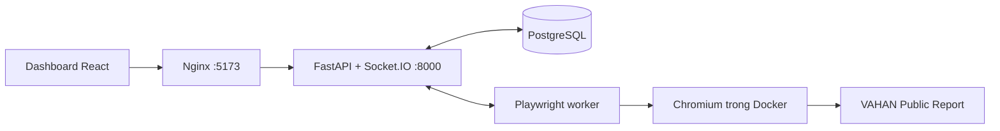

# VAHAN Automation — Chromium / Playwright / PostgreSQL

Dashboard điều phối báo cáo VAHAN; Playwright điều khiển Chromium trong Docker.

## Khởi chạy

Cần Docker Desktop đang hoạt động. Từ thư mục repository:

```bash
python3 scripts/setup-docker.py
docker compose --env-file .docker.env up -d --build
```

Hoặc chạy `./run-vahan-rpa.sh`. Dashboard: http://localhost:5173; API: http://localhost:8000; tài liệu API: http://localhost:8000/docs.

File `.docker.env` được tạo với quyền `600`, bị Git bỏ qua và không được đưa vào image. Tài khoản quản trị đầu tiên lấy từ `VAHAN_UI_AUTH_USERNAME` / `VAHAN_UI_AUTH_PASSWORD` trong file này. Khi nâng cấp checkout có `apps/api-server/.env`, script giữ thông tin đăng nhập hiện có và thay token runner mặc định bằng token riêng. Script không ghi đè cấu hình đã tồn tại. Các lần khởi động sau không đặt lại mật khẩu người dùng trong SQL.

`API_PORT` và `WEB_PORT` trong `.docker.env` mặc định là `8000` / `5173`. Nếu cổng đang dùng, hãy dừng đúng dịch vụ đang chiếm cổng trước khi khởi chạy. PostgreSQL chỉ mở trong mạng Docker.

## Kiến trúc



- `web`: giao diện React được build thành static assets; Nginx proxy `/api` và `/socket.io`.
- `api`: migration Alembic, xác thực tài khoản, phân quyền, job, file, cấu hình và sự kiện.
- `runner`: Chromium headless, một job tại một thời điểm, giữ một trang báo cáo để tái sử dụng; tải Excel bằng sự kiện download của Playwright.
- `postgres`: PostgreSQL 17, volume `postgres_data` giữ dữ liệu khi container khởi động lại.

Ảnh CAPTCHA xuất hiện trên dashboard. Người dùng nhập mã; worker chuyển nguyên văn mã đó vào biểu mẫu chính thức. Không có OCR giải CAPTCHA hoặc dịch vụ giải hộ trong luồng này. Khi trang yêu cầu xác thực riêng hoặc thay đổi DOM, job ghi lỗi để người vận hành xử lý.

## Dữ liệu lưu trong SQL

| Nhóm | Bảng / cách lưu |
| --- | --- |
| Tài khoản, vai trò, trạng thái, hồ sơ | `users`; mật khẩu băm PBKDF2 với salt riêng |
| Phiên đăng nhập và thu hồi khi logout | `auth_sessions`; lưu hash ID phiên |
| Phiên báo cáo, filters, trạng thái, thời gian, lỗi, số lần Apply | `report_sessions`, `jobs`, `job_events` |
| Worker, kết nối và job hiện tại | `runners` |
| Cấu hình ma trận, tiến độ batch, job đang xem của từng tài khoản | `user_state` |
| Lịch kiểm tra định kỳ | `app_settings` |
| Bảng chính, tên nhà sản xuất, State/RTO, năm và 12 tháng JAN–DEC | `main_reports`; ngày giờ đầy đủ và nguồn từng tháng lưu trong cùng hàng |
| Lịch sử cập nhật mỗi filter | `report_update_history`; thêm mới / đã lưu / cần xem lại / No record found |
| Ảnh CAPTCHA, ảnh lỗi và tài liệu kỹ thuật cũ | `stored_files`: BYTEA, metadata, kích thước, SHA-256 |
| Lịch sử kiểm tra trang, nội dung xuất CSV | `ui_health_checks` |
| Cookie / localStorage của Chromium | `browser_states`, mã hóa Fernet bằng `VAHAN_BROWSER_STATE_KEY` |
| Thao tác API, options đọc từ VAHAN và lỗi worker | `audit_events` |

Mỗi filter ghi trực tiếp vào bảng chính trong một transaction SQL, cùng lịch sử cập nhật, trạng thái hoàn tất và giải phóng worker. Dữ liệu có sẵn không thêm trùng; chỉ thêm nhà sản xuất hoặc tháng còn thiếu. Excel được đọc đầy đủ trong bộ nhớ rồi xóa bản tải tạm, không lưu bản sao Excel/DOM trong SQL. Giới hạn 50 MB tải lên, 250 MB giải nén và 500.000 dòng; vượt giới hạn hoặc dữ liệu không hợp lệ thì rollback cả filter.

Exported Reports hiển thị bảng chính 12 tháng, chọn năm từ 2026, tìm State/RTO và phân trang. Nút xuất Excel lấy toàn bộ kết quả khớp tìm kiếm qua mọi trang; nếu không tìm kiếm, hệ thống hỏi xác nhận xuất toàn bộ báo cáo/năm đang chọn. Tên file gồm RTO, mã RTO, State và năm theo mẫu. Phần Update history đã bỏ khỏi giao diện; lịch sử SQL nội bộ vẫn phục vụ ghi dữ liệu và kiểm tra độ phủ. Bảng tổng dùng chung cho mọi tài khoản đăng nhập; cùng bộ lọc chỉ có một bộ dữ liệu, không tách theo người chạy. Chi tiết migration/backup và kiểm thử: [bảng chính](docs/annual-reports.md).

## Chuyển dữ liệu runtime cũ

Trước khi dừng API cũ, xuất lịch sử:

```bash
python3 scripts/export-legacy-history.py --api-url http://127.0.0.1:8000
```

Sau khi Docker chạy, nhập runtime với mount chỉ đọc:

```bash
docker compose --env-file .docker.env run --rm --no-deps   -v "$(pwd)/apps/api-server/runtime:/legacy:ro"   api python -m app.import_legacy /legacy
```

Có thể dùng `--dry-run`. Import giữ nguyên nguồn, lưu file và các dòng trong cùng transaction, có ledger theo đường dẫn + SHA-256 để chạy lại không nhân bản. File thay đổi được giữ thành phiên bản mới. Snapshot giữ lại cả các job lỗi/hủy. Các dữ liệu chỉ còn trong RAM của API cũ phải được xuất trước khi API cũ dừng. Cấu hình cũ trong localStorage được chuyển sang SQL khi admin đăng nhập trên cùng địa chỉ dashboard ban đầu.

## Vận hành và sao lưu

```bash
docker compose --env-file .docker.env ps
docker compose --env-file .docker.env logs -f api runner
curl http://127.0.0.1:8000/api/ready
python3 scripts/backup-docker.py
docker compose --env-file .docker.env stop
```

Backup tạo `backups/<timestamp>/database.dump` bằng `pg_dump` và bản sao `.docker.env` với quyền `600`. Cần giữ cả khóa mã hóa khi khôi phục browser state. Thư mục backup bị Git và Docker build bỏ qua. `docker compose down` giữ volume; `down -v` xóa dữ liệu SQL.

API hiện chạy **một process** vì kết nối Socket.IO được định tuyến trong process. Một worker xử lý tuần tự; lịch sử/configuration lưu bền vững, còn điều phối hàng đợi batch vẫn nằm trong dashboard. Giữ dashboard mở để tiến tới các filter tiếp theo. Khi API/worker khởi động lại giữa job, job bị gián đoạn chuyển `FAILED` và cần Retry rõ ràng; không tự lặp lại thao tác Apply.

Batch kiểm tra sau từng nhóm 10 case và sau nhóm cuối nếu dưới 10. Case lỗi trong nhóm đó được chạy lại một lần theo đúng thứ tự và toàn bộ filters gốc trước khi sang nhóm kế tiếp. Case vẫn lỗi được giữ Failed để chạy lại thủ công. Retry tự động và nút Retry failed đều giữ session gốc; báo cáo lấy trạng thái mới nhất của mỗi case để cập nhật Failed, With data, No data và file tải về, không cộng thêm case cho mỗi lần thử lại. Các lần thử vẫn lưu riêng trong SQL qua `retryOfJobId` / `caseId` trong payload job.

Trong Run history, **Delete session** chuyển phiên sang **Deleted sessions** và **Restore session** khôi phục phiên. Xóa chỉ ẩn thẻ khỏi lịch sử; file, các lần chạy và dữ liệu tháng vẫn lưu. Backend chặn xóa phiên đang chạy, chặn retry/continue phiên đã xóa cho đến khi khôi phục, và kiểm tra quyền chủ sở hữu (admin quản lý mọi phiên).

Trong một case, worker điền đồng thời 5 nhóm bộ lọc và giữ đúng thứ tự của các trường phụ thuộc. Các giá trị còn sót được xóa; mọi field được yêu cầu đều được đối chiếu lại với DOM sau khi request tải options kết thúc và ngay trước Apply. Không khớp thì dừng case, không lấy báo cáo với bộ lọc sai. Dấu kiểm tra và thời gian từng nhóm lưu bền vững trong `jobs.payload.filter_execution`, với event `filters-verified`. Xem [flow điền song song](apps/browser-runner/README.md).

Sau Apply, chỉ **No record found** mới đã tải xong mới tạo `NO_DATA`. State/RTO, filters và ngày giờ đầy đủ được ghi vào lịch sử cập nhật. Hết giới hạn chờ 5 giây ghi `VAHAN_RESULT_TIMEOUT`.

Khi có dữ liệu, worker lấy workbook đầy đủ, đọc tất cả worksheet và ghi thẳng vào `main_reports` qua `/api/jobs/{id}/main-report`. Hoàn tất chỉ sau khi SQL commit thành công. Các giá trị có sẵn được giữ nguyên; thiếu tháng/nhà sản xuất mới thì bổ sung. Không lưu bảng DOM, các dòng Excel, workbook hoặc TXT vào SQL. Migration `0004_main_reports` chuyển toàn bộ dữ liệu cũ và lịch sử trước khi bỏ bảng phụ; xem [hướng dẫn](docs/annual-reports.md).

Sau mỗi filter lưu SQL, bảng tổng của mọi tài khoản đang xem nhận cập nhật tức thì qua socket. Dòng xác nhận trên bảng ghi rõ State/RTO, ngày giờ lưu, số dòng/tháng mới và số ô đã có sẵn. Lần chạy trùng dữ liệu hiện **Already saved in main table**, nên tổng số dòng không tăng; **No record found** cũng được xác nhận riêng. Không cần đợi cả batch kết thúc.


`observed_at` và `saved_at` là `TIMESTAMPTZ`, giữ đầy đủ năm-tháng-ngày và giờ-phút-giây. Bộ lọc thời kỳ báo cáo được lưu nguyên bản trong `filters`; không tự đặt ngày cho bộ lọc chỉ có tháng/năm. Dashboard hiển thị thời điểm thu thập theo UTC+7. Chi tiết truy vấn tại [PostgreSQL và Playwright](docs/postgres-playwright.md).

## Cấu trúc

- `apps/api-server`: FastAPI, repositories PostgreSQL, migrations, importer.
- `apps/browser-runner`: Playwright worker và DOM driver độc lập.
- `apps/web-ui`: dashboard, trạng thái theo người dùng, quản lý tài khoản/file.
- `docker`: Nginx và seccomp profile chính thức của Playwright.

Playwright package và image đều pin `1.63.0`; worker chạy dưới user `pwuser` và bật Chromium sandbox. [Hướng dẫn Docker của Playwright](https://playwright.dev/docs/docker).

Xem thêm [chi tiết dữ liệu và giới hạn](docs/postgres-playwright.md).
