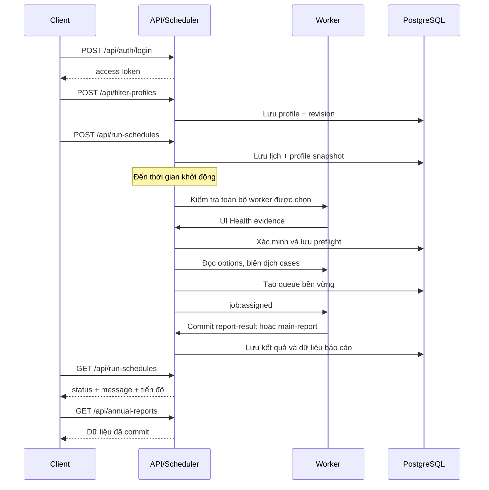

# Tài liệu API toàn hệ thống VAHAN Automation

Ngày rà soát: **08/10/2026**, theo giờ Việt Nam (UTC+07:00). Phạm vi: checkout `vahan-automation`, FastAPI, Socket.IO, browser runner và Docker worker controller. Tài liệu mô tả **mã nguồn hiện tại**, gồm cả API vẫn tồn tại sau khi giao diện Create Report đã được gỡ.

Đối chiếu OpenAPI lần gần nhất: **81 thao tác HTTP trong source và 81 trên API live** tại `127.0.0.1:8000`. `GET /api/network/status` có trên live; gọi không kèm token trả 401 như yêu cầu xác thực. Chưa đọc được giá trị trạng thái mạng vì lần kiểm tra này không dùng token. Việc có cùng route/schema không chứng minh mọi chi tiết xử lý của hai build hoàn toàn giống nhau.

Việc rà soát dùng đọc mã nguồn và GET OpenAPI; **không gọi API tạo job, đổi worker, pause/resume hay xóa dữ liệu thực tế**. Ví dụ dưới đây là mẫu tích hợp, không phải log hoặc token thật của hệ thống.

## Mục lục

1. [Địa chỉ và giao thức](#1-địa-chỉ-và-giao-thức)
2. [Xác thực và phân quyền](#2-xác-thực-và-phân-quyền)
3. [Quy ước dữ liệu và lỗi](#3-quy-ước-dữ-liệu-và-lỗi)
4. [Luồng tích hợp khuyến nghị](#4-luồng-tích-hợp-khuyến-nghị)
5. [Danh mục HTTP đầy đủ](#5-danh-mục-http-đầy-đủ)
6. [Các response không có schema OpenAPI đầy đủ](#6-các-response-không-có-schema-openapi-đầy-đủ)
7. [Socket.IO](#7-socketio)
8. [API nội bộ worker/controller](#8-api-nội-bộ-workercontroller)
9. [Trạng thái, retry và chẩn đoán](#9-trạng-thái-retry-và-chẩn-đoán)
10. [Ví dụ gọi API](#10-ví-dụ-gọi-api)
11. [Giới hạn và API tương thích](#11-giới-hạn-và-api-tương-thích)
12. [Toàn bộ schema request/response](#12-toàn-bộ-schema-requestresponse)
13. [Nguồn và cách kiểm chứng](#13-nguồn-và-cách-kiểm-chứng)
14. [Kiểm kê chức năng và mức hoàn thành](#14-kiểm-kê-chức-năng-và-mức-hoàn-thành)

## 1. Địa chỉ và giao thức

| Thành phần | Địa chỉ mặc định | Ghi chú |
| --- | --- | --- |
| FastAPI | `http://127.0.0.1:8000` | Tiền tố API là `/api`; `/` là route riêng. `API_PORT` có thể thay đổi cổng triển khai. |
| Dashboard/Nginx | `http://127.0.0.1:5173` | Proxy `/api/` và `/socket.io/` sang API; phần còn lại phục vụ React. |
| Swagger | `http://127.0.0.1:8000/docs` | Dùng cổng API trực tiếp; Nginx dashboard không proxy `/docs`. |
| ReDoc | `http://127.0.0.1:8000/redoc` | Tài liệu tự sinh của build đang chạy. |
| OpenAPI live | `http://127.0.0.1:8000/openapi.json` | Không bao gồm Socket.IO, controller hoặc runner health. |
| Socket.IO | `http://127.0.0.1:8000`, path `/socket.io/` | Namespace `/ui` và `/runner`; client hiện dùng WebSocket. Có thể đi qua proxy dashboard. |
| Worker controller | `http://worker-control:3002` | Nội bộ mạng Docker; không phải URL công khai cho người dùng. |
| Browser worker | `http://runner:3001`, `http://runner-2:3001` … | Chỉ có health endpoint nội bộ; ID tương ứng là `playwright-1`, `playwright-2` … |

Request JSON dùng `Content-Type: application/json`; upload dùng `multipart/form-data`; preview dùng NDJSON; tải tệp trả binary. Dùng URL HTTPS và prefix theo cấu hình reverse proxy thực tế khi triển khai ngoài máy cục bộ.

## 2. Xác thực và phân quyền

### 2.1. Tài khoản dashboard

```http
Authorization: Bearer <accessToken>
Content-Type: application/json
```

Token lấy từ `POST /api/auth/login`. Token mới có `expiresIn=null`, nhưng vẫn gắn với session trong SQL: logout, khóa tài khoản hoặc reset mật khẩu có thể thu hồi quyền. `POST /api/auth/renew` chỉ cấp token mới cho một session còn hợp lệ; không đăng nhập thay cho một session đã mất hiệu lực.

Không đặt access token trong query string. Các API download cần header Bearer giống API JSON; một đường dẫn được mở trực tiếp trong tab mới không tự lấy token đang lưu ở localStorage của React.

### 2.2. Browser runner

```http
X-VAHAN-RUNNER-TOKEN: <runner-secret>
X-VAHAN-RUNNER-ID: playwright-1
```

Runner token khác access token dashboard. Middleware chỉ chấp nhận token runner ở danh sách route được cho phép: đọc UI Health schedule/contract, gửi UI Health logs, lưu main-report/upload-excel/report-result/artifacts, đọc/ghi runner-state và gửi runner-logs. Header ID được handler kiểm tra cho các thao tác gắn job hoặc browser state.

| Nhãn quyền trong danh mục | Ý nghĩa |
| --- | --- |
| Công khai | Không cần token: `/`, `/api/health`, `/api/ready`, `/api/auth/status`, `/api/auth/login`. OPTIONS được cho qua để xử lý CORS. |
| Bearer | Tài khoản đã xác thực. Không tự suy ra quyền admin. |
| Bearer admin | Handler gọi `require_admin`; user thường nhận 403. |
| owner/admin | User bị giới hạn theo owner; admin được truy cập rộng hơn ở đúng endpoint áp dụng chính sách này. |
| owner hiện tại | Profile, schedule và queue gắn với username hiện tại, **kể cả khi role=admin**. Không có query để chọn owner khác. |
| Báo cáo dùng chung | Bảng annual-reports, lịch sử nhập, update-status và bằng chứng coverage không bị owner_filter chia riêng dữ liệu. Quyền điều khiển job/lịch vẫn riêng theo tài khoản. |
| Runner + ID | Cần runner-token và đúng runner ID; Bearer không thay thế được ở handler chỉ cho authenticated runner. |

`PUT /api/worker-pool` hiện yêu cầu Bearer qua middleware nhưng **không có require_admin riêng**; nó thay đổi pool toàn hệ thống. Đây là mô tả quyền thực tế của source, không phải cam kết rằng chỉ admin được đổi worker.

**OpenAPI tự sinh chưa khai báo đầy đủ security schemes vì xác thực nằm trong middleware.** Không hiểu một operation không có `security` là cho phép gọi ẩn danh. Bảng quyền trong tài liệu và kiểm tra handler mới thể hiện đúng yêu cầu xác thực.

### 2.3. Socket.IO

- `/ui`: handshake `auth: {token: "<accessToken>"}`. Server kiểm tra session; quyền được kiểm tra lại ở các handler. Token legacy có hạn vẫn có thể dẫn đến ngắt socket khi hết hạn.
- `/runner`: handshake `auth: {token: "<runner-secret>", runnerId: "playwright-1", runnerName: "Worker 1", engine: "playwright", version: "<version>", source: "new"}`.
- Room `runner:<runnerId>` nhận lệnh cho worker; room `job:<jobId>` nhận trạng thái job sau khi UI subscribe; room `reports:shared` nhận thông báo báo cáo đã commit cho dashboard đã xác thực.

## 3. Quy ước dữ liệu và lỗi

### 3.1. Dữ liệu

| Quy ước | Chi tiết |
| --- | --- |
| Alias | Request theo schema dùng camelCase: `runnerId`, `sessionId`, `startsAt`, `workerCount`, `preflightId`… Không giả định mọi response đều camelCase: record SQL có thể dùng `rto_code`, `owner_username`, `created_at`. |
| ID | Path có schema `format=uuid` phải là UUID. `runnerId` là chuỗi, thường `playwright-N`; `dataset`/scope là ID bộ lọc, không phải tên profile. |
| Thời gian | ISO 8601 có timezone cho lịch và bằng chứng `observedAt`. Lịch lặp theo `Asia/Ho_Chi_Minh`, UTC+07:00; response thường lưu UTC. |
| Năm báo cáo | Profile và schedule không nhận năm tương lai; API đọc annual-reports nhận 1900–9999. `GET annual-reports` hiện mặc định 2026, nên client truyền `year` rõ ràng. |
| Strict integer | Worker count ở lịch/pool/queue và một số model không nhận `true`, số thực hay chuỗi thay cho integer. |
| Phân trang | Dùng `offset` zero-based và `limit`; limit tối đa khác nhau theo endpoint, được ghi trong từng operation. |
| Position của queue | `position=0` là case thứ nhất. Giao diện có thể hiển thị case = position+1. |
| `null` và `0` | Trong mảng tháng, null là chưa có giá trị; 0 là số liệu bằng 0, không được xóa/đánh đồng hai giá trị. |
| Filter profile | StrictModel chặn field thừa. `fixed` giữ selection cùng một case; `iterate` sinh tổ hợp theo options với include/exclude. Nhãn phụ thuộc options VAHAN đang đọc trực tiếp. |
| VahanFilters | Cho phép extra fields để mở rộng payload. Việc model chấp nhận field không chứng minh worker có selector hay giá trị tương ứng hợp lệ. |
| Response chưa typed | Một số handler trả dict/list động nên OpenAPI không thể hiện đầy đủ schema. Phần 6 mô tả các hợp đồng response này. |

### 3.2. HTTP lỗi

FastAPI thường trả `{"detail":"..."}`. Với UI Health, detail có thể là object có `code`, `message`, `diagnostics`; lỗi validation là mảng record có `loc`, `msg`, `type`.

| Status | Trường hợp điển hình |
| --- | --- |
| 400 | Input nghiệp vụ không hợp lệ, tệp rỗng/workbook lỗi, ngày không hợp lệ, duplicate coverage filters. |
| 401 | Token dashboard thiếu/hỏng/đã thu hồi, credentials không đúng; thường có `WWW-Authenticate: Bearer`. |
| 403 | Không phải admin; sai runner ID; thao tác chỉ chấp nhận runner nhưng gửi Bearer. |
| 404 | Resource thiếu hoặc không thuộc quyền truy cập; tệp/kết quả chưa tồn tại. |
| 409 | Worker bận, revision thay đổi, state transition không hợp lệ, UI gate không đạt, resume/delete chưa an toàn, export-all chưa xác nhận. |
| 410 | Source VAHAN `old`; endpoint `/files/{id}/rows` đã ngừng hỗ trợ. |
| 413 | Upload/value quá lớn, export vượt số dòng Excel. |
| 422 | Kiểu dữ liệu, UUID, giới hạn model, timezone, field bắt buộc hoặc custom validator không hợp lệ. |
| 503 | Thiếu cấu hình xác thực/mã hóa, controller không truy cập được, hoặc network guard đang pause theo source mới. |
| 5xx khác | Lỗi hạ tầng hoặc lỗi chưa được handler ánh xạ; không chuyển thành NO_DATA. |

Worker controller dùng `{"error":"..."}` thay vì `detail`. Socket.IO ACK dùng `{ok:false,error:"..."}` và có thể kèm `code`, `retryAfterMs`; không áp dụng HTTP status cho ACK.

### 3.3. Tải tệp

- Excel: `application/vnd.openxmlformats-officedocument.spreadsheetml.sheet`.
- UI Health report: `text/csv`.
- `Content-Disposition` xác định tên tệp; annual export dùng tên UTF-8 `filename*`.
- Tệp SQL attachment có `X-Content-SHA256`; annual export có `X-Report-Row-Count`.
- CORS hiện expose `Content-Disposition`, `X-Report-Row-Count`; không mặc định expose `X-Content-SHA256` khi gọi khác origin.
- Export Excel toàn bảng không dùng `offset/limit`; phải gửi `confirmAll=true` nếu cả State và RTO đều trống.

## 4. Luồng tích hợp khuyến nghị

### 4.1. Lịch chạy tự động



Nếu preflight không đạt, luồng không đi tiếp tới Maker/case/assignment. Đóng dashboard không dừng scheduler. Với một lịch đang chạy, client chỉ đọc trạng thái và gọi **endpoint điều khiển lịch**; không tạo/claim một queue khác để điều phối trùng công việc.

### 4.2. Pause, đổi worker, tiếp tục và xóa

1. `POST /api/run-schedules/{id}/pause` trả PAUSING; đợi GET thấy PAUSED hoặc kết thúc COMPLETED.
2. `POST /api/run-schedules/{id}/resume` với `workerCount` mới. API giữ session/filter/queue; chỉ xử lý phần chưa hoàn thành và retry còn lại.
3. Muốn bỏ phiên: `DELETE /api/run-schedules/{id}` khi đã dừng hẳn. Lịch/queue/retry policy bị xóa, dữ liệu báo cáo và tệp vẫn giữ.
4. `PATCH {enabled:false}` chỉ ngừng lần khởi động tương lai. Nó không pause phiên hiện tại.
5. `/stop` và `/jobs/{id}/cancel` có thể hủy case đang chạy; không dùng hai thao tác này thay cho graceful pause nếu muốn đợi lưu xong.

### 4.3. Preview filter

1. Chọn worker rảnh từ `/api/runners`.
2. Gọi `/api/ui-health/preflight` trên worker cần dùng; kiểm tra allowed.
3. Đọc `/api/filter-profiles/options` hoặc `/makers`; lưu profile.
4. Gọi `/{profile_id}/preview` và đọc NDJSON cho tới `ready` hoặc `error`.
5. Preview không lưu dữ liệu báo cáo. Khi lịch bắt đầu, backend vẫn kiểm tra lại.


## 5. Danh mục HTTP đầy đủ

Danh mục dưới đây gồm đủ **81 method + path** đăng ký trong source tại thời điểm rà soát. `422` là lỗi xác thực request do FastAPI/Pydantic; lỗi nghiệp vụ như `404`, `409`, `410` có thể không hiện trong phần Responses của OpenAPI nhưng được ghi ở cột cuối. Cần dùng chính xác tên field trong schema; model `StrictModel` từ chối field ngoài danh sách.

### 5.1 Dịch vụ và xác thực

| Method | Endpoint | Quyền | Input | Kết quả và lưu ý | HTTP thành công / validation trong OpenAPI |
| --- | --- | --- | --- | --- | --- |
| `GET` | `/`<br>Thông tin dịch vụ | Công khai | Không có tham số/body. | JSON: status, app.<br><br>Không chứng minh PostgreSQL, worker hoặc VAHAN sẵn sàng. | 200 |
| `GET` | `/api/health`<br>Liveness của API | Công khai | Không có tham số/body. | JSON: status=ok.<br><br>Không kiểm tra browser hoặc kết nối VAHAN. | 200 |
| `GET` | `/api/ready`<br>Readiness của PostgreSQL | Công khai | Không có tham số/body. | JSON: status=ok, storage=postgresql.<br><br>Đọc bảng users; lỗi DB có thể trả 5xx. Không phải trạng thái của toàn bộ worker. | 200 |
| `GET` | `/api/network/status`<br>Kết nối upstream VAHAN | Bearer | Không có tham số/body. | JSON: online, checkedAt, changedAt, message; một số trường có thể chưa tồn tại trước lần kiểm tra đầu.<br><br>Có trong source và OpenAPI live. Lần gọi không token trả 401; trạng thái online thực tế chưa được đọc. | 200 |
| `GET` | `/api/auth/status`<br>Trạng thái cấu hình đăng nhập | Công khai | Không có tham số/body. | JSON: configured, tokenTtlSeconds=null.<br><br>configured chỉ true khi secret hợp lệ và đã có tài khoản. | 200 |
| `POST` | `/api/auth/login`<br>Đăng nhập | Công khai | body `application/json` → `LoginRequest` (bắt buộc) | JSON: accessToken, tokenType=Bearer, expiresIn=null, username; Cache-Control: no-store.<br><br>401 sai tài khoản/mật khẩu hoặc credentials vừa thay đổi; 503 thiếu cấu hình. Token mới không tự hết hạn nhưng session có thể bị thu hồi. | 200, 422 validation |
| `POST` | `/api/auth/renew`<br>Cấp lại token cho session hiện tại | Bearer | Không có tham số/body. | Cùng dạng response đăng nhập, giữ token_session.<br><br>Không khôi phục session đã bị thu hồi; 401 nếu token không hợp lệ. | 200 |
| `GET` | `/api/auth/me`<br>Tài khoản hiện tại | Bearer | Không có tham số/body. | JSON: username, role.<br><br>role là admin hoặc user; 401 nếu chưa xác thực. | 200 |
| `POST` | `/api/auth/logout`<br>Thu hồi phiên đăng nhập hiện tại | Bearer | Không có tham số/body. | JSON: ok=true; Socket.IO của session bị ngắt.<br><br>Không xóa lịch chạy hay dữ liệu báo cáo. Đóng tab không đồng nghĩa logout. | 200 |
| `POST` | `/api/auth/password`<br>Đổi mật khẩu của chính tài khoản | Bearer | body `application/json` → `ChangePasswordRequest` (bắt buộc) | JSON: ok=true; giữ session hiện tại và thu hồi các session khác.<br><br>409 nếu mật khẩu mới giống cũ hoặc mật khẩu hiện tại không đúng; mật khẩu mới 12–1024 ký tự. | 200, 422 validation |

### 5.2 Jobs, report sessions và Excel

| Method | Endpoint | Quyền | Input | Kết quả và lưu ý | HTTP thành công / validation trong OpenAPI |
| --- | --- | --- | --- | --- | --- |
| `GET` | `/api/jobs/reports`<br>Danh sách tệp Excel của job hoàn thành | Bearer; owner/admin | Không có tham số/body. | Mảng phần tử: jobId, name, size, source, states, rtos, sessionId, scenarioName, completedAt, successfulApplyCount.<br><br>Chỉ lấy Excel gắn với job COMPLETED và có kích thước lớn hơn 0. Giao diện cũ đã gỡ nhưng API vẫn tồn tại. | 200 |
| `GET` | `/api/jobs/reports/sessions`<br>Nhóm báo cáo theo session | Bearer; owner/admin | query `deleted` (boolean, tùy chọn); default=false | Mảng session với metadata và thông tin kết quả/tệp; deleted=true lấy nhóm đã ẩn.<br><br>Dữ liệu control theo chủ sở hữu; admin có thể xem rộng hơn. Không tương đương danh sách lịch tự động. | 200, 422 validation |
| `DELETE` | `/api/jobs/reports/sessions/{session_id}`<br>Ẩn report session | Bearer; owner/admin | path `session_id` (string, bắt buộc) | JSON: ok=true, sessionId.<br><br>Xóa mềm qua deleted_at; 409 khi còn job hoặc saved manual batch đang chạy. Không xóa main_reports. Khác DELETE run-schedules. | 200, 422 validation |
| `POST` | `/api/jobs/reports/sessions/{session_id}/restore`<br>Khôi phục report session đã ẩn | Bearer; owner/admin | path `session_id` (string, bắt buộc) | JSON: ok=true, sessionId.<br><br>404 session không tồn tại hoặc không thuộc quyền truy cập. | 200, 422 validation |
| `POST` | `/api/jobs/reports/verify`<br>Xác minh tệp đã lưu | Bearer; owner/admin | body `application/json` → `VerifyReportsRequest` (bắt buộc) | JSON: files là map tên tệp → kích thước byte; 0 khi không có tệp phù hợp.<br><br>Tối đa 500 fileNames; sessionIds có thể giới hạn từng tên. Không tạo báo cáo mới. | 200, 422 validation |
| `GET` | `/api/jobs/reports/file/{file_name}`<br>Tải Excel theo tên | Bearer; owner/admin | path `file_name` (string, bắt buộc) | Binary attachment có Content-Disposition và X-Content-SHA256.<br><br>404 không tìm thấy; 409 nếu nhiều tệp trùng tên. Khi trùng tên, dùng job ID hoặc file ID. | 200, 422 validation |
| `POST` | `/api/jobs/{job_id}/main-report`<br>Lưu Excel và nhập bảng chính | Bearer owner/admin hoặc Runner + ID | path `job_id` (string, bắt buộc); header `X-VAHAN-RUNNER-ID` (string hoặc null, tùy chọn); body `multipart/form-data` → `Body_upload_excel_api_jobs__job_id__main_report_post` (bắt buộc) | Metadata tệp/kết quả commit; phát reports:updated sau khi SQL commit.<br><br>Multipart: file, observedAt có timezone nếu cung cấp, pageUrl. ID worker phải trùng job. 400 workbook lỗi, 403 sai worker, 409 xung đột, 413 quá giới hạn upload. | 200, 422 validation |
| `POST` | `/api/jobs/{job_id}/upload-excel`<br>Alias cũ của main-report | Bearer owner/admin hoặc Runner + ID | path `job_id` (string, bắt buộc); header `X-VAHAN-RUNNER-ID` (string hoặc null, tùy chọn); body `multipart/form-data` → `Body_upload_excel_api_jobs__job_id__upload_excel_post` (bắt buộc) | Cùng xử lý với POST main-report.<br><br>Được đánh dấu deprecated; tích hợp mới dùng /main-report. | 200, 422 validation |
| `GET` | `/api/jobs/{job_id}/excel`<br>Tải Excel đã gắn với job | Bearer; owner/admin | path `job_id` (string, bắt buộc) | Binary attachment.<br><br>404 thiếu job/tệp; không phải thao tác tạo Excel mới từ DOM. | 200, 422 validation |
| `GET` | `/api/jobs/{job_id}/no-data`<br>Tải tệp xác nhận không có dữ liệu | Bearer; owner/admin | path `job_id` (string, bắt buộc) | Binary attachment, thường là tệp text no-data.<br><br>404 khi chưa có tệp tương ứng; NO_DATA không đồng nghĩa lỗi hoặc thiếu phản hồi. | 200, 422 validation |
| `POST` | `/api/jobs/{job_id}/report-result`<br>Commit bảng DOM hoặc No record found | Runner + ID; không dùng Bearer thay thế | path `job_id` (string, bắt buộc); header `X-VAHAN-RUNNER-ID` (string hoặc null, tùy chọn); body `application/json` → `ReportResultRequest` (bắt buộc) | JSON: ok=true, status, jobId; thông báo kết quả sau commit.<br><br>403 sai worker; 409 xung đột trạng thái/proof/kết quả. DATA cần body rows; NO_RECORD yêu cầu message chính xác No record found và tables=[]; tối đa 100.000 dòng. | 200, 422 validation |
| `GET` | `/api/jobs/{job_id}/report-result`<br>Đọc kết quả DOM đã lưu | Bearer; owner/admin | path `job_id` (string, bắt buộc); query `offset` (integer, tùy chọn); min=0, default=0; query `limit` (integer, tùy chọn); min=1, max=1000, default=100 | JSON chỉ trả metadata đã commit: job_id, result, message, states, rtos, filters, observed_at, saved_at, sha256, summary, scope=main-table, rows=[], tables=[], offset, limit.<br><br>404 nếu job chưa có kết quả đã lưu. Source hiện trả rows/tables rỗng; API này không cung cấp nội dung DOM hay trang dữ liệu. Dùng GET /api/annual-reports để đọc bảng chính. | 200, 422 validation |
| `GET` | `/api/jobs`<br>Danh sách job | Bearer; owner/admin | Không có tham số/body. | Mảng Job.<br><br>User chỉ thấy job thuộc tài khoản; admin không bị owner_filter giới hạn. | 200 |
| `POST` | `/api/jobs`<br>Tạo một job trực tiếp | Bearer | body `application/json` → `CreateJobRequest` (bắt buộc) | 201: Job ở trạng thái ASSIGNED, đồng thời gửi job:assigned tới runner.<br><br>API cấp thấp vẫn tồn tại sau khi bỏ Create Report. Có `updateKind` GLOBAL/DISCOVER/REFRESH cho client điều phối Maker update; endpoint này tự nó không điều phối chuỗi task. Bắt buộc preflight; source=old trả 410. Retry chỉ cho FAILED/CANCELLED, giữ session, filters, source và update task. 409 worker bận/reconnecting hoặc SQL gate không hợp lệ; source có guard mạng trả 503 NETWORK_PAUSED. | 201, 422 validation |
| `GET` | `/api/jobs/{job_id}`<br>Đọc trạng thái job | Bearer; owner/admin | path `job_id` (string, bắt buộc) | Job với alias camelCase.<br><br>404 nếu không có quyền hoặc job không tồn tại. Không có ảnh CAPTCHA trong response model Job. | 200, 422 validation |
| `POST` | `/api/jobs/{job_id}/cancel`<br>Hủy một job đang hoạt động | Bearer; owner/admin | path `job_id` (string, bắt buộc) | Job ở trạng thái CANCELLED; giải phóng runner và phát job:cancelled.<br><br>409 nếu job đã terminal. Không tương đương Pause run: cancel có thể làm gián đoạn case hiện tại. | 200, 422 validation |
| `POST` | `/api/jobs/{job_id}/artifacts`<br>Lưu artifact của job | Runner + ID; không dùng Bearer thay thế | path `job_id` (string, bắt buộc); header `X-VAHAN-RUNNER-ID` (string hoặc null, tùy chọn); body `multipart/form-data` → `Body_runner_artifact_api_jobs__job_id__artifacts_post` (bắt buộc) | 201: metadata, kind=screenshot.<br><br>403 nếu job/runner không khớp; multipart file, giới hạn upload chung. Runner hiện che CAPTCHA trong screenshot. | 201, 422 validation |

### 5.3 Browser runners và UI Health

| Method | Endpoint | Quyền | Input | Kết quả và lưu ý | HTTP thành công / validation trong OpenAPI |
| --- | --- | --- | --- | --- | --- |
| `GET` | `/api/runners`<br>Danh sách browser runner đã đăng ký | Bearer | Không có tham số/body. | Mảng Runner: id, name, source, status, currentJobId, version, lastSeenAt.<br><br>socketId bị loại khỏi response. ONLINE/BUSY/RECONNECTING khác với trạng thái Docker healthy; ONLINE không tự chứng minh Chromium sẵn sàng. | 200 |
| `GET` | `/api/ui-health/schedule`<br>Cấu hình kiểm tra UI Health tương thích cũ | Bearer hoặc Runner | Không có tham số/body. | UiHealthSchedule: intervalDays, updatedAt, nextCheckAt.<br><br>API còn tồn tại; Settings hiện không hiển thị lịch kiểm tra, worker hiện không dùng lịch này để kiểm tra định kỳ. | 200 |
| `PUT` | `/api/ui-health/schedule`<br>Cập nhật cấu hình UI Health cũ | Bearer admin | body `application/json` → `UiHealthScheduleUpdate` (bắt buộc) | UiHealthSchedule; phát ui-health:schedule-updated tới /runner.<br><br>403 nếu không phải admin. Không thay thế preflight bắt buộc trước phiên chạy. | 200, 422 validation |
| `POST` | `/api/ui-health/run-now`<br>Yêu cầu kiểm tra một worker | Bearer | body `application/json` → `UiHealthCheckNowRequest hoặc null` (tùy chọn) | 202: UiHealthCheckNowResponse với requestId, runnerId, runnerName, requestedAt, status=REQUESTED.<br><br>202 chỉ là đã gửi yêu cầu, không phải PASS. 404 worker chỉ định không tồn tại; 409 không có worker hoặc đang reconnecting. Settings không có nút check-now. | 202, 422 validation |
| `POST` | `/api/ui-health/logs`<br>Lưu log và xác minh hợp đồng DOM | Bearer cho log thông thường; Runner + ID cho DOM evidence | body `application/json` → `UiHealthLogRequest` (bắt buộc) | 201: UiHealthLogResponse gồm logId, fileName, rowCount, validation.<br><br>observedControls chỉ được nhận từ authenticated runner có ID khớp runnerId; 403 nếu sai. SQL mới quyết định allowed, client không tự chứng nhận PASS. | 201, 422 validation |
| `GET` | `/api/ui-health/reports`<br>Danh sách log/CSV UI Health | Bearer | query `date` (string hoặc null, tùy chọn) | UiHealthReportsResponse: selectedDate, availableDates, reports, rows.<br><br>date tùy chọn YYYY-MM-DD; 400 nếu ngày không hợp lệ. Giao diện Settings hiện không hiển thị màn hình lịch sử này. | 200, 422 validation |
| `GET` | `/api/ui-health/reports/{file_name}/download`<br>Tải báo cáo CSV UI Health | Bearer | path `file_name` (string, bắt buộc) | text/csv attachment.<br><br>404 nếu không tìm thấy tệp báo cáo. Không phải báo cáo Excel dữ liệu VAHAN. | 200, 422 validation |
| `GET` | `/api/ui-health/contract`<br>Hợp đồng UI được SQL công nhận | Bearer hoặc Runner | Không có tham số/body. | JSON trạng thái contract, versionId, revision, controls và lỗi quan sát hiện tại.<br><br>Worker dùng selectors đã được xác minh. Không có endpoint HTTP để tự ép allowed hoặc bỏ qua gate. | 200 |
| `GET` | `/api/ui-health/status`<br>Trạng thái UI Health và preflight mới nhất | Bearer | Không có tham số/body. | Trạng thái contract cùng latestPreflight: id, owner_username, runner_ids, version_id, status, reports, created_at.<br><br>Có sự pha trộn camelCase và snake_case trong record latestPreflight. Trạng thái/last preflight hiện đọc toàn hệ thống, không lọc riêng owner. | 200 |
| `POST` | `/api/ui-health/preflight`<br>Kiểm tra mới trên toàn bộ worker được chọn | Bearer | body `application/json` → `PreflightInput` (bắt buộc) | 200: allowed, preflightId, revision, versionId, reports.<br><br>runnerIds 1–10, không trùng. Kiểm tra tối đa 2 worker song song; mỗi worker có tối đa 2 lần ACK 55 giây. 409 UI_HEALTH_BLOCKED nếu bất kỳ worker/SQL contract không đạt. Chưa tạo case/crawl Maker khi gate không đạt. | 200, 422 validation |
| `POST` | `/api/runner-logs`<br>Lưu lỗi vận hành của worker | Runner + ID; không dùng Bearer thay thế | header `X-VAHAN-RUNNER-ID` (string hoặc null, tùy chọn); body `application/json` → `RunnerLog` (bắt buộc) | 201: ok=true, ghi audit runner.log.<br><br>403 runner không đăng ký hoặc thiếu ID. message 1–8000 ký tự; level=info/warning/error; jobId tùy chọn. | 201, 422 validation |

### 5.4 Tài khoản, state và audit

| Method | Endpoint | Quyền | Input | Kết quả và lưu ý | HTTP thành công / validation trong OpenAPI |
| --- | --- | --- | --- | --- | --- |
| `GET` | `/api/audit`<br>Nhật ký thao tác | Bearer admin | query `offset` (integer, tùy chọn); min=0, default=0; query `limit` (integer, tùy chọn); min=1, max=1000, default=100 | Mảng record: id, actor, event, payload, created_at.<br><br>offset/limit; 403 nếu user thường. Các thay đổi HTTP được audit, có ngoại lệ runner-state và runner-logs. | 200, 422 validation |
| `GET` | `/api/users`<br>Danh sách tài khoản | Bearer admin | Không có tham số/body. | Mảng tài khoản public, không trả password hash.<br><br>403 nếu không phải admin. | 200 |
| `POST` | `/api/users`<br>Tạo tài khoản | Bearer admin | body `application/json` → `UserCreate` (bắt buộc) | 201: username, role, profile.<br><br>409 trùng username; role chỉ admin/user; username theo pattern và mật khẩu tối thiểu 12 ký tự. | 201, 422 validation |
| `POST` | `/api/users/{username}/password`<br>Đặt lại mật khẩu tài khoản khác | Bearer admin | path `username` (string, bắt buộc); body `application/json` → `ResetPasswordRequest` (bắt buộc) | ok=true; thu hồi các session của tài khoản bị reset và ghi audit.<br><br>409 nếu tự reset chính mình; dùng /auth/password. 404 thiếu tài khoản. | 200, 422 validation |
| `PATCH` | `/api/users/{username}`<br>Đổi active hoặc profile | Bearer admin | path `username` (string, bắt buộc); body `application/json` → `UserUpdate` (bắt buộc) | ok=true.<br><br>Không thay role ở endpoint này. Không cho khóa admin đang hoạt động cuối cùng (409); khóa tài khoản thu hồi session. | 200, 422 validation |
| `GET` | `/api/user-state`<br>Đọc trạng thái dashboard đã lưu | Bearer; chỉ tài khoản hiện tại | Không có tham số/body. | Map key → value.<br><br>Admin vẫn đọc state của chính mình ở endpoint này. | 200 |
| `PUT` | `/api/user-state/{key}`<br>Lưu một khóa trạng thái dashboard | Bearer; chỉ tài khoản hiện tại | path `key` (string, bắt buộc); body `application/json` → `StateValue` (bắt buộc) | ok=true.<br><br>400 key dài hơn 128 hoặc chứa token/password; 413 JSON value lớn hơn 5 MB. Không có DELETE user-state trong router hiện tại. | 200, 422 validation |

### 5.5 Files và browser state

| Method | Endpoint | Quyền | Input | Kết quả và lưu ý | HTTP thành công / validation trong OpenAPI |
| --- | --- | --- | --- | --- | --- |
| `GET` | `/api/files`<br>Danh sách tệp lưu trong SQL | Bearer; owner/admin | Không có tham số/body. | Mảng metadata: id, owner_username, job_id, kind, name, mime_type, size, sha256, metadata, created_at; không kèm content.<br><br>Admin có thể xem tệp mọi owner; user bị lọc theo owner. | 200 |
| `POST` | `/api/files`<br>Upload tệp chung | Bearer | body `multipart/form-data` → `Body_upload_api_files_post` (bắt buộc) | 201: metadata tệp đã lưu; có thể trích xuất theo loại tệp.<br><br>Multipart file; tên được bỏ phần đường dẫn. 400 tệp rỗng/không hợp lệ; 413 vượt cấu hình upload, mặc định 50 MiB. | 201, 422 validation |
| `GET` | `/api/files/{file_id}/download`<br>Tải tệp theo UUID | Bearer; owner/admin | path `file_id` (string, bắt buộc) | Binary attachment.<br><br>404 tệp thiếu/không có quyền. Tải qua fetch có Bearer; mở URL trần không tự mang token localStorage. | 200, 422 validation |
| `GET` | `/api/files/{file_id}/rows`<br>Endpoint trích dòng cũ | Bearer; owner/admin | path `file_id` (string, bắt buộc); query `offset` (integer, tùy chọn); min=0, default=0; query `limit` (integer, tùy chọn); min=1, max=1000, default=100 | 410 sau khi kiểm tra quyền truy cập tệp.<br><br>Đã ngừng hỗ trợ: File row copies have been retired. Use the main report table. Dùng annual-reports hoặc job report-result. | 200, 422 validation |
| `GET` | `/api/runner-state/{runner_id}`<br>Khôi phục browser storage state | Runner + ID; không dùng Bearer thay thế | path `runner_id` (string, bắt buộc); header `X-VAHAN-RUNNER-ID` (string hoặc null, tùy chọn) | JSON: state là Playwright storageState hoặc null.<br><br>ID header phải trùng runner_id và đã đăng ký; 403 nếu sai, 503 nếu chưa cấu hình mã hóa. Dữ liệu trong SQL được mã hóa Fernet. | 200, 422 validation |
| `PUT` | `/api/runner-state/{runner_id}`<br>Lưu browser storage state | Runner + ID; không dùng Bearer thay thế | path `runner_id` (string, bắt buộc); header `X-VAHAN-RUNNER-ID` (string hoặc null, tùy chọn); body `application/json` → `StateValue` (bắt buộc) | ok=true.<br><br>Body StateValue; 413 nếu hơn 5 MB; cookie/localStorage thuộc browser VAHAN, không phải accessToken dashboard. | 200, 422 validation |

### 5.6 Báo cáo tổng và Maker updates

| Method | Endpoint | Quyền | Input | Kết quả và lưu ý | HTTP thành công / validation trong OpenAPI |
| --- | --- | --- | --- | --- | --- |
| `GET` | `/api/annual-reports`<br>Bảng Maker × 12 tháng | Bearer; dữ liệu báo cáo dùng chung | query `year` (integer, tùy chọn); min=1900, max=9999, default=2026; query `dataset` (string, tùy chọn); default=""; query `state` (string, tùy chọn); maxLength=200, default=""; query `rto` (string, tùy chọn); maxLength=200, default=""; query `offset` (integer, tùy chọn); min=0, default=0; query `limit` (integer, tùy chọn); min=1, max=500, default=100 | JSON: year, datasetId, datasets, years, states, rtos, summary, coverage, lastSaved, offset, limit, rows.<br><br>State/RTO tìm contains không phân biệt hoa/thường; rows có rto_code và months[12]. null khác 0. Mặc định API year=2026 đang hard-code; client nên truyền year. | 200, 422 validation |
| `GET` | `/api/annual-reports/history`<br>Lịch sử nhập/cập nhật bảng chính | Bearer; dữ liệu báo cáo dùng chung | query `year` (integer, tùy chọn); min=1900, max=9999, default=2026; query `dataset` (string, tùy chọn); default=""; query `state` (string, tùy chọn); maxLength=200, default=""; query `rto` (string, tùy chọn); maxLength=200, default=""; query `offset` (integer, tùy chọn); min=0, default=0; query `limit` (integer, tùy chọn); min=1, max=100, default=20 | JSON: total, offset, limit, rows; mỗi record có source_key, scope_key, job_id, status, details, observed_at, imported_at.<br><br>Dữ liệu không bị owner_filter giới hạn; lịch sử khác với danh sách job của tài khoản. | 200, 422 validation |
| `GET` | `/api/annual-reports/export`<br>Xuất tất cả dòng phù hợp bộ lọc | Bearer; dữ liệu báo cáo dùng chung | query `year` (integer, tùy chọn); min=1900, max=9999, default=2026; query `dataset` (string, tùy chọn); default=""; query `state` (string, tùy chọn); maxLength=200, default=""; query `rto` (string, tùy chọn); maxLength=200, default=""; query `confirmAll` (boolean, tùy chọn); default=false | XLSX attachment; Content-Disposition UTF-8 và X-Report-Row-Count.<br><br>Không phân trang. 409 nếu tìm kiếm trống mà chưa confirmAll=true; 404 không có dòng; 413 vượt 1.048.573 dòng dữ liệu Excel. | 200, 422 validation |
| `GET` | `/api/annual-reports/update-status`<br>Độ đầy đủ của cập nhật theo ngày/năm | Bearer; dữ liệu báo cáo dùng chung | query `fromYear` (integer, tùy chọn); min=1900, max=9999, default=2023; query `toYear` (integer, tùy chọn); min=1900, max=9999, default=2026; query `dataset` (string, tùy chọn); maxLength=64, default="" | JSON: fromYear, toYear, timezone, coverageBasis, datasets; mỗi dataset có latest/days.<br><br>Ngày UTC+07:00; trạng thái complete/updating/paused/partial/unknown. totalCases=null khi thiếu kế hoạch chứng minh; 400 range đảo chiều hoặc hơn 21 năm. | 200, 422 validation |
| `POST` | `/api/annual-reports/coverage`<br>Đo coverage trên danh sách case cụ thể | Bearer; bằng chứng dùng chung, control theo tài khoản | body `application/json` → `CoverageQuery` (bắt buộc) | JSON: total, covered, missing, withData, noData, missingIndices, coveredThrough, firstMissing, lastSaved, canContinue, blockedReason, matrixLoaded.<br><br>Không tạo job dù dùng POST. 400 case thiếu đúng một State/RTO/năm hoặc trùng filters; 404 dataset không tồn tại. canContinue là metadata cấp thấp, giao diện hiện không còn nút chạy thủ công. | 200, 422 validation |
| `GET` | `/api/maker-updates`<br>Lịch sử lượt cập nhật Maker | Bearer; chỉ owner hiện tại | query `year` (integer, bắt buộc); min=1900, max=9999 | Tối đa 20 lượt mới nhất: id, year, status, changedMakers, states, createdAt, updatedAt.<br><br>year bắt buộc. Router này chỉ đọc lịch sử; job Maker được tạo qua `/api/jobs` và cần client tự điều phối các task. | 200, 422 validation |
| `GET` | `/api/maker-updates/{run_id}`<br>Chi tiết lượt cập nhật Maker | Bearer; owner/admin | path `run_id` (string, bắt buộc) | Thông tin lượt + tasks + locations; task có kind, maker, state, rto, status, jobId, error.<br><br>404 lượt thiếu/không có quyền. Không suy ra một lượt GLOBAL/DISCOVER là làm mới toàn bộ RTO. | 200, 422 validation |

### 5.7 Queue và worker pool

| Method | Endpoint | Quyền | Input | Kết quả và lưu ý | HTTP thành công / validation trong OpenAPI |
| --- | --- | --- | --- | --- | --- |
| `POST` | `/api/batch-queue/sessions`<br>Tạo queue bền vững | Bearer; owner hiện tại | body `application/json` → `StartQueueInput` (bắt buộc) | Snapshot: sessionId, status, maxWorkers, tasks, retry.<br><br>1–3000 tasks; preflight phải phủ playwright-1..N; 409 khi gate/queue không hợp lệ. Với lịch tự động, scheduler tự tạo queue; client không tạo queue thứ hai. | 200, 422 validation |
| `GET` | `/api/batch-queue/sessions/{session_id}`<br>Đọc và reconcile queue | Bearer; owner hiện tại | path `session_id` (string, bắt buộc) | Snapshot queue cùng trạng thái retry.<br><br>GET này có thể cập nhật trạng thái task và policy trong SQL khi reconcile; không phải thao tác chỉ đọc thuần túy. 404 nếu queue không thuộc owner. | 200, 422 validation |
| `POST` | `/api/batch-queue/sessions/{session_id}/pause`<br>Pause queue cấp thấp | Bearer; owner hiện tại | path `session_id` (string, bắt buộc) | JSON: status=PAUSED.<br><br>Ngừng claim mới, không hủy job hiện tại. Không đồng bộ đầy đủ trạng thái run-schedules; với lịch dùng /run-schedules/{id}/pause. | 200, 422 validation |
| `POST` | `/api/batch-queue/sessions/{session_id}/resume`<br>Resume queue cấp thấp | Bearer; owner hiện tại | path `session_id` (string, bắt buộc); body `application/json` → `ResumeQueueInput hoặc null` (tùy chọn) | JSON: status=RUNNING.<br><br>Body tùy chọn; cần fresh preflight cho worker count hiện tại/mới. 409 nếu đổi workers khi case chưa dừng; với lịch dùng endpoint resume của lịch. | 200, 422 validation |
| `POST` | `/api/batch-queue/sessions/{session_id}/tasks/{position}/settle`<br>Reconcile một vị trí case | Bearer; owner hiện tại | path `session_id` (string, bắt buộc); path `position` (integer, bắt buộc) | QueueTask: position, name, status, attempts, failures, runnerId, jobId, error; có metadata retry theo policy.<br><br>position là zero-based; 404 nếu không có queue/case. Không đồng nghĩa xác nhận dữ liệu chưa được commit. | 200, 422 validation |
| `POST` | `/api/batch-queue/sessions/{session_id}/claim`<br>Giao case tiếp theo cho một runner | Bearer; owner hiện tại | path `session_id` (string, bắt buộc); body `application/json` → `ClaimInput` (bắt buộc) | Discriminated response: assigned, waiting, done, paused, runner_unavailable, pool_updating, worker_disabled hoặc network_paused; assigned có task, jobId, recovered.<br><br>Tạo/giao job chỉ khi gate, kết nối mạng và giới hạn worker cho phép; row lock chống claim trùng. Với lịch đang chạy, scheduler đã claim; không điều phối song song từ client. | 200, 422 validation |
| `GET` | `/api/worker-pool`<br>Pool Docker và desired count | Bearer | Không có tham số/body. | JSON: enabled, runningCount, desiredCount, phase, workers.<br><br>503 controller không truy cập được. Khi chưa cấu hình controller: enabled=false và số lượng null. | 200 |
| `PUT` | `/api/worker-pool`<br>Thay số container browser | Bearer; không có require_admin trong handler hiện tại | body `application/json` → `WorkerCount` (bắt buộc) | Worker pool sau khi áp dụng count.<br><br>count strict integer 1–10; 409 worker cần dừng còn bận hoặc controller từ chối. Đây là trạng thái toàn hệ thống, không pool riêng cho từng tài khoản. | 200, 422 validation |

### 5.8 Filter profiles và preview

| Method | Endpoint | Quyền | Input | Kết quả và lưu ý | HTTP thành công / validation trong OpenAPI |
| --- | --- | --- | --- | --- | --- |
| `GET` | `/api/filter-profiles`<br>Danh sách filter profile | Bearer; owner hiện tại | Không có tham số/body. | Mảng Profile: id, name, definition, revision, timestamps và metadata theo repository.<br><br>Admin không được tự xem profile người khác ở route này. | 200 |
| `POST` | `/api/filter-profiles`<br>Tạo profile SQL | Bearer; owner hiện tại | body `application/json` → `ProfileWrite` (bắt buộc) | 200: Profile đã lưu với revision.<br><br>Không tự chạy preview/crawl. StrictModel chặn field lạ; delhiNcr bắt buộc có selection hoặc iterate. | 200, 422 validation |
| `PUT` | `/api/filter-profiles/{profile_id}`<br>Sửa profile với revision | Bearer; owner hiện tại | path `profile_id` (string, bắt buộc); body `application/json` → `ProfileWrite` (bắt buộc) | 200: Profile có revision mới.<br><br>404 profile không thuộc owner; 409 revision cũ. Lịch đã lưu giữ snapshot, không bị thay đổi theo profile mới. | 200, 422 validation |
| `DELETE` | `/api/filter-profiles/{profile_id}`<br>Xóa profile theo revision | Bearer; owner hiện tại | path `profile_id` (string, bắt buộc); query `revision` (integer, bắt buộc) | ok=true.<br><br>revision query bắt buộc; 409 xung đột revision; 404 thiếu/không thuộc owner. Lịch giữ snapshot của profile đã lưu. | 200, 422 validation |
| `POST` | `/api/filter-profiles/options`<br>Đọc options phụ thuộc filter cha | Bearer | body `application/json` → `OptionsInput` (bắt buộc) | Map 15 field của profile → mảng nhãn option.<br><br>Cần fresh gate cho runnerId; context chỉ delhiNcr, states, categoryGroups, subCategories, evTypes. Giữ lease cho worker; lỗi options/gate trả 409. | 200, 422 validation |
| `POST` | `/api/filter-profiles/makers`<br>Tìm Maker từ VAHAN | Bearer | body `application/json` → `MakerSearchInput` (bắt buộc) | Mảng chuỗi Maker.<br><br>search 1–500 ký tự; dùng worker đã qua preflight và lease; không phải dữ liệu main_reports đã crawl. | 200, 422 validation |
| `POST` | `/api/filter-profiles/{profile_id}/preview`<br>Biên dịch case hợp lệ và stream tiến độ | Bearer; owner hiện tại | path `profile_id` (string, bắt buộc); body `application/json` → `OptionsInput` (bắt buộc) | application/x-ndjson: progress, heartbeat, ready(plan) hoặc error(message).<br><br>HTTP 200 có thể chứa type=error trong stream; không chỉ kiểm tra HTTP status. Heartbeat mỗi 10 giây khi chưa có tiến độ; ngắt kết nối hủy planner. Năm trong profile được ưu tiên hơn body.year. | 200, 422 validation |

### 5.9 Run schedules

| Method | Endpoint | Quyền | Input | Kết quả và lưu ý | HTTP thành công / validation trong OpenAPI |
| --- | --- | --- | --- | --- | --- |
| `GET` | `/api/run-schedules`<br>Danh sách lịch và diagnostics | Bearer; owner hiện tại | Không có tham số/body. | Mảng RunSchedulePublic; active run có diagnostics với worker/stage/heartbeat.<br><br>Ẩn definition, tasks, owner. Diagnostics theo source có thể chưa có ở build khác; đọc cả message, operation, retryProgress thay vì chỉ status. | 200 |
| `POST` | `/api/run-schedules`<br>Đặt lịch tự động | Bearer; owner hiện tại | body `application/json` → `RunScheduleCreate` (bắt buộc) | 201: RunSchedulePublic, status=WAITING, enabled=true.<br><br>startsAt có timezone và nằm trong tương lai; workers strict integer 1–10; repeat=once/daily. Năm trong profile được ưu tiên. Chưa có case khi chỉ tạo lịch. | 201, 422 validation |
| `GET` | `/api/run-schedules/captchas`<br>Metadata các job đợi validation | Bearer; owner/admin | Không có tham số/body. | Tối đa 10 item: jobId, runnerId, captchaId, scenarioName.<br><br>Chỉ metadata; không có imageDataUrl/bytes. Không phải endpoint giải hoặc gửi CAPTCHA. | 200 |
| `PATCH` | `/api/run-schedules/{schedule_id}`<br>Bật/tắt lần khởi động tương lai | Bearer; owner hiện tại | path `schedule_id` (string, bắt buộc); body `application/json` → `RunScheduleToggle` (bắt buộc) | RunSchedulePublic cập nhật enabled.<br><br>Không dừng phiên hiện tại. Một lịch once đã hết hạn không thể bật lại mà không có lượt tiếp theo; trả 409. | 200, 422 validation |
| `DELETE` | `/api/run-schedules/{schedule_id}`<br>Xóa lịch và queue đã dừng | Bearer; owner hiện tại | path `schedule_id` (string, bắt buộc) | ok=true.<br><br>Chỉ khi Paused/Stopped hoặc chưa/đã chạy xong và không còn active job; row lock chặn race Resume. Xóa queue/case còn lại và retry policy; giữ report_sessions, jobs, tệp, main_reports. 404 nếu không thuộc owner; 409 nếu chưa dừng xong. | 200, 422 validation |
| `POST` | `/api/run-schedules/{schedule_id}/stop`<br>Dừng terminal tương thích cũ | Bearer; owner hiện tại | path `schedule_id` (string, bắt buộc) | RunSchedulePublic: STOPPED, enabled=false, sessionId=null, nextRunAt=null.<br><br>Hủy job đang hoạt động và pause queue. Khác Pause/Continue; giao diện hiện dùng pause thay stop. | 200, 422 validation |
| `POST` | `/api/run-schedules/{schedule_id}/pause`<br>Tạm dừng, đợi case lưu | Bearer; owner hiện tại | path `schedule_id` (string, bắt buộc) | RunSchedulePublic ban đầu PAUSING; GET chuyển PAUSED sau khi drain.<br><br>Không hủy kết quả đang commit. Khi tất cả case đã hoàn thành, có thể đi thẳng COMPLETED thay vì PAUSED. | 200, 422 validation |
| `POST` | `/api/run-schedules/{schedule_id}/resume`<br>Tiếp tục cùng session với số worker mới | Bearer; owner hiện tại | path `schedule_id` (string, bắt buộc); body `application/json` → `RunScheduleResume` (bắt buộc) | RunSchedulePublic: RESUMING rồi RUNNING; dữ liệu cũ được giữ.<br><br>workerCount strict integer 1–10; 409 nếu chưa paused, queue không hợp lệ hoặc đã hết việc. Source mới chặn khi mất mạng; một số STOPPED cũ có lastSessionId vẫn tiếp tục được. | 200, 422 validation |


## 6. Hợp đồng response cần lưu ý

Một số endpoint trả `dict` động nên OpenAPI không mô tả được cấu trúc hoàn chỉnh. Các shape bên dưới được đọc trực tiếp từ handler/repository hiện tại.

### 6.1. Lịch chạy

`GET /api/run-schedules` trả mảng schedule do chính tài khoản tạo. Các trường công khai thường gồm `id`, `profileId`, `profileName`, `profileRevision`, `year`, `workerCount`, `startsAt`, `nextRunAt`, `repeat`, `timeZone`, `enabled`, `status`, `sessionId`, `lastSessionId`, `lastRunAt`, `lastFinishedAt`, `canResume`, `executionEpoch`, `activeElapsedMs`, `activeSegmentStartedAt`, `networkPaused`, `updatedAt`, `retryAfter`, `operation`, `message`, `total`, `done`, `withData`, `noData`, `failed`, `retryProgress`; khi đang chạy, source còn gắn `diagnostics`. `definition`, `tasks` và `owner` được loại khỏi response.

`operation` mô tả công đoạn hiện tại: `stage`, `detail`, `startedAt`, `progressAt`, `heartbeatAt`, `error`. `diagnostics` có `checkedAt`, tuổi heartbeat/công đoạn, cảnh báo và danh sách workers với `selected`, `connected`, `browserReady`, `optionsBusy`, `reachable` (khi probe thất bại), `jobId`, `status`, `case`, `error`, `jobAgeSeconds`. Một số trường phụ thuộc build và chỉ có khi đang chạy.

**Dự đoán giờ hoàn thành chưa hoàn tất.** Source có hàm tính `remainingMs`, `finishesAt` và `casesPerMinute` từ `total`, `done`, thời gian chạy và các mốc tiến độ. UI hiện chỉ hiển thị `casesPerMinute`; chưa hiển thị thời gian còn lại/giờ dự kiến hoàn thành, và API cũng chưa có field ETA. Vì vậy phần người dùng yêu cầu hiển thị dự đoán hoàn thành vẫn cần làm tiếp. Khi dữ liệu tiến độ quá cũ hoặc không đủ, dự báo phải để trống; đây luôn là ước tính, không phải cam kết thời hạn.

### 6.2. Kết quả DOM và bảng chính

- `POST /api/jobs/{job_id}/report-result` là đường runner gửi kết quả DOM có cấu trúc hoặc trạng thái `NO_RECORD`. Request `DATA` chứa `tables`; mỗi table có `id`, `caption`, `rows`; mỗi row có `section=head|body|foot`, `cells` và `spans` tùy chọn. `NO_RECORD` yêu cầu `message` chính xác `No record found` và `tables=[]`. Request tối đa 100 bảng, 100.000 dòng tổng, 1.000 cell mỗi row. Commit hợp lệ mới hoàn tất job và phát thông báo báo cáo.
- `GET /api/jobs/{job_id}/report-result` hiện trả **metadata**: `job_id`, `result` (`DATA` hoặc `NO_RECORD`), `message`, `states`, `rtos`, `filters`, `observed_at`, `saved_at`, `sha256`, `summary`, `scope`, `rows`, `tables`, `offset`, `limit`. Source hiện đặt `rows=[]`, `tables=[]`; các query phân trang không tải dữ liệu DOM. Dùng annual reports để đọc bảng dữ liệu chính.
- `NO_DATA` là kết quả hợp lệ khi trang báo `No record found`; nó không có nghĩa là lỗi. Job NO_DATA có thể không có file no-data để tải vì commit hiện lưu metadata trong SQL và xóa tên file. `GET /no-data` vì vậy có thể trả 404.
- `GET /api/annual-reports` trả bảng `Maker × 12 tháng`; mỗi row có State/RTO, Maker và `months[12]`. `null` nghĩa là chưa có dữ liệu, `0` là giá trị số không. Nội dung báo cáo chính được dùng chung giữa tài khoản đã đăng nhập.

### 6.3. Profile và queue

Profile public được trả dạng `{id, name, revision, definition, updatedAt}`. `revision` tăng khi sửa; lịch đã lưu giữ profile snapshot nên sửa/xóa profile không thay đổi lịch cũ.

Queue snapshot có `sessionId`, `status`, `maxWorkers`, `tasks`, `retry`. Task có `position` zero-based, `name`, `status`, `attempts`, `failures`, `runnerId`, `jobId`, `error`, `recoveryPending`. Claim response là union phân biệt bằng `type`: `assigned`, `waiting`, `done`, `paused`, `runner_unavailable`, `pool_updating`, `worker_disabled`, `network_paused`. Chỉ `assigned` có dữ liệu task/job. `GET` queue có thể reconcile trạng thái task trong SQL.

### 6.4. UI Health, network và users

- `POST /api/ui-health/preflight` trả `{allowed, preflightId, revision, versionId, reports}` khi đạt; nếu block thường trả 409 với object detail có `code`, `message`, `diagnostics`. `allowed=true` chỉ do server quyết định sau khi đối chiếu worker evidence với SQL contract.
- `GET /api/ui-health/status` ghép contract và `latestPreflight`. Record SQL của preflight dùng snake_case (`owner_username`, `runner_ids`, `created_at`), trong khi field khác có camelCase.
- `GET /api/network/status` trả `{online, checkedAt, message}` và `changedAt` sau lần thay đổi trạng thái. Route có trong OpenAPI live; lần gọi không token trả 401 nên chưa xác minh giá trị trạng thái mạng.
- `GET /api/users` không trả password/hash. Response user public tùy repository có thể gồm username, role, profile, active.
- Annual history, update status và shared report data không bị lọc theo owner; job, profile, schedule và queue vẫn chịu quyền owner được ghi ở danh mục.

### 6.5. Maker update

Maker update có các primitive backend, nhưng chưa có một API riêng để khởi chạy/điều phối toàn bộ quy trình. Client có thể gửi `POST /api/jobs` với `updateKind="GLOBAL"` và filters bao phủ toàn bộ State, không chọn RTO/Maker, trục Maker × Month Wise và một năm. Khi workbook được lưu thành công, backend ghi snapshot Maker, tạo `maker_update_run` và các task DISCOVER cho Maker thay đổi. Client bên ngoài phải đọc `GET /api/maker-updates/{run_id}`, tạo job DISCOVER cho từng task, chờ kết quả, rồi tạo job REFRESH cho các RTO đã xác định. Backend kiểm tra task/filter/year khớp và đối soát số liệu.

Luồng này có thể hỗ trợ cập nhật tăng dần khi được một client điều phối đúng, nhưng chưa có nút/scheduler/orchestrator trong dashboard để tự đi hết GLOBAL → DISCOVER → REFRESH. Lần GLOBAL đầu tiên còn chỉ tạo baseline Maker và office index từ dữ liệu đang có; nó không tự crawl bù toàn bộ State/RTO. Vì vậy không xem nó như một lần full refresh hoàn chỉnh.

## 7. Socket.IO

Socket.IO chạy chung API origin trên path `/socket.io/`, namespace `/ui` cho dashboard và `/runner` cho browser worker. Các event bên dưới là hợp đồng ở source hiện tại; OpenAPI không thể hiện chúng.

### 7.1. Kết nối

```js
const socket = io(`${API_BASE}/ui`, {
  path: "/socket.io/",
  auth: { token: accessToken },
  transports: ["websocket"]
});
```

Runner đăng nhập ở namespace `/runner` với `auth: { token, runnerId, runnerName, engine: "playwright", version, source: "new" }`. `engine` phải là `playwright`; `runnerName` là tên hiển thị. Token runner không phải Bearer token của người dùng.

### 7.2. Dashboard → server (`/ui`)

| Event | Payload | ACK / hành vi |
| --- | --- | --- |
| `ui:subscribe-job` | `{jobId}` | `{ok:true, job, captcha?}`; kiểm tra owner/admin và thêm socket vào room job. `captcha` chỉ có ID nếu đang chờ. |
| `ui:runner-options` | `{runnerId, request:{type, ...}}`; type một trong `GET_ALL_OPTIONS`, `GET_STATE_OPTIONS`, `GET_RTO_OPTIONS`, `GET_X_AXIS_OPTIONS`, `SEARCH_MAKERS` | Forward tới worker đủ điều kiện và trả `{ok:true, options}`; lỗi có thể là `RUNNER_BUSY`, `UI_PREFLIGHT_REQUIRED`, `retryAfterMs`. |
| `captcha:submitted` | `{jobId, captchaId, text1}` | `{ok:true, accepted:true}` chỉ xác nhận server nhận mã operator nhập; worker gửi thao tác tiếp theo. Job có thể thất bại nếu mã bị từ chối hoặc hết hạn. |
| `captcha:refresh` | `{jobId, captchaId}` | Yêu cầu worker refresh CAPTCHA chính thức; trả metadata captcha mới khi thành công. ID cũ/stale bị từ chối. |

Không có API để lấy token giải tự động. REST `GET /api/run-schedules/captchas` cũng chỉ trả metadata, không trả ảnh hoặc token.

### 7.3. Runner → server (`/runner`)

| Event | Payload | ACK / điều kiện |
| --- | --- | --- |
| `runner:heartbeat` | `{}` | `{ok:true}`; cập nhật heartbeat. |
| `runner:recover` | `{activeJobId}` | `{ok:true, activeJobId}` theo SQL; khôi phục job sau reconnect, terminal job giải phóng worker. |
| `job:status` | `{jobId, status, error?}` | `{ok:true}` nếu runner sở hữu job và transition hợp lệ. `COMPLETED` chỉ hợp lệ sau lưu report; `NO_DATA` không được ghi đè Excel. |
| `job:apply-clicked` | `{jobId, clickId}` | `{ok:true, successfulApplyCount}`; click ID trùng được tính idempotent; chỉ khi trạng thái phù hợp. |
| `job:filters-verified` | `{jobId, phase:"filled"|"before-apply", execution}` | Lưu bằng chứng đối chiếu filter trong SQL. |
| `captcha:required` | `{jobId, captchaId}` | Cập nhật trạng thái chờ và gửi metadata về UI. |
| `captcha:invalid` | `{jobId, captchaId}` | Cập nhật trạng thái CAPTCHA không hợp lệ; từ chối ID cũ. |
| `captcha:refreshed` | `{jobId, captchaId}` | Cập nhật ID CAPTCHA sau refresh chính thức. |
| `network:problem` | Payload được bỏ qua | Server tự probe upstream rồi ACK `{ok:true, online}`; runner không tự đặt trạng thái global. |

`execution` của `job:filters-verified` hiện là `FilterExecution` nội bộ: `version` (`parallel-fill-v1` hoặc `sequential-mutation-v2`), `checks[]`, `fieldCount`, `validatedAt`, `verificationMs`, `durationMs?`, `groups?`, `repairPasses?`. Mỗi check có `field`, `selector`, `expected[]`, `actual[]`, `match`, `mode`. Trường này chưa nằm trong 52 OpenAPI schemas vì nó chỉ đi qua Socket.IO.

### 7.4. Server → dashboard (`/ui`)

| Event | Nội dung |
| --- | --- |
| `runner:online` / `runner:offline` | Runner public model; offline mang `{runnerId}`. |
| `job:status` | Job đã cập nhật trong giới hạn owner/admin của socket. |
| `captcha:required`, `captcha:invalid`, `captcha:refreshed` | `{jobId, captchaId}`; không gửi ảnh/đáp án. |
| `ui-health:blocked`, `ui-health:verified` | Contract/preflight diagnostics đã xác minh. |
| `ui-health:log-received` | Metadata log UI Health, status, checkedAt, trigger. |
| `reports:updated` | Summary sau SQL commit: scope, status, State/RTO, thời điểm và số liệu tổng hợp. Phát tới room `reports:shared`. |
| `network:status` | Trạng thái kết nối từ network guard ở source mới. |

### 7.5. Server → runner (`/runner`)

| Event | Nội dung / ACK |
| --- | --- |
| `job:assigned` | `{jobId, filters, scenarioName, source}`. |
| `job:cancelled` | `{jobId}`; hủy job cụ thể. |
| `runner:options` | Yêu cầu đọc VAHAN; runner ACK `{ok, options}` hoặc lỗi. |
| `runner:cancel-options` | `{requestId}`; ACK `{ok:true}` nếu hủy planner request hợp lệ. |
| `ui-health:preflight` | `{requestId, trigger:"preflight"}`; worker phải gửi SQL evidence qua HTTP logs và ACK. |
| `ui-health:run-now` | `{requestId, requestedAt, trigger}`; kiểm tra bất đồng bộ, lưu log rồi báo ACK. |
| `ui-health:schedule-updated` | Schedule legacy; event còn để tương thích, runner hiện không chạy timer định kỳ từ schedule này. |
| `captcha:submit` | `{jobId, captchaId, value}`; forward mã do operator gửi tới tab đang chờ. |
| `captcha:refresh` | `{jobId, captchaId}`; gọi refresh chính thức trên trang. |

## 8. API nội bộ worker/controller

Các địa chỉ sau nằm trong mạng nội bộ Docker và không thuộc `/api` FastAPI công khai.

### 8.1. Worker controller (cổng 3002)

| Method | Path | Auth | Kết quả / lỗi |
| --- | --- | --- | --- |
| `GET` | `/health` | Không | `200 {"status":"ok"}` khi Docker Engine trả `/version`; nếu không `503 {"error":"Docker engine unavailable."}`. |
| `GET` | `/workers` | `X-Worker-Control-Token` | `200 {runningCount, workers:[{number,service,running}]}`; lỗi Docker `503`; thiếu token `401`. |
| `POST` | `/workers` | `X-Worker-Control-Token` | JSON `{count:1..10}`; điều chỉnh containers thuộc Compose project này, chờ health tối đa 60 giây. `409` input/busy/missing container; `401` auth; `503` Docker. |

Controller kiểm tra cả nhóm worker cần dừng trước khi dừng bất kỳ container nào; không dừng runner đang có job hoặc chưa xác định được trạng thái. Header dùng chung secret với runner token đã cấu hình, nhưng tên header riêng.

### 8.2. Browser runner (cổng 3001)

Runner chỉ có `GET /health` cho diagnostics nội bộ: `{connected, browserReady, activeJobId, optionsBusy}`. Đây không phải API điều khiển job qua HTTP; việc giao job và đọc options dùng Socket.IO. Không mở endpoint nội bộ này qua Internet.

## 9. Trạng thái, retry và chẩn đoán

### 9.1. Run schedule

| Trạng thái | Ý nghĩa |
| --- | --- |
| `WAITING` | Đang chờ đến giờ hẹn; chưa tạo queue/case. |
| `PREPARING` | Kiểm tra UI Health, worker và xây dựng case plan. |
| `RUNNING` | Đang xử lý queue. |
| `PAUSING` | Dừng claim mới và đợi các case đang chạy lưu xong. |
| `PAUSED` | Phiên dừng an toàn; có thể tiếp tục nếu còn việc/retry. |
| `RESUMING` | Kiểm tra worker/UI Health và chuẩn bị tiếp tục session đã lưu. |
| `COMPLETED` | Đã hoàn tất các case. |
| `COMPLETED_WITH_ERRORS` | Hết chính sách retry nhưng còn case lỗi. |
| `ERROR` | Chuẩn bị hoặc scheduler gặp lỗi; xem `message`, `operation.error`, diagnostics. |
| `STOPPED` | Dừng terminal cũ; có thể tiếp tục nếu còn session tương thích. |

`PATCH enabled=false` chỉ ngăn lần chạy tương lai. `pause` là graceful; `stop` cũ hủy job đang hoạt động. `DELETE schedule` xóa lịch/queue/task/retry policy sau khi dừng an toàn, còn report session, job, file, bảng chính. Xóa session lịch sử bằng `DELETE /api/jobs/reports/sessions/{id}` là thao tác khác và chỉ soft delete.

### 9.2. Job và runner

Job status gồm `QUEUED`, `ASSIGNED`, `OPENING_VAHAN`, `CAPTURING_CAPTCHA`, `FILLING_FILTERS`, `WAITING_CAPTCHA`, `SUBMITTING`, `WAITING_RESULT`, `COMPLETED`, `NO_DATA`, `FAILED`, `CANCELLED`. Runner status gồm `ONLINE`, `BUSY`, `RECONNECTING`; các trạng thái này không thay thế `browserReady` hoặc Docker container health.

### 9.3. Retry và tiến độ

Queue lưu `attempts`, `failures`, `recoveryPending` và chính sách `retry`. Source đang chạy check lỗi theo mỗi 10 case, retry các case lỗi của checkpoint rồi tiếp tục, sau lượt chính có final pass cho lỗi còn lại. Kết quả hợp lệ `NO_DATA` không retry. Có thể thấy phase `PRIMARY`, `CHECKPOINT`, `FINAL`, `DONE`, `pendingRetries`, `failedRemaining`, `complete`, cùng checkpoint index. `done` đo số case đã hoàn tất, không đo tổng số lần worker thử.

### 9.4. Khi phiên đứng ở PREPARING hoặc RUNNING

1. Đọc `GET /api/run-schedules`; kiểm tra `message`, `operation.stage/detail`, `operation.heartbeatAt`, `diagnostics.warning`.
2. Trong `diagnostics.workers`, so `selected`, `connected`, `browserReady`, `reachable`, `status`, `jobId`, `jobAgeSeconds`, `error`.
3. `selected=true, connected=false` thường chỉ ra runner chưa kết nối Socket.IO. `reachable=false` chỉ rằng HTTP health probe nội bộ thất bại. `connected=true` nhưng `browserReady=false` nghĩa browser chưa sẵn sàng; không đồng nhất với API alive.
4. `jobAgeSeconds >= 300` là cảnh báo khả năng chậm, không xác nhận worker treo. So với runner logs/job error và UI Health reports trước khi kết luận.
5. Nếu lỗi `UI_HEALTH_BLOCKED`, đọc `diagnostics`/reports và sửa nguyên nhân; lần chạy mới phải qua preflight SQL trước khi đọc options/tạo việc.

Network guard ở source probe kết nối upstream định kỳ; một lần lỗi tạm thời chưa đủ để đánh dấu offline. Khi guard xác nhận offline, lịch giữ queue và pause claim; khi mạng ổn lại, resume cần UI Health gate mới. Route `/api/network/status` hiện có trên live OpenAPI, nhưng trạng thái online thực tế chưa được kiểm tra vì endpoint yêu cầu Bearer.

## 10. Ví dụ gọi API

Các ví dụ chỉ là cấu trúc request; hãy thay UUID/runner/options bằng giá trị đọc từ hệ thống. Không đưa secret vào log hoặc query string.

### 10.1. Đăng nhập và đọc trạng thái

```bash
export VAHAN_API_BASE="http://127.0.0.1:8000"
curl -sS -X POST "$VAHAN_API_BASE/api/auth/login" \
  -H 'Content-Type: application/json' \
  -d '{"username":"<username>","password":"<password>"}'
```

Dùng token nhận được trong biến do secret manager cung cấp:

```bash
curl -sS "$VAHAN_API_BASE/api/run-schedules" \
  -H "Authorization: Bearer ${VAHAN_ACCESS_TOKEN}"
```

### 10.2. Tạo profile tối giản rồi đặt lịch

Ví dụ profile cần thay State/RTO/options bằng nhãn hiện tại worker trả về. Bản `fields` là object động nhưng chỉ nhận 15 field đã hỗ trợ; `delhiNcr` phải có selection hoặc iterate.

```json
{
  "name": "Calendar year 2025",
  "definition": {
    "version": 1,
    "report": {"year": 2025},
    "fields": {
      "delhiNcr": {"mode": "fixed", "values": ["<live State region option>"]},
      "states": {"mode": "iterate", "include": ["<state option>"]},
      "rtos": {"mode": "iterate", "include": ["<rto option>"]}
    },
    "rules": [],
    "maxCases": 3000
  }
}
```

```bash
curl -sS -X POST "$VAHAN_API_BASE/api/filter-profiles" \
  -H "Authorization: Bearer ${VAHAN_ACCESS_TOKEN}" \
  -H 'Content-Type: application/json' \
  --data-binary @profile.json
```

Dùng `profileId` từ response; `startsAt` phải là thời điểm tương lai, ISO 8601 có offset. Nếu `definition.report.year` có mặt, năm trong profile được ưu tiên.

```json
{
  "profileId": "00000000-0000-4000-8000-000000000001",
  "startsAt": "2026-12-01T09:30:00+07:00",
  "workerCount": 7,
  "year": 2025,
  "repeat": "once"
}
```

Gọi `POST /api/run-schedules` với JSON trên. Sau đó poll `GET /api/run-schedules`; không POST queue riêng cho schedule này.

### 10.3. Preflight và resume với worker count mới

```bash
curl -sS -X POST "$VAHAN_API_BASE/api/ui-health/preflight" \
  -H "Authorization: Bearer ${VAHAN_ACCESS_TOKEN}" \
  -H 'Content-Type: application/json' \
  -d '{"runnerIds":["playwright-1","playwright-2","playwright-3","playwright-4","playwright-5"]}'
```

Một lịch PAUSED được tiếp tục bằng worker count được kiểm tra lại trước khi tiếp tục:

```bash
curl -sS -X POST "$VAHAN_API_BASE/api/run-schedules/<schedule-uuid>/resume" \
  -H "Authorization: Bearer ${VAHAN_ACCESS_TOKEN}" \
  -H 'Content-Type: application/json' \
  -d '{"workerCount":5}'
```

### 10.4. Tải bảng tổng

```bash
curl -sS "$VAHAN_API_BASE/api/annual-reports?year=2025&offset=0&limit=100" \
  -H "Authorization: Bearer ${VAHAN_ACCESS_TOKEN}"
```

Export không phân trang; hãy đặt State/RTO để thu hẹp dữ liệu. Chỉ gửi `confirmAll=true` khi đã chủ ý xuất toàn bộ scope rỗng:

```bash
curl -fL "$VAHAN_API_BASE/api/annual-reports/export?year=2025&state=<state>&rto=<rto>" \
  -H "Authorization: Bearer ${VAHAN_ACCESS_TOKEN}" \
  -o annual-report.xlsx
```

### 10.5. Socket.IO nhận cập nhật tiến độ

```js
const socket = io(`${API_BASE}/ui`, {
  path: "/socket.io/",
  auth: { token: accessToken },
  transports: ["websocket"]
});
socket.emit("ui:subscribe-job", { jobId }, ack => console.log(ack));
socket.on("job:status", job => console.log(job.status, job.error));
socket.on("reports:updated", report => console.log(report));
```

### 10.6. Lỗi preflight

```json
{
  "detail": {
    "code": "UI_HEALTH_BLOCKED",
    "message": "The browser UI did not pass the required check.",
    "diagnostics": {"runnerId":"playwright-2", "status":"BLOCKED"}
  }
}
```

Giữ nguyên `diagnostics` khi gửi báo lỗi kỹ thuật; không tự chuyển lỗi này thành kết quả không dữ liệu.

## 11. Giới hạn, quyền sở hữu và API tương thích

| Khu vực | Giới hạn / hành vi |
| --- | --- |
| Upload | Mặc định 50 MiB. Reverse proxy có thể giới hạn tổng request body thấp hơn file tối đa. |
| Excel nhập main report | Workbook được đọc trong memory; source checks 50 MiB, 250 MiB giải nén, tối đa 500.000 dòng. |
| Worker | Pool, schedule, resume từ 1–10; số lượng phải là integer thực, `true` không hợp lệ. |
| Queue | 1–3.000 tasks/session. Filter profile tối đa 3.000 cases, tối đa 30 rules. |
| Pagination | Annual table tối đa 500 rows/call; history mặc định 20, tối đa 100; audit tối đa 1.000; report-result `limit` tối đa 1.000 nhưng payload hiện metadata rỗng; retired file rows tối đa 1.000 rồi trả 410. |
| Maker updates | Danh sách tối đa 20 run mới nhất; endpoint yêu cầu `year`. Router source chỉ có GET list/detail. |
| Coverage | Tối đa 5.000 case; mỗi case đúng một State, một RTO và một năm, không trùng combination. |
| Preview | Stream NDJSON; HTTP 200 vẫn có thể chứa `type:error`. Đọc đến `ready` hoặc `error`, xử lý heartbeat và cancel khi client disconnect. |
| UI Health preflight | 1–10 runner ID, không trùng; 2 worker song song; tối đa 2 ACK/runner, timeout 55 giây mỗi lượt; kết quả phải fresh (5 phút), đúng owner/version/worker coverage và chưa bị BLOCKED mới hơn. |
| Runner state / user state | JSON tối đa 5 MiB; runner state được mã hóa Fernet. User-state key tối đa 128 ký tự và không cho key chứa token/password. |
| Token | Token dashboard mới không đặt expiry; session SQL vẫn thu hồi được. Password đổi giữ session hiện tại và thu hồi session khác. |
| Shared data | Annual report main table/history/update-status/coverage evidence dùng chung; job/profile/schedule/queue theo owner. Admin có phạm vi rộng ở các endpoint được đánh dấu owner/admin, nhưng admin vẫn chỉ xem profile/queue/schedule của chính mình. |

API giữ lại nhưng không nên dùng cho luồng tích hợp mới:

- `POST /api/jobs/{id}/upload-excel` là alias deprecated của `/main-report`.
- `POST /api/jobs` và `/api/batch-queue/*` là API điều phối cấp thấp; Create Report đã bỏ khỏi UI. Không tạo job/queue mới song song với lịch scheduler.
- `GET /api/files/{id}/rows` luôn trả 410 sau khi kiểm tra quyền; file row-copy đã retired.
- `POST /api/run-schedules/{id}/stop` là đường tương thích kiểu hủy. Dùng `pause`, `resume`, rồi `DELETE schedule` khi muốn dừng an toàn và bỏ case còn lại.
- UI Health schedule/run-now/reports vẫn có API cũ, nhưng giao diện hiện chỉ báo lỗi UI Health và preflight vẫn là điều kiện bắt buộc khi bắt đầu/tiếp tục phiên.
- `source="old"` còn trong enum model nhưng tạo job bằng source này trả 410.
- Không có endpoint `POST /api/maker-updates` để tự điều phối trọn luồng; generic `POST /api/jobs` nhận `updateKind`, nhưng client phải quản lý các task GLOBAL/DISCOVER/REFRESH. Không suy diễn từ `updateKind=GLOBAL` rằng toàn bộ State/RTO đã được crawl.

## 12. Toàn bộ schema request/response trong OpenAPI source

Bảng sau tóm tắt cả 52 component schemas của OpenAPI được sinh từ source local. Schema JSON đầy đủ cũng có tại `/openapi.json` ở API đang chạy; nó có thể khác source. `FilterExecution` được mô tả riêng ở phần 7 vì chỉ đi qua Socket.IO.

#### `Body_runner_artifact_api_jobs__job_id__artifacts_post`

| Field | Kiểu | Bắt buộc | Ràng buộc / ghi chú |
| --- | --- | --- | --- |
| `file` | `string` | Có | — |

#### `Body_upload_api_files_post`

| Field | Kiểu | Bắt buộc | Ràng buộc / ghi chú |
| --- | --- | --- | --- |
| `file` | `string` | Có | — |

#### `Body_upload_excel_api_jobs__job_id__main_report_post`

| Field | Kiểu | Bắt buộc | Ràng buộc / ghi chú |
| --- | --- | --- | --- |
| `file` | `string` | Có | — |
| `observedAt` | `string hoặc null` | Không | — |
| `pageUrl` | `string` | Không | default="" |

#### `Body_upload_excel_api_jobs__job_id__upload_excel_post`

| Field | Kiểu | Bắt buộc | Ràng buộc / ghi chú |
| --- | --- | --- | --- |
| `file` | `string` | Có | — |
| `observedAt` | `string hoặc null` | Không | — |
| `pageUrl` | `string` | Không | default="" |

#### `ChangePasswordRequest`

| Field | Kiểu | Bắt buộc | Ràng buộc / ghi chú |
| --- | --- | --- | --- |
| `currentPassword` | `string` | Có | minLength=1, maxLength=1024 |
| `newPassword` | `string` | Có | minLength=12, maxLength=1024 |

#### `ClaimInput`

| Field | Kiểu | Bắt buộc | Ràng buộc / ghi chú |
| --- | --- | --- | --- |
| `runnerId` | `string` | Có | minLength=1, maxLength=128 |

#### `CombinationRule`

| Field | Kiểu | Bắt buộc | Ràng buộc / ghi chú |
| --- | --- | --- | --- |
| `whenField` | `string` | Có | — |
| `whenValues` | `array<string>` | Có | minItems=1, maxItems=100 |
| `targetField` | `string` | Có | — |
| `targetValues` | `array<string>` | Có | minItems=1, maxItems=100 |
| `action` | `string` | Không | enum=["require", "exclude"], default="exclude" |

#### `CoverageQuery`

| Field | Kiểu | Bắt buộc | Ràng buộc / ghi chú |
| --- | --- | --- | --- |
| `year` | `integer` | Có | min=1900.0, max=9999.0 |
| `dataset` | `string` | Không | maxLength=64, default="" |
| `state` | `string` | Không | maxLength=200, default="" |
| `rto` | `string` | Không | maxLength=200, default="" |
| `scenarios` | `array<PlannedReport>` | Có | maxItems=5000 |

#### `CreateJobRequest`

| Field | Kiểu | Bắt buộc | Ràng buộc / ghi chú |
| --- | --- | --- | --- |
| `runnerId` | `string` | Có | minLength=1, maxLength=128 |
| `filters` | `VahanFilters` | Có | — |
| `scenarioName` | `string hoặc null` | Không | — |
| `sessionId` | `string hoặc null` | Không | — |
| `retryOfJobId` | `string hoặc null` | Không | — |
| `source` | `ReportSource` | Không | default="new" |
| `updateKind` | `UpdateKind` | Không | default="NORMAL" |
| `updateRunId` | `string hoặc null` | Không | — |
| `updateTaskId` | `string hoặc null` | Không | — |

#### `FilterPolicy`

| Field | Kiểu | Bắt buộc | Ràng buộc / ghi chú |
| --- | --- | --- | --- |
| `mode` | `string` | Không | enum=["fixed", "iterate"], default="fixed" |
| `values` | `array<string>` | Không | maxItems=100 |
| `include` | `array<string>` | Không | maxItems=100 |
| `exclude` | `array<string>` | Không | maxItems=500 |

#### `HTTPValidationError`

| Field | Kiểu | Bắt buộc | Ràng buộc / ghi chú |
| --- | --- | --- | --- |
| `detail` | `array<ValidationError>` | Không | — |

#### `Job`

| Field | Kiểu | Bắt buộc | Ràng buộc / ghi chú |
| --- | --- | --- | --- |
| `id` | `string` | Không | — |
| `ownerUsername` | `string hoặc null` | Không | — |
| `runnerId` | `string` | Có | — |
| `sessionId` | `string` | Không | — |
| `retryOfJobId` | `string hoặc null` | Không | — |
| `caseId` | `string hoặc null` | Không | — |
| `status` | `JobStatus` | Không | default="QUEUED" |
| `filters` | `VahanFilters` | Có | — |
| `scenarioName` | `string hoặc null` | Không | — |
| `source` | `ReportSource` | Không | default="new" |
| `updateKind` | `UpdateKind` | Không | default="NORMAL" |
| `updateRunId` | `string hoặc null` | Không | — |
| `updateTaskId` | `string hoặc null` | Không | — |
| `captchaId` | `string hoặc null` | Không | — |
| `error` | `string hoặc null` | Không | — |
| `excelFileName` | `string hoặc null` | Không | — |
| `excelFileSize` | `integer hoặc null` | Không | — |
| `noDataFileName` | `string hoặc null` | Không | — |
| `resultMessage` | `string hoặc null` | Không | — |
| `resultObservedAt` | `string hoặc null` | Không | — |
| `reportTableCount` | `integer hoặc null` | Không | — |
| `reportRowCount` | `integer hoặc null` | Không | — |
| `mainReportSavedAt` | `string hoặc null` | Không | — |
| `mainReportChecksum` | `string hoặc null` | Không | — |
| `mainReportSummary` | `object<string, —> hoặc null` | Không | — |
| `resultChecksum` | `string hoặc null` | Không | — |
| `filterExecution` | `object<string, —>` | Không | cho phép field dư |
| `successfulApplyCount` | `integer` | Không | min=0.0, default=0 |
| `createdAt` | `string` | Không | — |
| `updatedAt` | `string` | Không | — |

#### `JobStatus`

Giá trị: `QUEUED, ASSIGNED, OPENING_VAHAN, CAPTURING_CAPTCHA, FILLING_FILTERS, WAITING_CAPTCHA, SUBMITTING, WAITING_RESULT, COMPLETED, NO_DATA, FAILED, CANCELLED`.

#### `LoginRequest`

| Field | Kiểu | Bắt buộc | Ràng buộc / ghi chú |
| --- | --- | --- | --- |
| `username` | `string` | Có | minLength=1, maxLength=128 |
| `password` | `string` | Có | minLength=1, maxLength=1024 |

#### `MakerSearchInput`

| Field | Kiểu | Bắt buộc | Ràng buộc / ghi chú |
| --- | --- | --- | --- |
| `runnerId` | `string` | Có | minLength=1, maxLength=128 |
| `year` | `integer` | Có | min=1900.0 |
| `context` | `object<string, —>` | Không | cho phép field dư |
| `search` | `string` | Có | minLength=1, maxLength=500 |

#### `OptionsInput`

| Field | Kiểu | Bắt buộc | Ràng buộc / ghi chú |
| --- | --- | --- | --- |
| `runnerId` | `string` | Có | minLength=1, maxLength=128 |
| `year` | `integer` | Có | min=1900.0 |
| `context` | `object<string, —>` | Không | cho phép field dư |

#### `PlannedReport`

| Field | Kiểu | Bắt buộc | Ràng buộc / ghi chú |
| --- | --- | --- | --- |
| `name` | `string` | Có | maxLength=1000 |
| `filters` | `object<string, —>` | Có | cho phép field dư |

#### `PreflightInput`

| Field | Kiểu | Bắt buộc | Ràng buộc / ghi chú |
| --- | --- | --- | --- |
| `runnerIds` | `array<string>` | Có | minItems=1, maxItems=10 |

#### `ProfileDefinition`

| Field | Kiểu | Bắt buộc | Ràng buộc / ghi chú |
| --- | --- | --- | --- |
| `version` | `integer` | Không | fixed=1, default=1 |
| `report` | `ReportSettings hoặc null` | Không | — |
| `fields` | `object<string, FilterPolicy>` | Có | — |
| `rules` | `array<CombinationRule>` | Không | maxItems=30 |
| `maxCases` | `integer` | Không | min=1.0, max=3000.0, default=3000 |

#### `ProfileWrite`

| Field | Kiểu | Bắt buộc | Ràng buộc / ghi chú |
| --- | --- | --- | --- |
| `name` | `string` | Có | minLength=1, maxLength=120 |
| `definition` | `ProfileDefinition` | Có | — |
| `revision` | `integer hoặc null` | Không | — |

#### `QueueTaskInput`

| Field | Kiểu | Bắt buộc | Ràng buộc / ghi chú |
| --- | --- | --- | --- |
| `name` | `string` | Có | minLength=1, maxLength=500 |
| `filters` | `VahanFilters` | Có | — |

#### `ReportResultRequest`

| Field | Kiểu | Bắt buộc | Ràng buộc / ghi chú |
| --- | --- | --- | --- |
| `result` | `string` | Có | enum=["DATA", "NO_RECORD"] |
| `message` | `string` | Có | maxLength=240 |
| `observedAt` | `string` | Có | — |
| `pageUrl` | `string` | Có | maxLength=2048 |
| `tables` | `array<ReportTable>` | Không | maxItems=100 |

#### `ReportRow`

| Field | Kiểu | Bắt buộc | Ràng buộc / ghi chú |
| --- | --- | --- | --- |
| `section` | `string` | Có | enum=["head", "body", "foot"] |
| `cells` | `array<string>` | Có | minItems=1, maxItems=1000 |
| `spans` | `array<object<string, integer>>` | Không | maxItems=1000 |

#### `ReportSettings`

| Field | Kiểu | Bắt buộc | Ràng buộc / ghi chú |
| --- | --- | --- | --- |
| `year` | `integer` | Có | min=1900.0 |
| `period` | `string` | Không | fixed="CALENDAR YEAR", default="CALENDAR YEAR" |
| `yAxis` | `string` | Không | fixed="Maker", default="Maker" |
| `xAxis` | `string` | Không | fixed="Month Wise", default="Month Wise" |

#### `ReportSource`

Giá trị: `new, old`.

#### `ReportTable`

| Field | Kiểu | Bắt buộc | Ràng buộc / ghi chú |
| --- | --- | --- | --- |
| `id` | `string` | Không | maxLength=512, default="" |
| `caption` | `string` | Không | maxLength=8000, default="" |
| `rows` | `array<ReportRow>` | Có | minItems=1, maxItems=100000 |

#### `ResetPasswordRequest`

| Field | Kiểu | Bắt buộc | Ràng buộc / ghi chú |
| --- | --- | --- | --- |
| `password` | `string` | Có | minLength=12, maxLength=1024 |

#### `ResumeQueueInput`

| Field | Kiểu | Bắt buộc | Ràng buộc / ghi chú |
| --- | --- | --- | --- |
| `preflightId` | `string hoặc null` | Không | — |
| `maxWorkers` | `integer hoặc null` | Không | — |

#### `RunScheduleCreate`

| Field | Kiểu | Bắt buộc | Ràng buộc / ghi chú |
| --- | --- | --- | --- |
| `profileId` | `string` | Có | — |
| `startsAt` | `string` | Có | — |
| `workerCount` | `integer` | Có | min=1.0, max=10.0 |
| `year` | `integer` | Có | min=1900.0 |
| `repeat` | `string` | Không | enum=["once", "daily"], default="once" |

#### `RunScheduleResume`

| Field | Kiểu | Bắt buộc | Ràng buộc / ghi chú |
| --- | --- | --- | --- |
| `workerCount` | `integer` | Có | min=1.0, max=10.0 |

#### `RunScheduleToggle`

| Field | Kiểu | Bắt buộc | Ràng buộc / ghi chú |
| --- | --- | --- | --- |
| `enabled` | `boolean` | Có | — |

#### `Runner`

| Field | Kiểu | Bắt buộc | Ràng buộc / ghi chú |
| --- | --- | --- | --- |
| `id` | `string` | Có | — |
| `name` | `string` | Có | — |
| `version` | `string hoặc null` | Không | — |
| `source` | `ReportSource` | Không | default="new" |
| `status` | `RunnerStatus` | Không | default="ONLINE" |
| `currentJobId` | `string hoặc null` | Không | — |
| `lastSeenAt` | `string` | Không | — |

#### `RunnerLog`

| Field | Kiểu | Bắt buộc | Ràng buộc / ghi chú |
| --- | --- | --- | --- |
| `level` | `string` | Không | default="error" |
| `message` | `string` | Có | minLength=1, maxLength=8000 |
| `jobId` | `string hoặc null` | Không | — |

#### `RunnerStatus`

Giá trị: `ONLINE, BUSY, RECONNECTING`.

#### `StartQueueInput`

| Field | Kiểu | Bắt buộc | Ràng buộc / ghi chú |
| --- | --- | --- | --- |
| `sessionId` | `string` | Có | — |
| `tasks` | `array<QueueTaskInput>` | Có | minItems=1, maxItems=3000 |
| `preflightId` | `string hoặc null` | Không | — |
| `maxWorkers` | `integer` | Không | min=1.0, max=10.0, default=10 |

#### `StateValue`

| Field | Kiểu | Bắt buộc | Ràng buộc / ghi chú |
| --- | --- | --- | --- |
| `value` | `—` | Có | — |

#### `UiHealthCheckNowRequest`

| Field | Kiểu | Bắt buộc | Ràng buộc / ghi chú |
| --- | --- | --- | --- |
| `runnerId` | `string hoặc null` | Không | — |

#### `UiHealthCheckNowResponse`

| Field | Kiểu | Bắt buộc | Ràng buộc / ghi chú |
| --- | --- | --- | --- |
| `ok` | `boolean` | Không | default=true |
| `requestId` | `string` | Có | — |
| `runnerId` | `string` | Có | — |
| `runnerName` | `string` | Có | — |
| `requestedAt` | `string` | Có | — |
| `status` | `string` | Không | default="REQUESTED" |

#### `UiHealthDaySummary`

| Field | Kiểu | Bắt buộc | Ràng buộc / ghi chú |
| --- | --- | --- | --- |
| `date` | `string` | Có | — |
| `total` | `integer` | Không | default=0 |
| `pass` | `integer` | Không | default=0 |
| `dataChanged` | `integer` | Không | default=0 |
| `dataChangedErrors` | `integer` | Không | default=0 |
| `uiDrift` | `integer` | Không | default=0 |
| `uiDriftErrors` | `integer` | Không | default=0 |
| `checkError` | `integer` | Không | default=0 |
| `latestCheckedAt` | `string` | Không | default="" |

#### `UiHealthLogRequest`

| Field | Kiểu | Bắt buộc | Ràng buộc / ghi chú |
| --- | --- | --- | --- |
| `healthCheck` | `object<string, —>` | Có | cho phép field dư |
| `pageUrl` | `string` | Không | maxLength=2000, default="" |
| `runnerId` | `string hoặc null` | Không | — |

#### `UiHealthLogResponse`

| Field | Kiểu | Bắt buộc | Ràng buộc / ghi chú |
| --- | --- | --- | --- |
| `ok` | `boolean` | Không | default=true |
| `logId` | `string` | Có | — |
| `fileName` | `string` | Có | — |
| `rowCount` | `integer` | Có | min=1.0 |
| `fromDate` | `string` | Có | — |
| `toDate` | `string` | Có | — |
| `part` | `integer` | Có | min=1.0 |
| `validation` | `object<string, —> hoặc null` | Không | — |

#### `UiHealthReportFile`

| Field | Kiểu | Bắt buộc | Ràng buộc / ghi chú |
| --- | --- | --- | --- |
| `fileName` | `string` | Có | — |
| `fromDate` | `string` | Có | — |
| `toDate` | `string` | Có | — |
| `part` | `integer` | Có | min=1.0 |
| `rowCount` | `integer` | Có | min=0.0 |
| `sizeBytes` | `integer` | Có | min=0.0 |
| `updatedAt` | `string` | Có | — |
| `containsSelectedDate` | `boolean` | Có | — |
| `downloadUrl` | `string` | Có | — |

#### `UiHealthReportsResponse`

| Field | Kiểu | Bắt buộc | Ràng buộc / ghi chú |
| --- | --- | --- | --- |
| `selectedDate` | `string hoặc null` | Không | — |
| `availableDates` | `array<UiHealthDaySummary>` | Không | — |
| `reports` | `array<UiHealthReportFile>` | Không | — |
| `rows` | `array<object<string, string>>` | Không | — |

#### `UiHealthSchedule`

| Field | Kiểu | Bắt buộc | Ràng buộc / ghi chú |
| --- | --- | --- | --- |
| `intervalDays` | `integer` | Không | min=1.0, max=365.0, default=3 |
| `updatedAt` | `string` | Không | — |
| `nextCheckAt` | `string` | Có | — |

#### `UiHealthScheduleUpdate`

| Field | Kiểu | Bắt buộc | Ràng buộc / ghi chú |
| --- | --- | --- | --- |
| `intervalDays` | `integer` | Có | min=1.0, max=365.0 |

#### `UpdateKind`

Giá trị: `NORMAL, GLOBAL, DISCOVER, REFRESH`.

#### `UserCreate`

| Field | Kiểu | Bắt buộc | Ràng buộc / ghi chú |
| --- | --- | --- | --- |
| `username` | `string` | Có | minLength=1, maxLength=128 |
| `password` | `string` | Có | minLength=12, maxLength=1024 |
| `role` | `string` | Không | default="user" |
| `profile` | `object<string, —>` | Không | cho phép field dư |

#### `UserUpdate`

| Field | Kiểu | Bắt buộc | Ràng buộc / ghi chú |
| --- | --- | --- | --- |
| `active` | `boolean hoặc null` | Không | — |
| `profile` | `object<string, —> hoặc null` | Không | — |

#### `VahanFilters`

| Field | Kiểu | Bắt buộc | Ràng buộc / ghi chú |
| --- | --- | --- | --- |
| `states` | `array<string>` | Không | — |
| `rtos` | `array<string>` | Không | — |
| `categoryGroups` | `array<string>` | Không | — |
| `fuels` | `array<string>` | Không | — |
| `yAxis` | `string hoặc null` | Không | — |
| `xAxis` | `string hoặc null` | Không | — |
| `autoApply` | `boolean` | Không | default=false |
| `autoExport` | `boolean` | Không | default=true |

#### `ValidationError`

| Field | Kiểu | Bắt buộc | Ràng buộc / ghi chú |
| --- | --- | --- | --- |
| `loc` | `array<string hoặc integer>` | Có | — |
| `msg` | `string` | Có | — |
| `type` | `string` | Có | — |
| `input` | `—` | Không | — |
| `ctx` | `object` | Không | — |

#### `VerifyReportsRequest`

| Field | Kiểu | Bắt buộc | Ràng buộc / ghi chú |
| --- | --- | --- | --- |
| `fileNames` | `array<string>` | Có | maxItems=500 |
| `sessionIds` | `object<string, string>` | Không | — |

#### `WorkerCount`

| Field | Kiểu | Bắt buộc | Ràng buộc / ghi chú |
| --- | --- | --- | --- |
| `count` | `integer` | Có | min=1.0, max=10.0 |


### Field names được ProfileDefinition cho phép

Profile chỉ nhận các field sau trong `definition.fields`: `delhiNcr`, `states`, `rtos`, `categoryGroups`, `subCategories`, `classes`, `evTypes`, `fuels`, `archivedFlags`, `emissions`, `makers`, `statuses`, `ownerTypes`, `vehicleType`, `fitness`. `delhiNcr`, `vehicleType`, `fitness` là scalar; các field khác có thể iterate theo danh sách option. `fixed` dùng `values`; `iterate` lấy options rồi áp dụng `include` / `exclude`. Rules chỉ hỗ trợ `require` / `exclude`, field nguồn và đích phải khác nhau.

## 13. Nguồn và cách kiểm chứng

Tài liệu này được lập từ router, middleware, Pydantic models, repository SQL, Socket.IO handlers, worker/controller và OpenAPI source trong checkout ngày **08/10/2026**. Lần kiểm tra live gần nhất tại `127.0.0.1:8000` có 81 operations như source; `/api/network/status` trả 401 nếu thiếu Bearer. Route/schema tương đồng không bảo đảm build live có cùng logic xử lý.

Rà soát không gửi request gây thay đổi dữ liệu, không tạo job/schedule, không chỉnh worker, pause/resume hoặc xóa session. Ví dụ chứa placeholder; cần đọc options thực tế trước khi dùng profile. Mọi endpoint mutation cần được gọi có chủ ý trong môi trường đúng và với token phù hợp.


## 14. Kiểm kê chức năng và mức hoàn thành

Bảng này đánh giá **mã nguồn trong checkout ngày 08/10/2026**. “Đã có trong source” nghĩa là đã tìm thấy luồng UI/API/logic tương ứng; không thay cho nghiệm thu tải thật. Cột live chỉ ghi điều đã đối chiếu ở bản API chạy `127.0.0.1:8000` trong lần rà soát OpenAPI.

| Chức năng | Tình trạng | Nhận xét và phần còn thiếu |
| --- | --- | --- |
| Đăng nhập, phiên đăng nhập, đổi mật khẩu, vai trò admin/user | Đã có trong source | Có logout trong Account của Settings, quản lý user cho admin, token session có thể thu hồi. |
| Điều hướng Exported Reports → Filters → Settings | Đã có trong source | Create Report đã được gỡ khỏi điều hướng theo yêu cầu; Logout nằm trong Settings → Account. |
| Xem dữ liệu báo cáo năm, lọc State/RTO, phân trang và xuất Excel | Đã có trong source | Bảng chính 12 tháng được dùng chung; export tất cả có cảnh báo xác nhận khi không lọc. |
| Xem report session, chi tiết case, tải tệp, ẩn/khôi phục session | Đã có trong source | Xóa report session là soft delete; giữ dữ liệu bảng chính. Có phân biệt với xóa schedule. |
| Update history và độ phủ cập nhật theo năm/ngày | Đã có trong source | Nút Update history đang được gọi trong trang Exported Reports; dữ liệu coverage chỉ phản ánh case plan đã biết. |
| Tạo/sửa/xóa filter profile và đọc options trực tiếp từ VAHAN | Đã có trong source | Có preview dạng NDJSON; phải dùng options thực tế và qua UI Health gate. |
| Lập lịch Once/Daily từ Settings | Đã có trong source | Schedule được lưu bền vững và API scheduler tự tạo queue đến giờ chạy, không cần dashboard đang mở. Chưa đối chiếu hành vi full run sau deploy trong lần tạo tài liệu này. |
| Kiểm tra UI Health trước khi bắt đầu hoặc tiếp tục run | Đã có trong source | Preflight fail-closed cho toàn bộ worker chọn. Settings chỉ hiện phần UI Health khi có lỗi/chặn; có copy lỗi và diagnostics. |
| Lịch kiểm tra UI Health định kỳ/Check now trên giao diện | Đã gỡ khỏi UI theo yêu cầu | Các route tương thích vẫn tồn tại trong API. Worker hiện không chạy timer kiểm tra định kỳ từ schedule API cũ. |
| Hiển thị tiến độ, số liệu, trạng thái, stage, worker heartbeat và lỗi | Đã có trong source | Settings có Diagnostics và Failed cases; cảnh báo tuổi job là chỉ báo chậm, không tự kết luận treo. |
| Pause an toàn, Continue cùng queue, đổi 1–10 workers khi paused | Đã có trong source | Case đang chạy được drain/lưu trước khi paused; resume kiểm tra worker/UI Health lại và giữ kết quả đã lưu. |
| Disable future runs và Delete schedule/case còn lại | Đã có trong source | Delete yêu cầu phiên dừng; xóa queue và case chưa chạy nhưng giữ report data, job, file và bảng chính. |
| Retry lỗi theo checkpoint mỗi 10 case và final recovery pass | Đã có trong source | `NO_DATA` hợp lệ không bị retry; số lần thử/failed cases được lưu. Cần kiểm chứng runtime với các lỗi thật trước khi xem như nghiệm thu vận hành. |
| Dự đoán **thời gian hoàn thành** | Chưa hoàn tất | Helper tính `remainingMs`/`finishesAt`, UI mới hiện `cases/min`; chưa hiện “còn bao lâu” hoặc giờ hoàn thành, API chưa trả ETA. Đây là mục cần phát triển tiếp theo yêu cầu trước đó. |
| Đồng bộ trạng thái mạng VAHAN và tự giữ queue khi offline | Có trong source; runtime chưa xác minh | Route có trong live OpenAPI; gọi không token trả 401. Chưa đọc giá trị trạng thái mạng hoặc quan sát tình huống offline/recovery. |
| Update Maker tăng dần theo Maker thay đổi | Mới có một phần backend | GLOBAL snapshot, tạo task DISCOVER/REFRESH, validation và commit/đối soát có trong repository; generic `POST /api/jobs` có thể tạo các job loại này. Thiếu dashboard/orchestrator tự chạy hết chuỗi task và thiếu thao tác full crawl ban đầu. Router `/api/maker-updates` chỉ có GET để theo dõi; chưa thể dùng như một nút thay thế full manual run. |
| Xử lý CAPTCHA cần người vận hành | Chưa hoàn chỉnh trên dashboard | Socket/API có metadata và event submit/refresh, nhưng dashboard không có panel nhập/refresh challenge; job gặp challenge có thể thất bại hoặc chờ hết hạn. |
| Chạy job/queue thủ công qua API mức thấp | API còn, giao diện đã gỡ | `/api/jobs` và `/api/batch-queue/*` vẫn phục vụ tích hợp nội bộ/compatibility. Không còn Create Report UI; schedule là luồng được hỗ trợ trong giao diện hiện tại. |
| Đối chiếu API live với source | Số route/schema khớp ở lần rà soát mới nhất | Cả hai có 81 operations. Điều này chưa chứng minh behavior live khớp hoàn toàn với source. |

### Kết luận sử dụng

Luồng **lọc profile → đặt lịch → preflight UI Health → chạy queue → lưu dữ liệu vào bảng chính → theo dõi/retry → xem hoặc xuất Exported Reports** đã được triển khai trong source và có thể thay cho thao tác tạo report thủ công qua giao diện cũ. Điều này không chứng minh dữ liệu đầy đủ ngang với mọi cách chạy thủ công nếu filter plan chưa bao phủ toàn bộ State/RTO hoặc nếu thiếu case do lỗi worker.

Để đánh giá thay thế chạy thủ công **toàn bộ** dữ liệu, hiện còn các điều kiện chưa đạt: làm rõ/hoàn tất Update Maker; bổ sung hiển thị ETA; xác nhận CAPTCHA/operator path; deploy đồng bộ network API; sau đó chạy nghiệm thu toàn bộ filter plan, so sánh số case dự kiến với số case đã commit, xác minh dữ liệu tháng/tệp đầu ra và lặp lại thử pause/resume/retry. Tài liệu này chưa thực hiện crawl hay thay đổi trạng thái runtime.
