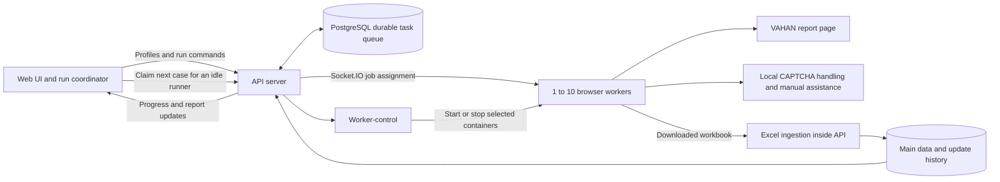
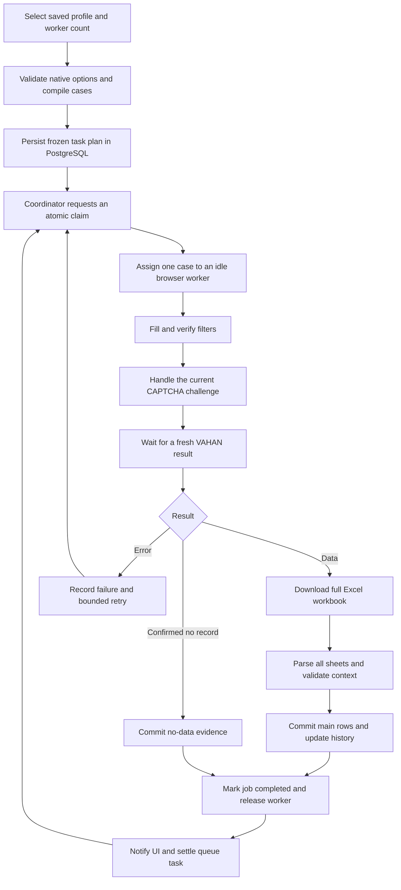
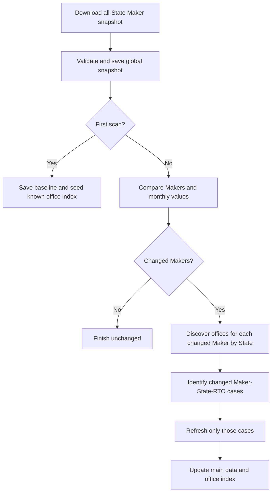

# VAHAN — Context hệ thống hiện tại và cơ sở lập timeline

**Ngày đối chiếu:** 07/10/2026, múi giờ Asia/Ho_Chi_Minh (GMT+7).

**Mã nguồn:** `feat/filter`; baseline chức năng ở commit `d641a9f`, có bổ sung trang UI Health trong working tree ngày 07/10/2026.

**Mục đích:** cung cấp một đầu vào đầy đủ cho việc phân tích phạm vi, chia công việc, lập timeline và nghiệm thu hệ thống. Tài liệu mô tả phiên bản hiện tại; không coi mọi đề xuất trong các báo cáo kiến trúc cũ là chức năng đã triển khai.

## 1. Mục tiêu và phạm vi sản phẩm

**Cập nhật phân quyền 08/10/2026:** user thường chỉ xem/tra cứu/xuất tại Exported Reports. Filters và Settings bị ẩn; truy cập URL trực tiếp báo không có quyền, API quản trị trả 403. Admin quản lý bộ lọc, lịch chạy (gồm lịch của admin khác) và cấp/thu hồi role admin trong Account → Manage user accounts. Đổi role thu hồi phiên tài khoản đích; hệ thống giữ ít nhất một admin hoạt động.

Hệ thống thu thập báo cáo đăng ký phương tiện từ VAHAN, chạy nhiều browser worker song song, lưu kết quả vào PostgreSQL và cung cấp giao diện theo dõi, tra cứu, xuất Excel và kiểm tra mức độ cập nhật dữ liệu.

| Khái niệm | Ý nghĩa trong hệ thống |
| --- | --- |
| State | Bang hoặc vùng lãnh thổ được chọn trên VAHAN. |
| RTO | Văn phòng đăng ký phương tiện thuộc State. |
| Maker | Nhà sản xuất; `OTHERS` được chấp nhận như một nhóm dữ liệu hợp lệ. |
| Filter profile | Bộ lựa chọn filter, ràng buộc, năm báo cáo và revision được lưu trong SQL. |
| Case/task | Một tổ hợp filter cụ thể trong một lượt chạy. Một RTO có thể có nhiều case nếu các filter khác nhau. |
| Job/attempt | Một lần worker thực hiện case. Retry tạo attempt có liên kết với lần trước. |
| Session/run | Một lượt chạy gồm danh sách case, giới hạn worker và lịch sử kết quả. |
| Dataset | Phạm vi dữ liệu được phân biệt bằng các filter; có thể chứa nhiều năm và nhiều State/RTO. |
| Freshness theo ngày | Bao nhiêu case trong kế hoạch đã được xác nhận lưu thành công trong ngày đó. Không suy ra toàn bộ dataset đã mới chỉ từ một timestamp. |

**Định dạng đầu ra chính hiện được hỗ trợ:** Calendar Year / Maker / Month Wise, một năm cho mỗi bộ filter. `From` và `To` đồng bộ về cùng năm. Dữ liệu tháng nằm trong báo cáo của năm, không phải một scheduler crawl từng tháng đã triển khai.

Số case phụ thuộc bộ filter và danh sách State/RTO thực tế. **1.676 case là một tập case đã sử dụng, không phải hằng số cho mọi lượt chạy.**

## 2. Kiến trúc đang triển khai

| Thành phần | Trách nhiệm | Giao tiếp và dữ liệu |
| --- | --- | --- |
| Web UI | Đăng nhập, cấu hình, điều phối lượt chạy, yêu cầu claim cho từng runner, theo dõi, xem và xuất dữ liệu. | REST API và Socket.IO; trạng thái người dùng được đồng bộ SQL. |
| API server | Xác thực, quản lý job/queue, claim an toàn, nhận kết quả, nhập dữ liệu, cung cấp báo cáo và điều khiển worker pool. | FastAPI, Socket.IO, PostgreSQL. |
| PostgreSQL | Lưu dữ liệu nghiệp vụ và trạng thái bền vững của queue, job, profile, tài khoản và lịch sử. | Transaction, khóa hàng, chỉ mục, JSONB. |
| Browser runner | Mỗi container có một runner ID, browser/context riêng; nhận job, thao tác VAHAN, tải Excel và gửi kết quả. | Node.js, Chromium/Playwright, REST và Socket.IO tới API. |
| Worker-control | Bật/tắt đúng các container crawler theo số worker được chọn. | API nội bộ được bảo vệ bằng token; truy cập Docker engine. |
| Bộ xử lý Excel | Đọc workbook, phân tích các sheet, kiểm tra context, lưu dữ liệu và lịch sử. | Hiện nằm trong API; chưa phải một dịch vụ processor độc lập. |
| Xử lý CAPTCHA | Nhận diện cục bộ trong runner, quản lý challenge và hỗ trợ thao tác thủ công trên giao diện. | Mã hiện có dùng Tesseract; chưa có CAPTCHA service độc lập trong Compose. |
| UI health check | Kiểm tra giao diện VAHAN theo lịch hoặc theo yêu cầu. | Runner dùng trang kiểm tra riêng, gửi log và CSV về API. |

**Điểm cần giữ đúng khi lập timeline:** queue hiện tại dùng PostgreSQL, không dùng Redis. Bộ điều phối batch hiện còn nằm trong Web UI; worker nhận job qua Socket.IO, không phải một daemon tự polling Redis. Việc đóng UI không được xem là cơ chế backend tự chạy toàn bộ batch một cách độc lập đã được nghiệm thu.

## 3. Danh mục chức năng theo màn hình

### 3.1. Đăng nhập và trạng thái người dùng

| ID | Chức năng | Hoạt động và đầu ra | Ranh giới |
| --- | --- | --- | --- |
| AUTH-01 | Đăng nhập | Kiểm tra tài khoản/mật khẩu; cấp access token gắn với session trong SQL. | API phải được cấu hình xác thực. |
| AUTH-02 | Duy trì phiên | Khôi phục trạng thái người dùng và token hợp lệ khi mở lại giao diện. | Token hiện không có thời hạn tự hết; logout, khóa tài khoản hoặc thay secret có thể làm phiên mất hiệu lực. |
| AUTH-03 | Đăng xuất | Thu hồi session hiện tại và kết thúc đăng nhập trên UI. | Không xóa dữ liệu đã crawl. |
| AUTH-04 | Trạng thái kết nối | Hiển thị backend và các runner online/reconnecting. | Online không đồng nghĩa worker rảnh; cần kiểm tra current job. |
| AUTH-05 | Đồng bộ trạng thái | Lưu lựa chọn profile, năm/worker settings, kế hoạch và dữ liệu khôi phục vào `user_state`. | Có thông báo khi trạng thái chưa đồng bộ thành công. |

### 3.2. Điều hướng và chạy báo cáo theo lịch

Giao diện hiện chỉ có **Exported Reports → Filters → Settings**. Exported Reports là trang mặc định; **Log out** nằm ở đầu trang Settings. Trang chạy thủ công và màn hình theo dõi worker riêng đã được gỡ.

| ID | Chức năng | Hoạt động và đầu ra | Ranh giới |
| --- | --- | --- | --- |
| RUN-01 | Chọn profile | Chọn filter đã lưu trong Settings, giữ năm và revision cho lịch chạy. | Sửa profile không tự đổi lịch đã lưu. |
| RUN-02 | Đặt lịch | Chọn giờ Việt Nam, 1–10 worker, chạy một lần hoặc hàng ngày. Backend chuẩn bị case và điều phối queue. | Không cần mở trình duyệt dashboard. |
| RUN-03 | Tiến độ | Card trong Settings hiển thị done/total, cases/min và thanh tiến độ. | Mở hoặc tải lại trang không tạo một queue mới. |
| RUN-04 | Pause/Continue | Tạm dừng nhận case mới, đợi case đang chạy lưu; đổi worker và tiếp tục cùng phiên. | Không chạy lại dữ liệu/no-data đã lưu. |
| RUN-05 | Dữ liệu báo cáo | Dữ liệu đã thu thập hiển thị trong Exported Reports, hỗ trợ tìm kiếm và xuất Excel. | Dữ liệu lịch sử được giữ lại. |
| RUN-06 | UI Health | Kiểm tra trước phiên chạy; Settings chỉ hiển thị khi có lỗi. | Lỗi contract chặn công việc mới. |

Chi tiết hành vi và API: [run-schedules.md](../run-schedules.md).

### 3.3. Filters — tạo và quản lý cấu hình

| ID | Chức năng | Hoạt động và đầu ra |
| --- | --- | --- |
| FIL-01 | New profile | Tạo bộ cấu hình mới với năm hiện tại; sang 2027 sẽ mặc định 2027. |
| FIL-02 | CRUD profile | Tạo, đọc, sửa, xóa profile trong SQL; lưu owner và revision. |
| FIL-03 | Chống ghi đè cấu hình | Kiểm tra revision; báo xung đột nếu profile đã được sửa ở nơi khác. |
| FIL-04 | Chọn năm | From/To cùng một năm; profile đã lưu giữ năm riêng, không tự đổi sang năm hiện tại. |
| FIL-05 | Fixed values | Giữ các giá trị chọn cùng nhau trong filter; field đơn trị chỉ cho một giá trị cố định. |
| FIL-06 | Iterate all | Sinh case theo từng giá trị hợp lệ; dùng Include/Exclude để thu hẹp. |
| FIL-07 | Combination rules | Quy tắc require/exclude giữa điều kiện của một field và giá trị của field khác. |
| FIL-08 | Phụ thuộc filter | State → RTO; Category Group → Sub-Category → Class; EV Type → Fuel; vùng State ảnh hưởng State. |
| FIL-09 | Đọc lựa chọn trực tiếp | Dùng runner rảnh, reservation/lease và context filter để lấy lựa chọn từ VAHAN. |
| FIL-10 | Cache lựa chọn | Lưu tối đa 20 snapshot trong trạng thái người dùng được đồng bộ SQL; dùng context phù hợp và State/RTO từ kế hoạch cùng năm khi có. |
| FIL-11 | Làm việc khi worker BUSY | Cho phép chọn từ dữ liệu đã ghi nhận; khi có worker rảnh thì làm mới danh sách. Không tự thao tác trên browser đang xử lý job. |
| FIL-12 | Tìm Maker | Tra cứu lựa chọn Maker bằng tìm kiếm trên VAHAN khi có điều kiện truy cập phù hợp. |
| FIL-13 | Save & preview | Lưu profile rồi kiểm tra tổ hợp; hiển thị số case hợp lệ và nhánh bị loại. |
| FIL-14 | Use in Settings | Chọn profile đã preview trong Settings để đặt lịch. Backend vẫn kiểm tra lại khi lịch bắt đầu. |
| FIL-15 | Giao diện chọn giá trị | Bảng thả xuống bám dưới ô, có Mode, tìm kiếm, Include/Exclude, Clear/Done; đóng bằng Esc hoặc bấm ngoài. |

**15 nhóm filter:** Active / Archive Type, State, RTO, Emission, Maker, Category Group, Sub-Category, Class, Fuel, EV Type, Status, Owner Type, Type, Delhi NCR?, Fitness Valid as On Date?. Active/Archive gồm các cờ Active Compliant, Active Non-Compliant, Permanent Archive và Temporary Archive.

Các giới hạn hiện có gồm tối đa 3.000 case cho một profile/kế hoạch, tối đa 30 combination rules, giới hạn số giá trị và kích thước preview. Khi vượt giới hạn, hệ thống báo lỗi; không âm thầm chạy một danh sách bị cắt ngắn.

Cache và danh sách từ kế hoạch không bảo đảm luôn là toàn bộ lựa chọn hiện tại của VAHAN. Nếu chưa có snapshot/kế hoạch tương thích, vẫn cần worker rảnh để lấy danh sách; bước preview kiểm tra lại lựa chọn thực tế trước khi chạy.

Mục phụ “RTO options for State” đã được bỏ. State/RTO dùng trực tiếp các lựa chọn và phụ thuộc trong bộ filter. Các đoạn hướng dẫn dài ở ngoài bộ chọn cũng đã được bỏ; điều này không loại bỏ kiểm tra nghiệp vụ.

### 3.4. Exported Reports — tra cứu, xuất và mức độ cập nhật

| ID | Chức năng | Hoạt động và đầu ra | Ranh giới |
| --- | --- | --- | --- |
| REP-01 | Năm mặc định | Khi mở trang, dùng năm hiện tại; vẫn chọn được năm cũ. | Không kế thừa ngầm năm cũ của lượt crawl. |
| REP-02 | Chọn dataset | Phân biệt các phạm vi filter trong bảng dữ liệu. | Không gộp các phạm vi filter khác nhau như cùng một báo cáo. |
| REP-03 | Tra cứu | Tìm theo State, RTO/tên hoặc mã văn phòng; phân trang bảng Maker. | Tra cứu và export phải dùng cùng điều kiện. |
| REP-04 | Bảng tháng | Hiển thị Maker và các giá trị tháng, thống kê Maker/RTO, tháng có dữ liệu và cập nhật gần nhất. | `0` là số lượng bằng không; ô thiếu dữ liệu không được biến thành `0`. |
| REP-05 | Cập nhật trong lúc chạy | Mỗi workbook lưu thành công phát thông báo để UI đọc lại dữ liệu. | Không cần đợi hết batch mới thấy kết quả. |
| REP-06 | Export search to Excel | Xuất toàn bộ dòng phù hợp tìm kiếm, gồm các trang chưa hiển thị. | Không chỉ xuất trang đang xem. |
| REP-07 | Export all to Excel | Xuất toàn bộ dataset/năm được chọn sau xác nhận. | Có giới hạn worksheet Excel và thông báo khi phải thu hẹp. |
| REP-08 | Update history | Mở bảng lịch sử cạnh nút export; chọn khoảng năm và dataset; xem theo ngày. | Tải khi mở và làm mới có giới hạn tần suất để giảm tải. |
| REP-09 | Độ mới dữ liệu | Hiển thị updated/total cases, %, phần còn thiếu, case đầu tiên chưa refresh và lần lưu cuối. | Complete nghĩa là đầy đủ **case trong kế hoạch đã biết**, không khẳng định mọi dữ liệu có thể tồn tại trên VAHAN. |
| REP-10 | Trạng thái cập nhật | Complete, Updating/queued, Paused, Partial hoặc Coverage unknown. | No data hợp lệ được tính; attempt lỗi hoặc import cần review không được coi là dữ liệu mới hợp lệ. |
| REP-11 | Coverage/Continue missing | Đối chiếu bằng chứng import với kế hoạch để chỉ chạy phần chưa có. | Cần kế hoạch tương thích dataset/năm; không đo coverage bằng số attempt đã thử. |

Ví dụ: ngày trước đã lưu 1.676/1.676 case, hôm nay mới làm mới 800 case thì **coverage của hôm nay là 800/1.676**, còn 876 case chưa refresh hôm nay. Các giá trị từ ngày trước có thể vẫn còn trong SQL; “chưa refresh hôm nay” không đồng nghĩa “không có dữ liệu”. Do worker chạy song song, phần được cập nhật có thể có các khoảng trống, không nhất thiết là một đoạn liên tục.

### 3.5. Settings và trang UI Health

| ID | Chức năng | Hoạt động và đầu ra | Quyền/giới hạn |
| --- | --- | --- | --- |
| SET-01 | Quản lý tài khoản | Liệt kê, tạo tài khoản, bật/tắt quyền đăng nhập. | Admin; mật khẩu tạo mới tối thiểu 12 ký tự. |
| SET-02 | Lịch UI health — trang UI Health | Cấu hình khoảng cách 1–365 ngày; mặc định model là 3 ngày. | Admin đổi lịch; không phải lịch crawl dữ liệu. |
| SET-03 | Check now | Gửi yêu cầu kiểm tra ngay tới runner phù hợp. | Trang kiểm tra tách riêng và chỉ đọc giao diện. |
| SET-04 | Lịch sử UI health — trang UI Health | Chọn ngày, xem log, thống kê Healthy/Data changed/UI drift/Check error. | Kiểm tra lỗi có thông tin chẩn đoán. |
| SET-05 | Download CSV | Tải log kiểm tra từ backend. | Thời gian lưu log/tệp theo cấu hình và chính sách retention hiện tại. |
| SET-06 | Bố cục thống nhất | Nền sáng, thẻ gọn, nút chữ nhật; header Filters/Settings căn hai mép giống các trang còn lại. | Responsive; danh sách/tables cuộn riêng khi cần. |
| SET-07 | DOM và phiên bản trong SQL | Lưu định nghĩa control, quan sát, hash options và phiên bản DOM đã xác minh; crawler dùng selector được SQL phê duyệt. | ID đổi chỉ tự ánh xạ khi tên/nhãn khớp duy nhất và kiểu control còn phù hợp. |
| SET-08 | Kiểm tra trước lượt crawl | Kiểm tra tất cả worker được chọn trước tải Maker, preview filter và tạo queue; lưu kết quả theo user và gắn với session. | Lỗi chặn việc mới, retry tối đa một lần và có Copy error gửi dev; worker ngoài pool không chặn pool nhỏ hơn. |

Hai khối **UI health check schedule** và **Daily UI health reports** nằm trên trang riêng `#health`, truy cập bằng nút **UI Health** trên thanh điều hướng. Settings tập trung vào quản lý tài khoản; thao tác Check now và xem log được thực hiện trên UI Health.

Chi tiết về phạm vi control, quy tắc cập nhật DOM, bảng SQL và khôi phục khi lỗi: [UI Health với SQL](../ui-health-sql.md). Kiểm tra form không thay thế đối soát filter, dữ liệu tải xuống và xác thực khi nhập SQL.

Ngoài các chức năng thấy trên UI, API còn có audit/log runner, lưu trạng thái browser được mã hóa, quản lý artifact và các endpoint session báo cáo cũ. Sự tồn tại của API tương thích không đồng nghĩa có một màn hình quản trị đầy đủ cho mọi endpoint.

## 4. Luồng crawl đầy đủ và bảo đảm lưu kết quả

1. Kế hoạch được lưu trước khi phát việc, gồm toàn bộ filter của từng case.
2. API dùng transaction, khóa runner và khóa task với `SKIP LOCKED`; kiểm tra worker pool và reservation để tránh giao trùng ngoài ý muốn.
3. Worker xử lý tối đa một job; worker hoàn tất sớm được nhận case tiếp theo.
4. Worker kiểm tra filter trước khi Apply, kiểm tra kết quả đã mới và tải workbook đầy đủ khi có dữ liệu.
5. API chỉ đánh dấu `COMPLETED` sau khi transaction nhập dữ liệu thành công. Nếu nhập SQL thất bại, không báo case đã hoàn thành.
6. Kết quả No record được lưu như bằng chứng riêng. Không suy diễn timeout, lỗi CAPTCHA hay lỗi RTO thành No data.
7. Lưu xong từng case thì UI và bảng dữ liệu được cập nhật, không đợi kết thúc toàn bộ lượt.

**Retry và khôi phục:** queue hiện có ngưỡng `MAX_FAILURES = 2`; sau lỗi đầu task có thể trở về Pending, lỗi đạt ngưỡng được giữ Failed. Khi có nhiều worker, cơ chế claim ưu tiên tránh đưa retry trở lại chính worker vừa thất bại nếu có lựa chọn khác. Cancelled có thể trả task về Pending. UI còn có logic tương thích các lượt cũ, checkpoint/retry và retry thủ công; không nên mô tả mọi phiên bản recovery là cùng một thuật toán.

Sau API restart, job browser chưa terminal được đánh dấu lỗi để khôi phục và retry rõ ràng; không tự phát lại một thao tác Apply đang dở. Trạng thái SQL và browser context là hai lớp khác nhau. Restart an toàn cần kiểm tra job đang chạy và giữ nguyên volume dữ liệu.

## 5. Luồng Update Maker theo thay đổi

| Giai đoạn | Dữ liệu và hành vi |
| --- | --- |
| GLOBAL | Lấy snapshot Maker toàn State theo template của luồng update và năm đã chọn. |
| BASELINE | Lần đầu lưu baseline, không coi toàn bộ Maker là “vừa thay đổi”; tận dụng bảng chính để tạo chỉ mục văn phòng đã biết. |
| So sánh | So Maker mới/mất khỏi snapshot và giá trị theo tháng; chỉ có tổng không thay đổi chưa đủ để kết luận từng RTO không thay đổi. |
| DISCOVER | Với Maker thay đổi, dò theo từng State để xác định RTO và thay đổi ở cấp văn phòng. |
| REFRESH | Tạo và chạy các case Maker–State–RTO cần làm mới; cập nhật dữ liệu và chỉ mục. |
| Đối soát | Kiểm tra context Maker/State/RTO, cập nhật trạng thái run/task; hỗ trợ dừng/tiếp tục phần chưa xong. |

**Giới hạn cần đưa vào timeline:** luồng này không đảm bảo không phải dò nhiều State khi chỉ có tổng toàn quốc. Mã hiện điều phối Update Maker bằng luồng riêng trong Web UI, không mặc nhiên dùng toàn bộ worker của queue thường. Nút Update hiện bị khóa khi chọn profile tùy chỉnh và dùng template tiêu chuẩn; việc hỗ trợ Update Maker cho mọi profile là hạng mục mở rộng/cần thống nhất, không phải đã hoàn tất.

## 6. CAPTCHA, tệp và dữ liệu SQL

### 6.1. CAPTCHA

Mỗi worker có một ảnh hiện hành theo số runner; challenge có liên kết job/captcha ID để tránh dùng ảnh cũ hoặc ảnh của worker khác. Mã hiện có nhận diện cục bộ và tự xử lý kết quả nhận diện, đồng thời có UI hỗ trợ thủ công. Khối này nằm trong runner, không phải một CAPTCHA service ngoài đã được triển khai. Tài liệu mô tả hiện trạng mã; việc sử dụng tự động, chính sách được phép và tiêu chí bàn giao cần được chốt riêng trong phạm vi vận hành.

### 6.2. Nhập và xuất Excel

API đọc các sheet, giới hạn kích thước/kích thước giải nén/số dòng, kiểm tra file hỏng và kiểm tra nhận diện Maker/tháng/năm/State/RTO. `OTHERS` được lưu đúng nhãn nhóm. Thiếu dữ liệu và số `0` được phân biệt. Lượt nhập lặp có checksum và định danh nguồn; giá trị mới hơn có thể cập nhật bảng chính, với lịch sử và thông tin xung đột được ghi nhận.

Luồng hiện tại **không giữ mọi workbook tải từ VAHAN thành một kho Excel gốc đầy đủ để luôn tải lại từng file**. Với crawl bình thường, dữ liệu được commit vào bảng chính; file export trên màn hình được tổng hợp lại từ SQL. Artifact và một số endpoint tương thích vẫn tồn tại nhưng không nên dùng chúng để cam kết tính năng lưu trữ mọi bản gốc chưa có.

### 6.3. Nhóm bảng dữ liệu

| Nhóm | Bảng chính | Nội dung |
| --- | --- | --- |
| Tài khoản | `users`, `auth_sessions` | Tài khoản, password hash, vai trò, khóa tài khoản và session. |
| Điều phối | `report_sessions`, `jobs`, `runners`, `job_events` | Lượt chạy, attempt, worker và sự kiện. |
| Queue | `batch_queue_sessions`, `batch_queue_tasks` | Danh sách case, trạng thái, lần thử, runner/job được gán. |
| Cấu hình | `filter_profiles`, `user_state`, `app_settings`, `runner_planning_leases` | Profile/version, trạng thái người dùng, số worker và reservation. |
| Dữ liệu | `main_reports` | Phạm vi filter + năm + State + RTO/mã RTO + Maker + giá trị 12 tháng. |
| Lịch sử nhập | `report_update_history` | Nguồn import, context, ngày lưu/quan sát, kết quả, chênh lệch và bằng chứng. |
| Maker update | `maker_global_reports`, `maker_office_index`, `maker_update_runs`, `maker_update_tasks` | Baseline, map văn phòng, run và các việc Discover/Refresh. |
| Vận hành | `stored_files`, `browser_states`, `ui_health_checks`, `audit_events` | Artifact, trạng thái browser mã hóa, kết quả kiểm tra và audit. |

Dữ liệu báo cáo bảng chính được tra cứu theo phạm vi dùng chung trong ứng dụng; profile, session/job và trạng thái người dùng có cơ chế owner. Không suy rộng thành mọi dữ liệu/mọi thao tác đều được chia sẻ hoặc đều chỉ dành riêng cho một tài khoản. Quyền đổi worker pool hiện là endpoint xác thực dùng chung, chưa được giới hạn Admin giống chức năng quản lý tài khoản.

## 7. Đo hiệu năng và ETA

- Cases/min và ETA dựa vào số case hệ thống hoàn tất theo thời gian chạy thực tế, không dựa trên trung bình thời gian của một filter rồi nhân/chia đơn giản cho số worker.
- Công thức hiện kết hợp tốc độ gần đây (cửa sổ khoảng 90 giây) và toàn lượt; khi đủ mẫu thì dùng trọng số 75% gần đây, 25% toàn lượt.
- Thời gian pause được tách khỏi thời gian hoạt động. Khi chưa đủ dữ liệu hoặc không có tiến triển trong khoảng 120 giây, ETA có thể không được đưa ra.
- Throughput chịu ảnh hưởng của tỷ lệ case có dữ liệu/No data, VAHAN, CAPTCHA, tải Excel, nhập SQL, retry, số worker thực sự hoạt động và CPU/RAM.
- Yêu cầu 45–50 case/phút trong trao đổi trước là mục tiêu để kiểm chứng. Một số đo trên dashboard của một lượt không thay cho benchmark hoặc SLA đã được nghiệm thu.

Để lập timeline hiệu năng, cần chốt tập dữ liệu, số worker, thời lượng đo, tiêu chí thành công, retry được tính thế nào và chất lượng dữ liệu phải giữ. Thời gian crawl vận hành và thời gian phát triển phần mềm là hai loại thời gian khác nhau.

## 8. Hiện trạng, khoảng trống và phần chưa triển khai

| Hạng mục | Hiện trạng dùng làm baseline |
| --- | --- |
| 1–10 worker và hàng đợi phân phối động | Đã có mã, Docker controller và UI. Không chia cố định 160 case/worker. |
| SQL profile, preview/ràng buộc, cache lựa chọn | Đã có; cache được kiểm tra theo context, không thay thế bước xác thực lựa chọn lúc preview. |
| Nhập bảng chính ngay từng case, xuất từ SQL | Đã có. |
| Coverage và Update history theo ngày | Đã có; phụ thuộc bằng chứng import và kế hoạch ghi nhận. |
| Tài khoản và UI health theo lịch | Đã có. |
| Update Maker có phụ thuộc Global/Discover/Refresh | Đã có luồng riêng; giới hạn template và UI nêu ở mục 5. |
| Redis/broker | Chưa có trong triển khai hiện tại. PostgreSQL đang giữ queue. |
| Crawl dữ liệu tự động hàng tháng | Chưa có scheduler cho luồng crawl dữ liệu. Không nhầm với lịch UI health. |
| Backend tự điều phối batch độc lập với UI | Chưa coi là đã có đầy đủ; cần tách orchestration nếu muốn chạy unattended. |
| Dịch vụ CAPTCHA riêng | Chưa có; phần xử lý hiện nằm trong runner. |
| Dịch vụ Excel processor riêng | Chưa có; parse/import hiện nằm trong API. |
| Các loại Year Type/Y-Axis/X-Axis tùy ý | Không thuộc phạm vi đầu ra chính hiện được hỗ trợ. Phần mở rộng từng đề xuất đã được hoàn tác. |
| Kho lưu mọi Excel gốc | Không phải chức năng của pipeline bảng chính hiện tại. |
| Observability/SLA/backup-restore production hoàn chỉnh | Có nền tảng health/log/audit; cần tiêu chí, cấu hình và diễn tập trước khi coi đã nghiệm thu production. |

Các kế hoạch/báo cáo cũ có thể mô tả hai worker chia đôi, Redis, scheduler hoặc các service tách rời. Chúng là lịch sử/đề xuất; timeline mới phải dùng baseline trong tài liệu này và xác định rõ phần nào còn được khách hàng yêu cầu.

## 9. Cấu trúc công việc để lập timeline

Bảng dưới là WBS để lập kế hoạch **kiểm chứng, hoàn thiện và bàn giao**, không có nghĩa phải xây lại tất cả chức năng đã có. Các hàng “mở rộng” chỉ đưa vào lịch khi được chốt phạm vi.

| WBS | Nhóm công việc | Baseline và việc cần lập kế hoạch | Phụ thuộc | Tiêu chí đầu ra |
| --- | --- | --- | --- | --- |
| T01 | Chốt phạm vi | Chốt loại báo cáo, user/role, năm, filter, số worker và phạm vi bàn giao. | Không | Scope được duyệt; phân biệt hiện có/mở rộng. |
| T02 | Dữ liệu và bộ case nghiệm thu | Chọn case có dữ liệu, No data, lỗi, OTHERS, năm cũ và nhiều bộ filter. | T01 | Bộ case và kết quả kỳ vọng có thể đối soát. |
| T03 | Profile và phụ thuộc | Kiểm chứng Fixed/Iterate/Include/Exclude, version, preview, State/RTO khi BUSY và sau reload. | T02 | Không sinh tổ hợp sai hoặc danh sách bị cắt; cache không làm mất lựa chọn. |
| T04 | Queue và worker pool | Kiểm chứng 1/5/10 worker, claim đồng thời, pause/resume, đổi số container và mất kết nối. | T02, T03 | Không giao trùng, không vượt số worker, không mất task. |
| T05 | Runner và CAPTCHA | Kiểm chứng filter đúng, challenge đúng job, refresh, timeout, thao tác thủ công; chốt phạm vi vận hành của phần nhận diện hiện có. | T01, T03, T04 | Không dùng challenge cũ; lỗi được phân loại, không nhầm thành No data. |
| T06 | Excel và chất lượng SQL | Đối soát all sheets, context, NULL/0, OTHERS, duplicate, xung đột và lưu song song. | T02, T05 | Chỉ hoàn thành sau commit; dữ liệu khớp workbook kiểm chứng. |
| T07 | Exported Reports | Kiểm chứng live update, tìm kiếm, phân trang, export search/all và năm tự đổi. | T06 | Export đầy đủ mọi trang; UI không cần chờ hết batch. |
| T08 | Freshness và coverage | Kiểm chứng dataset/năm/ngày, cập nhật một phần, retry, No data và trường hợp không có kế hoạch đầy đủ. | T04, T06, T07 | Không báo full update chỉ vì một case mới lưu; chỉ rõ phần chưa làm mới. |
| T09 | Update Maker | Kiểm chứng baseline, Maker mới/mất, dò State/RTO, Refresh và đối soát; chốt hỗ trợ custom profile hay không. | T03, T06 | Chạy đúng các việc cần thiết, giữ dữ liệu ngoài phạm vi, có đối soát. |
| T10 | Auth và Settings | Kiểm chứng quyền Admin/user, logout, khóa tài khoản, lịch và log UI health. | T01 | Quyền và vòng đời phiên đúng; kiểm tra UI không làm sai lượt crawl. |
| T11 | Khôi phục và vận hành | Diễn tập runner/API restart, DB reconnect, không có worker rảnh, cập nhật Docker và giữ volume. | T04, T06, T10 | Lỗi/việc chưa hoàn tất có thể phát hiện và xử lý lại; dữ liệu đã lưu còn nguyên. |
| T12 | Benchmark và tối ưu | Đo bottleneck VAHAN/CAPTCHA/download/SQL; thử các mức worker và kiểm tra ETA. | T04–T08 | Báo cáo số đo, điều kiện đo và ngưỡng được thống nhất; chất lượng không giảm. |
| T13 | Scheduler và orchestration backend — mở rộng | Nếu yêu cầu crawl theo lịch: chuyển orchestration ra backend, trigger định kỳ, chống trùng lịch và run ngay. | T01, T04, T11 | Batch chạy theo lịch không phụ thuộc một tab UI; retry và đối soát bền vững. |
| T14 | Redis hoặc service tách riêng — mở rộng | Chỉ thực hiện nếu phạm vi hoặc số đo chứng minh cần broker/processor/service riêng. | T12; T13 nếu liên quan | Hợp đồng giao tiếp, idempotency, lỗi và vận hành được kiểm chứng. |
| T15 | UAT và bàn giao | Tài liệu, demo, quyền sử dụng, dataset nghiệm thu, hướng dẫn vận hành và các giới hạn. | Các hạng mục trong scope | Biên bản nghiệm thu; danh sách tồn đọng và trách nhiệm xử lý. |

**Lộ trình đề xuất để xếp việc:** chốt scope và dữ liệu nghiệm thu → profile/queue/runner → nhập SQL và đối soát → báo cáo/freshness/Update Maker → vận hành và benchmark → phần mở rộng được duyệt → UAT/bàn giao. Auth/Settings, thiết kế giao diện và tài liệu có thể làm song song với các nhánh phù hợp khi nhân sự cho phép.

Chưa gán ngày bắt đầu, hạn bàn giao hoặc số ngày công vì chưa chốt nhân sự và scope. Không tự dùng lại mốc 25/10/2026 trong một timeline cũ như deadline của yêu cầu mới.

## 10. Đầu vào cần chốt trước khi xây timeline có ngày cụ thể

1. Timeline cho nghiệm thu phiên bản hiện tại, nâng cấp, hay xây dựng lại từ đầu?
2. Ngày bắt đầu, hạn bàn giao, ngày làm việc/ngày nghỉ và các mốc khách hàng duyệt.
3. Nhân sự theo vai trò FE, BE, RPA, QA, DevOps; số người có thể làm song song.
4. Phần bắt buộc: scheduler tháng, backend orchestration, Redis, CAPTCHA/Excel service riêng, custom Maker update hay các report axis khác có nằm trong scope không?
5. Số môi trường và chính sách backup/restore, vận hành, quyền và xử lý CAPTCHA.
6. Bộ dataset và case nghiệm thu; các năm/bộ filter bắt buộc; tiêu chí dữ liệu đủ và dữ liệu mới.
7. KPI tốc độ, điều kiện benchmark, tỷ lệ lỗi/retry chấp nhận được và cách đo ETA.
8. Lịch UAT, người xác nhận số liệu, số vòng sửa và thời gian dự phòng.

Mỗi hàng timeline nên có: `WBS | Nhóm chức năng | Công việc | Hiện trạng | Owner | Ngày bắt đầu | Ngày kết thúc | Ngày công | Phụ thuộc | Đầu ra | Tiêu chí nghiệm thu | Rủi ro | Trạng thái | Bằng chứng`.

## 11. Context/prompt có thể đưa trực tiếp cho người lập timeline

> Hãy lập timeline dự án VAHAN từ tài liệu baseline này. Phân biệt chức năng đã có cần kiểm chứng/hoàn thiện với chức năng mới cần phát triển. Không mô tả Redis, scheduler crawl tháng, CAPTCHA service độc lập, Excel service độc lập hoặc hỗ trợ report axis tùy ý là đã triển khai. Queue hiện dùng PostgreSQL; UI còn điều phối batch. Chia công việc theo T01–T15, nêu phụ thuộc, vai trò, đầu ra và Definition of Done. Nếu thiếu deadline hoặc nhân sự, liệt kê giả định và dùng thời lượng tương đối, không tự cam kết ngày bàn giao. Tách ngày công phát triển khỏi thời gian chạy 1.676 case. Có các mốc đối soát dữ liệu, benchmark, khôi phục lỗi, UAT và bàn giao. Chỉ thêm hạng mục mở rộng khi scope xác nhận cần. Với freshness, phải phân biệt dữ liệu đang có với số case được refresh trong ngày mới nhất.

## 12. Điểm kiểm chứng trong mã nguồn

| Nội dung | Nguồn hiện tại |
| --- | --- |
| UI và điều phối | `apps/web-ui/src/App.tsx`, `components/RunControls.tsx`, `components/WorkerDashboard.tsx`, `components/MatrixRunner.tsx` |
| Profile và lựa chọn | `components/FilterProfiles.tsx`, `filter-profiles.ts`, `filter-options-cache.ts`, API `filter_profiles.py`, `filter_planner.py` |
| Queue/worker | API và repository `batch_queue.py`, `worker_pool.py` |
| Browser/CAPTCHA | `apps/browser-runner/runner.mjs`, `page-driver.js` |
| Nhập dữ liệu | `repositories/file_store.py`, `repositories/annual_reports.py`, `repositories/report_results.py` |
| Export và freshness | API `annual_reports.py`, `report_coverage.py`, `update_status.py`; UI `AnnualReports.tsx`, `UpdateHistory.tsx` |
| Maker update | API/repository `maker_updates.py`, các bảng Maker trong `db/schema.py` |
| Auth/Settings/health | API `auth.py`, `data.py`, `ui_health.py`; UI `AuthGate.tsx`, `DataManagement.tsx`, `HealthCheckSchedule.tsx`, `HealthCheckReports.tsx` |
| Schema và Docker | `apps/api-server/app/db/schema.py`, migrations, `compose.yaml` |
| ETA | `apps/web-ui/src/batch-timing.ts` |
| Kiểm thử | `apps/api-server/verification/`, `apps/web-ui/scripts/`, các test browser-runner, worker pool và session limits |

Tài liệu này được đối chiếu bằng mã nguồn. Các kiểm tra tập trung trong quá trình làm việc trước gồm queue/timing, profile UI, cache khi worker BUSY, nhập SQL và Update history; không thay thế một vòng UAT hoặc benchmark đầy đủ cho mọi profile, mọi năm và mọi trạng thái lỗi. Các đề xuất mở rộng trong timeline cần có thiết kế và nghiệm thu riêng.
