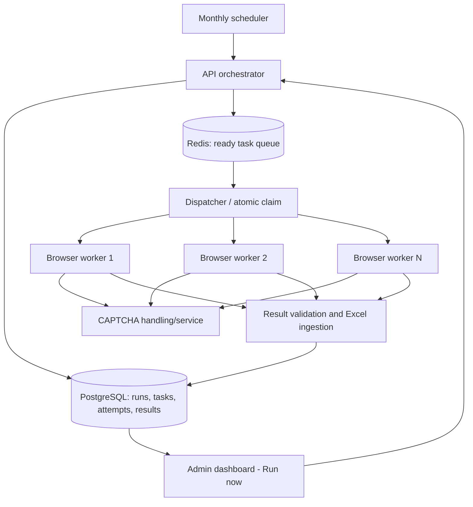

# Kế hoạch phân tích và triển khai nhiều crawler worker VAHAN

**Cập nhật giai đoạn đầu:** Theo yêu cầu mới, lượt Run all dùng hai browser worker độc lập và chia cố định danh sách State/RTO thành hai nửa liên tiếp. Mỗi worker chạy tuần tự nửa của mình, đồng thời với worker còn lại. Redis queue, scheduler tháng và CAPTCHA service riêng vẫn là các giai đoạn mở rộng; phần chia đôi hiện tại dùng API/Socket.IO và PostgreSQL sẵn có.

Tài liệu làm việc này dựa trên kiến trúc đề xuất trong `docs/reports/baocao2.pdf` và mã nguồn hiện tại. Hai crawler đã được cấu hình và kiểm tra đồng thời ở mức đọc filter; toàn bộ batch 1.676 case chưa được chạy kiểm chứng. Redis, scheduler tháng và CAPTCHA service riêng chưa được triển khai.

## 1. Mục tiêu và ranh giới

- Một lần chạy thủ công hoặc theo lịch tạo tập case có thể theo dõi, khôi phục và đối soát từ PostgreSQL.
- Các worker độc lập lấy case từ hàng đợi chung; mỗi worker xử lý tối đa một case tại một thời điểm. Worker rảnh lấy case tiếp theo, không chia cố định danh sách State/RTO.
- Giữ nguyên ý nghĩa kết quả `COMPLETED`, `NO_DATA`, `FAILED`, `CANCELLED`; chỉ coi case có dữ liệu là hoàn tất sau khi SQL xác nhận lưu thành công.
- Hỗ trợ cả crawl đầy đủ State/RTO và luồng cập nhật Maker có phụ thuộc `GLOBAL -> DISCOVER -> REFRESH`.
- Giới hạn đồng thời và tốc độ theo khả năng của VAHAN, CAPTCHA và hệ thống lưu dữ liệu; không đặt mục tiêu tăng tốc tuyến tính khi chưa đo.

## 2. Hiện trạng đã kiểm tra và khoảng cách cần giải quyết

| Thành phần | Hiện trạng trong mã | Việc cần phân tích/thay đổi |
| --- | --- | --- |
| Điều phối batch | `apps/web-ui/src/App.tsx` chạy vòng lặp tuần tự, lưu một `activeJobId` và chỉ chọn runner rảnh trước từng case. | Chuyển quyền sở hữu tiến độ/retry sang API; UI theo dõi một `runId` có nhiều case đang chạy. |
| API và runner | `POST /jobs` yêu cầu `runnerId`; API khóa hàng runner trong PostgreSQL trước khi giao job qua Socket.IO. Một runner chỉ có một `current_job_id`. | Giữ khả năng giao job hiện tại, thêm lớp task/hàng đợi để gán cho bất kỳ runner rảnh nào; định danh runner duy nhất. |
| Triển khai | `compose.yaml` có một service `runner` với ID cố định `playwright-1`; chưa có Redis hoặc scheduler. | Cấu hình nhiều runner riêng biệt, Redis và scheduler; kiểm tra tài nguyên CPU/RAM/browser. |
| CAPTCHA và tệp tạm | Runner dùng đường dẫn ảnh cố định `runtime/images1/ảnh1.png`; hiện có nhận dạng cục bộ và nhập thủ công. | Cô lập ảnh và yêu cầu theo `jobId`/`captchaId`; thiết kế hợp đồng dịch vụ CAPTCHA riêng nếu được chọn, có kiểm tra challenge còn hiệu lực. |
| Kết quả Excel/SQL | Runner tải Excel, API phân tích và ghi PostgreSQL; giao dịch lưu kết quả gắn với trạng thái job. Có khóa theo phạm vi văn phòng khi ghi báo cáo. | Kiểm thử nhập song song, lặp thông điệp, xung đột cùng State/RTO và xác nhận `COMPLETED` sau commit. Chỉ tách Excel processor nếu số đo chứng minh API là nút nghẽn. |
| Maker update | Có bảng snapshot toàn State, chỉ mục Maker–State–RTO và task cập nhật; UI hiện điều khiển tuần tự. | Chỉ phát task kế tiếp khi các task phụ thuộc đã hoàn thành và được đối soát; retry đúng Maker/State/RTO. |
| Kỳ dữ liệu | Filter hiện tại đặt `fromYear = toYear` và báo cáo trả về 12 tháng trong năm. | Xác nhận tháng trong scheduler là **kỳ chạy/snapshot** hay một filter dữ liệu riêng. Mặc định thiết kế: mỗi tháng chạy lại bản báo cáo của năm tương ứng; không tự diễn giải thành crawl riêng một tháng. |

## 3. Kiến trúc đích để kiểm chứng

PostgreSQL là nguồn sự thật cho run, case, lần thử và kết quả. Redis truyền tín hiệu phân phối; mất hoặc phát lặp một tín hiệu không được làm mất case hoặc ghi kết quả hai lần. Trong giai đoạn đầu, dispatcher có thể dùng giao thức Socket.IO đang có để giao cho runner, giảm phạm vi sửa crawler. Nếu cần worker tự tiêu thụ Redis, phải chứng minh lợi ích trước khi đổi giao thức.

Một `run` đại diện cho một lần bấm Run now hoặc một kỳ scheduler. Một `task` đại diện cho một case logic với bộ filter đã chốt; `attempt`/job là một lần thực thi trên một runner. Đề xuất tạo các bảng `crawl_runs`, `crawl_tasks`, `crawl_attempts` hoặc liên kết task với bảng `jobs` hiện có, thay vì dùng `jobs` chưa có `runner_id` trong khi schema đang bắt buộc cột này. Khóa chống trùng cần bao gồm loại run, năm báo cáo, State, RTO, cấu hình filter/version và kỳ chạy; retry của cùng case phải phân biệt với một lần chạy mới được yêu cầu chủ ý.

## 4. Các bước phân tích và sản phẩm bàn giao

### Giai đoạn A — Đóng băng hành vi hiện tại và đo nền

1. Lập sơ đồ luồng từ UI → `POST /jobs` → Socket.IO → Playwright → Excel → commit SQL → cập nhật UI cho ba kết quả: có dữ liệu, không có dữ liệu, lỗi.
2. Đo một mẫu nhỏ theo từng chặng: lấy RTO/filter, chờ CAPTCHA, tải Excel, phân tích/commit; ghi CPU/RAM của browser và số CAPTCHA phát sinh. Không chạy hàng loạt trước khi biết ngưỡng nguồn.
3. Chốt ý nghĩa `reportYear`, `triggerMonth` và `dataMonth`; khảo sát một workbook thực tế để xác nhận 12 cột tháng và dữ liệu năm đang chạy.
4. Lập danh sách cấu hình filter cần khóa theo từng run, gồm nhóm xe, nhiên liệu, archive, year và Maker; xác định ai được chỉnh và việc sửa có hiệu lực từ run nào.

**Đầu ra:** sơ đồ luồng hiện trạng, số đo nền, hợp đồng case/filter và các quyết định còn mở.

### Giai đoạn B — Thiết kế điều phối bền vững

1. Thiết kế schema run/task/attempt, trạng thái, sự kiện, chỉ mục và API tạo run, xem tiến độ, dừng, tiếp tục, retry đúng case.
2. Thiết kế outbox hoặc bước hòa giải PostgreSQL–Redis để case đã ghi SQL nhưng chưa publish vẫn được đưa lại vào queue. Trước khi giao job, dispatcher claim task trong giao dịch; gắn lease/heartbeat và token thế hệ để kết quả muộn của attempt cũ không ghi đè kết quả mới.
3. Chốt giới hạn retry theo loại lỗi, thời gian chờ/backoff và danh sách case cần xử lý thủ công. `NO_DATA` hợp lệ không được retry như lỗi; `FAILED` không được âm thầm biến thành `NO_DATA`.
4. Thiết kế pause/stop: ngừng giao task mới, hủy hoặc cho kết thúc task đang chạy theo lựa chọn, và ghi trạng thái để khởi động lại API/UI không mất tiến độ.

**Đầu ra:** sơ đồ trạng thái, migration dự kiến, API contract và kịch bản lỗi/khôi phục.

### Giai đoạn C — Chạy thử hai worker độc lập

1. Cấp ID, hồ sơ browser, phiên, thư mục tải và ảnh CAPTCHA riêng cho mỗi worker/job; không dùng chung tên ảnh cố định.
2. Dùng một queue chung, giới hạn một job trên mỗi worker; dispatcher chỉ giao khi runner sẵn sàng và nhận xác nhận. Giới hạn tổng số browser và nhịp truy cập VAHAN bằng cấu hình.
3. Đưa nhận diện CAPTCHA vào một giao diện dịch vụ theo `jobId` và `captchaId`; có đường xử lý khi dịch vụ chưa trả lời hoặc CAPTCHA hết hạn. UI có thể hiển thị nhiều challenge đồng thời theo từng job nếu vẫn cần người nhập.
4. Giữ Excel ingestion trong API trước; đo thời gian commit và cân nhắc tách thành processor riêng ở giai đoạn sau nếu nó thực sự gây nghẽn.

**Đầu ra:** bản thử nghiệm 2 worker trên 5–10 case có log thời gian và bằng chứng không trùng job.

### Giai đoạn D — Scheduler, Run now và Maker update

1. Scheduler hàng tháng và nút Run now gọi cùng API tạo run; cả hai đi qua cùng quy tắc chống trùng, filter snapshot và queue.
2. UI hiển thị run, tổng/đang chờ/đang chạy/có dữ liệu/không có dữ liệu/thất bại, worker nhận job, lỗi theo case, và thao tác dừng/tiếp tục/retry.
3. Luồng Maker update: lấy snapshot toàn State → so sánh Maker → dò State cho Maker đổi → đợi toàn bộ DISCOVER đạt điều kiện → tạo đúng REFRESH theo RTO → đối soát và cập nhật bảng chính. Không phát REFRESH trước khi có kết quả dò đầy đủ.
4. Trường hợp Maker mới hoặc hiện ở RTO chưa có trong bảng chính phải dò từng State và tạo case theo RTO thực tế, đúng quyết định nghiệp vụ đã nêu.

**Đầu ra:** bản chạy thủ công và lịch tháng dùng chung điều phối, UI theo dõi nhiều job, Maker update có điều kiện phụ thuộc rõ ràng.

### Giai đoạn E — Kiểm chứng và mở rộng dần

1. Test đơn vị/tích hợp: chống trùng khi submit đồng thời, queue giao lặp, worker rớt giữa chừng, lease hết hạn, API/Redis khởi động lại, cancel trong lúc retry, CAPTCHA cũ, Excel upload lỗi, cùng RTO ghi song song và các RTO khác nhau ghi song song.
2. Đối soát số case và từng giá trị tháng giữa workbook nguồn, bảng SQL và Excel xuất lại. Với Maker update, đối chiếu danh sách Maker đổi, State/RTO được chạy và hàng dữ liệu thực sự thay đổi.
3. Chạy thử 2 worker trên 5–10 case, sau đó 50–100 case; chỉ tăng đến 3–N worker và batch lớn sau khi các chỉ số lỗi, độ chính xác và tải hệ thống ổn định.
4. Dashboard vận hành phải cho thấy queue depth, thời gian chờ, số worker bận/rảnh, thời gian CAPTCHA, thời gian nhập Excel, retry/failure và case quá hạn. Có cờ tắt điều phối mới để quay về luồng một worker khi cần.

**Điều kiện nghiệm thu:** một case chỉ có một attempt hợp lệ đang chạy; khi có nhiều worker, worker rảnh lấy case tiếp; restart không mất case; `COMPLETED` chỉ sau SQL commit; `NO_DATA` vẫn phân biệt với lỗi; số liệu xuất lại khớp SQL và nguồn; mọi case không thành công còn nhìn thấy và có thể retry có kiểm soát.

## 5. Các quyết định cần chốt trước khi viết migration và queue

1. Lịch chạy hàng tháng dùng ngày/giờ và múi giờ nào; kỳ chạy tháng có nghĩa là snapshot của báo cáo cả năm hay phải lấy một tháng từ nguồn nếu VAHAN hỗ trợ?
2. Mặc định chạy toàn bộ State/RTO, chạy Maker update sau baseline, hay cho quản trị viên chọn một trong hai? Có tự động đối soát lại toàn bộ theo chu kỳ dài hơn không?
3. Số worker và số phiên CAPTCHA đồng thời tối đa lúc đầu; ngưỡng lưu lượng chấp nhận được với VAHAN.
4. Cấu hình filter nào được phép sửa trên UI; có cần version và phê duyệt trước khi scheduler dùng cấu hình mới không?
5. Khi dừng run, để case đang chạy hoàn tất hay hủy ngay? Khi bấm Run now trùng kỳ, trả về run đang tồn tại hay tạo run mới có chủ đích?

**Khuyến nghị mặc định để bắt đầu:** 2 worker, một job/worker, cùng một queue; scheduler tạo snapshot báo cáo năm hiện hành mỗi tháng; filter được đóng băng theo run; PostgreSQL giữ trạng thái chuẩn; Redis là kênh phân phối; bắt đầu bằng crawl đầy đủ cỡ nhỏ rồi kiểm tra luồng Maker update riêng. Các giá trị này sẽ được hiệu chỉnh bằng số đo của giai đoạn A.
