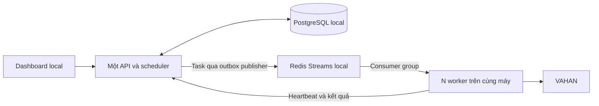

# Plan thay cơ chế 10 worker cố định bằng Redis Streams trên local

- **Ngày cập nhật:** 09/10/2026
- **Nhánh đối chiếu:** `ocr`
- **Trạng thái:** Smoke run local đã qua với API, PostgreSQL, Redis, dashboard và 3 runner; chưa chạy task VAHAN.

**Ghi chú cập nhật 10/10/2026:** Đây là tài liệu lịch sử của phương án Redis Streams. Source hiện chuyển queue báo cáo sang claim trực tiếp từ PostgreSQL, có migration riêng để bỏ outbox và Compose không còn service Redis. Stack Docker đang chạy cần được chuyển phiên bản sau khi các job hiện tại kết thúc.

## 1. Mục tiêu và phạm vi

Thay cơ chế khai báo sẵn 10 runner và API/scheduler chọn worker theo tên bằng **Redis Streams + Consumer Groups**. Worker tự đăng ký và tự nhận task khi rảnh. Kiểm chứng trên một máy local trước.

- Một service worker dùng chung, chạy N instance bằng cấu hình; không khai báo riêng `runner-2` đến `runner-10`.
- Bỏ giới hạn cứng 10 trong launcher, API, scheduler và UI; worker được nhận diện bằng ID tự sinh.
- Cấu hình riêng số instance và hạn mức task đồng thời, phù hợp CPU/RAM và tải VAHAN.
- Phục hồi task khi worker ngắt; kiểm soát commit kết quả để tránh ghi trùng.
- Giữ luồng báo cáo hoạt động: filters, UI Health, OCR, lưu báo cáo, pause/resume/cancel và retry.

Plan kết thúc ở nghiệm thu local. Loại khỏi phạm vi: Kubernetes/KEDA, tự co giãn worker khi hệ thống đang chạy, nhiều node, API nhiều replica, load balancer/Ingress, triển khai production và các giai đoạn mở rộng phía sau. Launcher local đánh giá tài nguyên mỗi lần khởi chạy để chọn số worker; operator vẫn có thể ghi đè bằng cấu hình.

## 2. Các điểm cần thay thế

| Vị trí hiện tại | Cơ chế cần thay | Kế hoạch cho local |
| --- | --- | --- |
| [compose.yaml](../../compose.yaml), [run-docker.py](../../scripts/run-docker.py) | Danh sách 10 service runner và launcher khởi chạy theo tên cố định. | Một service worker nhân bản thành N instance. |
| [worker_pool.py](../../apps/api-server/app/worker_pool.py), [API worker pool](../../apps/api-server/app/api/worker_pool.py), [model lịch chạy](../../apps/api-server/app/models/run_schedule.py), [worker-settings.ts](../../apps/web-ui/src/worker-settings.ts) và nơi sử dụng | `MAX_WORKERS = 10`, validation 1–10 và danh sách `playwright-N`. | Registry worker động; validation theo hạn mức cấu hình thay vì hằng số 10. |
| [run_scheduler.py](../../apps/api-server/app/run_scheduler.py) và luồng chạy thủ công | Chọn worker theo số thứ tự, chờ đủ worker cụ thể và gửi `job:assigned` vào room runner. | Tạo task chưa gắn worker rồi đưa vào queue; xử lý khi có worker ready và còn hạn mức. |
| [batch_queue.py](../../apps/api-server/app/repositories/batch_queue.py) | Claim phụ thuộc tên runner; cửa sổ checkpoint cố định 10 case. | Claim nguyên tử theo lease và hạn mức đồng thời; kích thước cửa sổ task cấu hình được. |
| [runner.mjs](../../apps/browser-runner/runner.mjs) | Nhận job được API chỉ định qua socket. | Consumer loop tự nhận task; đăng ký ID, readiness và heartbeat. |
| [run_diagnostics.py](../../apps/api-server/app/run_diagnostics.py) | Kiểm tra hostname runner theo danh sách cố định. | Lấy danh sách từ registry và kiểm tra heartbeat/readiness. |
| [postgres.py](../../apps/api-server/app/repositories/postgres.py), [main.py](../../apps/api-server/app/main.py) | Phục hồi startup đặt lại trạng thái job/runner. | Với task Redis, phục hồi theo lease hết hạn; không đánh lỗi công việc còn lease hợp lệ khi API local restart. |

Rà cả chạy thủ công và lịch chạy để cùng dùng một đường giao task, tránh bỏ sót giới hạn 10 ở UI hoặc API.

## 3. Mô hình chạy local

| Thành phần | Trách nhiệm |
| --- | --- |
| PostgreSQL | Lưu task, trạng thái phiên, attempt, lease, registry và báo cáo; là nguồn trạng thái nghiệp vụ. |
| Redis Streams | Phân phối task qua một consumer group; theo dõi message chưa ACK. |
| API/scheduler | Tạo task, kiểm tra hạn mức, xác nhận lease, ghi kết quả và cập nhật dashboard. |
| Publisher/recovery | Phát outbox và phục hồi task hết lease; chạy trong một tiến trình API local ở giai đoạn này. |
| Worker | Mỗi instance có ID, browser/profile riêng và xử lý một task tại một thời điểm. |
| Docker Compose | Khởi chạy các thành phần trên cùng máy và nhân bản service worker thành N instance. |

Redis phân phối công việc cho worker đã khởi chạy. Thêm/bớt instance do cấu hình Compose quyết định. Consumer Groups hỗ trợ chia message và ACK sau xử lý: [Redis XREADGROUP](https://redis.io/docs/latest/commands/xreadgroup/).

## 4. Cơ chế giao việc và phục hồi

1. API/scheduler tạo task và outbox trong cùng transaction PostgreSQL. Task chưa gắn worker.
2. Publisher phát message vào Redis Stream rồi ghi nhận đã phát. Message chứa ID task/phiên bản hợp đồng; dữ liệu nghiệp vụ được lấy qua API.
3. Worker ready đọc một message bằng `XREADGROUP`, yêu cầu API claim task. API kiểm tra trạng thái phiên, readiness và hạn mức rồi cấp lease/attempt nguyên tử trong SQL.
4. Worker gia hạn lease bằng heartbeat và thực hiện luồng VAHAN. Khi chưa được cấp lease, worker không chạy task; message được giữ để thử lại/phục hồi, không ACK như đã hoàn tất.
5. Worker gửi kết quả về API. API xác minh lease/attempt rồi lưu kết quả cùng trạng thái cuối trong transaction SQL.
6. Worker chỉ `XACK` sau khi API xác nhận đã lưu trạng thái cuối. Task hoàn tất nhưng mất ACK được nhận diện khi giao lại và ACK mà không chạy lại browser.
7. Recovery kiểm tra lease hết hạn trước khi thu hồi message pending và cấp attempt mới. Worker giữ lease cũ không được commit vào attempt mới.

Các quy tắc triển khai cần giữ:

- Message có thể được phát/giao lặp; claim và commit phải nhận diện task đang có lease hoặc đã hoàn tất để tránh xử lý/ghi trùng. Không giả định thao tác trên VAHAN chỉ xảy ra đúng một lần sau sự cố.
- Thời gian message pending không đủ kết luận worker chết. Recovery đối chiếu heartbeat và lease trước khi reclaim bằng [Redis XAUTOCLAIM](https://redis.io/docs/latest/commands/xautoclaim/).
- Phân biệt giao lại message với retry nghiệp vụ; giữ chính sách retry hiện có và không retry `NO_DATA` hợp lệ.
- Pause/resume/cancel và network gate được kiểm tra từ SQL khi claim và trong vòng đời task. Task tạm chưa đủ điều kiện phải có đường xử lý lại.
- Khi Redis gián đoạn, SQL giữ task/outbox; publisher/recovery đối soát và phát lại task đủ điều kiện khi phục hồi. Không xóa message còn cần cho recovery.
- Worker dừng có kiểm soát sẽ ngừng nhận việc mới và hoàn tất task đang chạy; dừng đột ngột được recovery xử lý sau khi lease hết hạn.

## 5. Số worker và các phụ thuộc trực tiếp

| Thông số | Ý nghĩa |
| --- | --- |
| Số instance local | Launcher đánh giá CPU/RAM Docker, RAM host còn trống và mức dùng runner để đề xuất N worker; giữ các replica hiện tại khi chạy lại để không ngắt job. Có thể ghi đè bằng cấu hình chạy. |
| Hạn mức đồng thời | Số task tối đa được cấp lease toàn hệ thống và từng phiên; kiểm tra trong SQL, không dựa vào số thứ tự worker. |
| Worker sẵn sàng | Instance có heartbeat hợp lệ, browser sẵn sàng và qua UI Health; lấy từ registry thực tế. |

Ví dụ: chạy 12 worker, đặt hạn mức toàn hệ thống là 6 thì tối đa 6 task xử lý cùng lúc. Nếu chỉ có 3 worker ready, phiên xử lý với 3 worker và các task khác chờ. Hạn mức local cần cấu hình phù hợp tài nguyên máy.

Các điều chỉnh đi kèm chỉ phục vụ cơ chế này:

- **Checkpoint:** kích thước cửa sổ task cấu hình được, chốt lúc tạo phiên và đủ lớn cho concurrency mong muốn. Giữ thứ tự kiểm tra/retry giữa các cửa sổ; nghiệm thu việc thay kích thước nhóm. Cửa sổ 10 hiện tại không được chặn phiên cấu hình chạy hơn 10 task đồng thời.
- **Options/Maker và UI Health:** chọn worker ready từ registry, giữ luồng hiện có và cơ chế giữ worker lúc planning; chưa thiết kế queue/pool riêng. Worker mới phải qua readiness/UI Health trước khi nhận report.
- **Socket.IO:** tiếp tục phục vụ dashboard và trao đổi phụ trợ hiện có; giao report task chuyển sang Redis Streams.
- **Browser/profile:** mỗi instance có vùng dữ liệu riêng; không dùng chung profile đang hoạt động giữa nhiều worker.
- **UI/API:** hiển thị worker thực tế, ready/busy/offline và task chờ; nơi chỉnh concurrency dùng hạn mức cấu hình. Giữ quyền quản trị hiện có.

## 6. Kế hoạch triển khai riêng cho local

Đã triển khai và khởi chạy stack local biệt lập cho các bước dưới đây. Smoke run xác nhận API, PostgreSQL, Redis, dashboard và ba runner cùng healthy; chưa chạy task tổng hợp hoặc truy cập VAHAN.

| Bước | Công việc | Trạng thái |
| --- | --- | --- |
| 1. Chốt hợp đồng | Rà luồng thủ công/lịch chạy; task, outbox, registry, lease/attempt, claim/commit và hạn mức. | Đã nối vào SQL queue, Redis Streams và scheduler; cần nghiệm thu lỗi giữa chừng. |
| 2. Chuẩn bị local | Redis persistence, PostgreSQL và một service worker nhân bản được; cách ly database test. | Đã chạy bằng project/volume riêng; healthcheck của các dịch vụ đều healthy. |
| 3. Thay đường giao task | Publisher/consumer/recovery; worker tự sinh ID, claim qua API, heartbeat và ACK sau commit; chạy thủ công/lịch. | Đã nối publisher, consumer, reclaim và ACK; chưa chạy task tổng hợp để xác minh end-to-end. |
| 4. Bỏ giới hạn cố định | Launcher, validation, registry, diagnostics, UI và checkpoint; nối planning/UI Health. | Đã bỏ hard cap 10 trong luồng runtime; Compose scale từ 1 lên 3 và PostgreSQL ghi nhận 3 ID riêng. |
| 5. Nghiệm thu local | Kiểm tra worker, lỗi giữa chừng, chống trùng, restart và luồng VAHAN. | Health/replica smoke run đã qua; task tổng hợp, restart mid-task và luồng VAHAN chưa chạy. |

Mỗi phiên thử local chỉ dùng một đường giao việc. Hoàn tất hoặc dừng có kiểm soát phiên socket cũ trước khi chạy phiên Redis; không dispatch cùng task qua cả socket lẫn Redis. Dùng dữ liệu test để có thể quay về phiên bản cũ mà không mất báo cáo hiện có.

## 7. Kiểm chứng và tiêu chí nghiệm thu local

| Kịch bản dự kiến | Điều kiện đạt |
| --- | --- |
| Chạy 1 → 3 → 12 worker với task giả lập, database test | Không sửa code hoặc thêm service tên riêng; ID không trùng; task chia cho worker rảnh. |
| Cho phép 12 task đồng thời trong một phiên giả lập | Validation, hạn mức toàn hệ thống và checkpoint không chặn ở 10. Nếu máy không đủ RAM cho 12 browser, dùng consumer giả lập và ghi rõ giới hạn kiểm chứng browser. |
| Thêm worker khi queue đang có task | Worker mới đăng ký, qua readiness rồi tự nhận việc; không lập lại danh sách runner. |
| Hạn mức đồng thời nhỏ hơn số worker | Active lease không vượt hạn mức, kể cả khi nhiều consumer claim cùng lúc. |
| Dừng worker giữa task | Task thu hồi sau khi lease hết hạn; kết quả từ lease cũ bị từ chối. |
| API commit nhưng mất ACK; publisher gửi trùng | Giao lại không tạo báo cáo trùng hoặc chạy lại task hoàn tất. |
| Restart API hoặc Redis; mất kết nối tạm thời | Task SQL được đối soát/phục hồi; lease hợp lệ không bị đánh lỗi hàng loạt. |
| Pause/resume/cancel, hết retry và `NO_DATA` | Đúng chính sách; task chờ không mất và task hủy không được thực thi mới. |

Nhân bản service dùng `--scale` của [Docker Compose](https://docs.docker.com/reference/cli/docker/compose/up/). Stack biệt lập đã smoke run từ 1 lên 3 runner; các kịch bản task và recovery bên dưới vẫn chờ nghiệm thu.

Kiểm chứng thêm luồng VAHAN thực tế:

- Chạy với 1 rồi 3 browser worker, trong hạn mức tài nguyên máy và tải VAHAN cho phép.
- Kiểm tra cả thủ công/lịch chạy: options/Maker, preflight UI Health, filters, OCR, tải/lưu báo cáo và dashboard.
- Đối soát task dự kiến với trạng thái cuối và báo cáo SQL; kiểm tra retry, `NO_DATA` và pause/resume/cancel.
- Ghi nhận ready/busy/offline, task chờ, pending, lease hết hạn, retry, thời gian xử lý và CPU/RAM để chọn cấu hình local.

Phạm vi hoàn tất khi worker động và Redis Streams đạt tiêu chí local trên. Không lập tiếp các giai đoạn hạ tầng khác.
