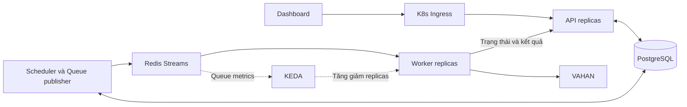

# Plan chuyển worker VAHAN sang Redis Streams và Kubernetes

**Ngày lập:** 09/10/2026  
**Nhánh đối chiếu:** `ocr`  
**Trạng thái:** Đề xuất kiến trúc và kế hoạch triển khai; chưa triển khai thay đổi trong plan này.

## 1. Mục tiêu

Thay cơ chế API chọn worker theo danh sách cố định rồi phát `job:assigned` vào Socket.IO room bằng hàng đợi Redis. Worker tự nhận việc khi rảnh; Kubernetes quản lý số replica và phân bổ pod trên các node.

Kết quả mong muốn:

- Không giới hạn cứng 10 worker trong Compose, launcher, API, scheduler hoặc UI.
- Không cần khai báo riêng `runner-2` đến `runner-10` hay danh sách `playwright-N`.
- Hạ tầng tự tăng/giảm worker theo tải và tài nguyên cho phép.
- Worker bị ngắt giữa chừng không làm mất task; kết quả được ghi có kiểm soát để tránh trùng.
- Lịch chạy, profile, báo cáo, OCR, UI Health, pause/resume và retry tiếp tục hoạt động khi worker thêm/bớt.

## 2. Chọn Redis Streams cho job

Redis Pub/Sub thuần phát message tới tất cả subscriber của channel và có thể mất message khi subscriber ngắt kết nối. Mô hình này phù hợp với thông báo; job báo cáo cần chia việc, xác nhận hoàn tất và phục hồi khi worker chết.

Đề xuất dùng **Redis Streams + Consumer Groups** cho hàng đợi thực thi. Các report worker cùng một consumer group; mỗi worker có consumer ID riêng. Message có thể được giao lại khi phục hồi, vì vậy xử lý và commit kết quả phải có cơ chế chống trùng.

| Thành phần | Trách nhiệm |
| --- | --- |
| Redis Streams | Lưu và phân phối message công việc, theo dõi message chưa được ACK. |
| Redis Pub/Sub | Thông báo cập nhật/wake-up nếu cần; trạng thái quan trọng vẫn đọc lại được từ SQL. |
| PostgreSQL | Nguồn trạng thái nghiệp vụ: task, attempt, lịch, lease, lỗi, lịch sử và báo cáo. |
| Kubernetes | Quản lý vòng đời và số replica của API/worker; phân bổ pod trên node. |
| KEDA | Điều chỉnh worker replicas dựa trên các chỉ số hàng đợi. |

Tài liệu: [Redis Pub/Sub](https://redis.io/docs/latest/develop/pubsub/), [Redis consumer groups](https://redis.io/docs/latest/commands/xreadgroup/).

## 3. Hiện trạng cần thay đổi

Luồng hiện tại là scheduler/API chọn `playwright-N`, claim case trong SQL rồi gửi `job:assigned` tới room `runner:<id>`. Worker nhận việc, trả trạng thái và xử lý các yêu cầu options/UI Health qua Socket.IO.

| Vị trí | Ràng buộc hiện tại | Hướng thay đổi |
| --- | --- | --- |
| [compose.yaml](../../compose.yaml), [run-docker.py](../../scripts/run-docker.py) | Khai báo/khởi động danh sách 10 runner. | Một service/image worker có thể nhân bản; K8s quyết định số replica. |
| [worker_pool.py](../../apps/api-server/app/worker_pool.py), model/API/UI | `MAX_WORKERS = 10`, validation và lựa chọn 1–10. | Tách concurrency nghiệp vụ khỏi số replica thực tế; giới hạn cấu hình được. |
| [run_scheduler.py](../../apps/api-server/app/run_scheduler.py) | Chọn worker theo số thứ tự, chờ số worker cụ thể và phát assignment vào room. | Phát task đủ điều kiện vào queue; worker tự nhận việc. |
| [batch_queue.py](../../apps/api-server/app/repositories/batch_queue.py) | Claim gắn với runner và xử lý tuần tự từng nhóm 10 case. | Claim theo lease; đổi checkpoint để nhiều lô có thể thực thi song song. |
| [runner.mjs](../../apps/browser-runner/runner.mjs) | Socket listeners cho job, options, preflight, cancel và heartbeat. | Consumer loop, đăng ký động, lease/heartbeat và API cập nhật trạng thái. |
| [run_diagnostics.py](../../apps/api-server/app/run_diagnostics.py) | Probe hostname `runner`, `runner-N`. | Diagnostics từ registry/heartbeat/readiness động. |
| [postgres.py](../../apps/api-server/app/repositories/postgres.py), [main.py](../../apps/api-server/app/main.py) | API startup đánh lỗi mọi job chưa kết thúc, xóa trạng thái runner/planning lease. | Phục hồi từng lease hết hạn; API restart không ngắt worker còn sống. |

**Checkpoint là một giới hạn riêng:** nếu vẫn đợi toàn bộ nhóm 10 case kết thúc trước khi mở nhóm tiếp theo, một lượt chạy khó sử dụng hơn 10 worker. Đề xuất kiểm tra/retry theo các lô độc lập, cho phép nhiều lô chạy song song. Đây là thay đổi cách lập lịch; chính sách số lần retry và `NO_DATA` cần được bảo toàn và nghiệm thu.

## 4. Kiến trúc đề xuất

Ingress cân bằng request giữa các API replica. Consumer group phân phối công việc giữa các worker. Browser worker không cần một HTTP load balancer riêng để nhận job.

Các service deploy dự kiến gồm API, scheduler/publisher/recovery, worker, Redis và PostgreSQL. Redis/PostgreSQL dùng chung giữa các replica. Scheduler có cơ chế leader để tránh tạo lịch trùng.

## 5. Luồng task và phục hồi

1. API/scheduler tạo task chưa gắn worker và bản ghi outbox trong cùng transaction PostgreSQL. Outbox là danh sách message cần phát ra Redis.
2. Publisher đọc outbox và đưa message vào Redis Stream. Message chứa ID và phiên bản hợp đồng; filters và dữ liệu nghiệp vụ có thể lấy từ SQL. Workbook, ảnh CAPTCHA và credentials không đưa vào queue.
3. Worker rảnh đọc message bằng consumer group, kiểm tra task đủ điều kiện rồi lấy lease bằng thao tác nguyên tử. Khi đó mới gắn worker và attempt vào task.
4. Worker gia hạn lease qua heartbeat, cập nhật trạng thái và xác minh bộ lọc. Trước Apply, API phải chấp nhận trạng thái/filters và lease còn hợp lệ.
5. Worker thực hiện VAHAN, gửi kết quả về API. API xác minh attempt/lease và commit PostgreSQL.
6. Sau khi kết quả hoặc trạng thái cuối đã được lưu, worker ACK message bằng `XACK`.
7. Nếu mất ACK sau commit, message có thể được giao lại. Worker/API nhận diện task đã hoàn tất và ACK mà không chạy lại thao tác browser.
8. Nếu worker chết, recovery xác minh lease đã hết hạn rồi thu hồi message/task để phục hồi theo chính sách retry.

Các nguyên tắc bắt buộc:

- Mỗi attempt có lease token hoặc generation; worker cũ mất quyền không được commit vào attempt mới.
- Reclaim dựa trên heartbeat và lease hết hạn. Thời gian pending dài không tự chứng minh worker đã chết.
- Phân biệt message được giao lại với một lần retry nghiệp vụ; redelivery không tự tăng số lần thất bại.
- Pause/cancel và network gate lưu trong SQL, được kiểm tra khi nhận việc và trong vòng đời lease. Pub/Sub có thể báo thức nhanh, nhưng không là nguồn trạng thái duy nhất.
- Có giới hạn retry và nơi ghi nhận task hết lượt phục hồi; `NO_DATA` hợp lệ không bị retry.
- Publisher/recovery đối soát task SQL với queue để có thể tái phát công việc đủ điều kiện sau sự cố Redis.
- Chỉ dọn stream theo chính sách retention an toàn, không xóa payload của message còn cần phục hồi.

Thiết kế hướng tới giao việc ít nhất một lần và commit có chống trùng. Thao tác trên trang VAHAN có thể phải thực hiện lại sau sự cố; không coi toàn bộ thao tác ngoài hệ thống là exactly-once.

Tài liệu: [XREADGROUP và ACK](https://redis.io/docs/latest/commands/xreadgroup/), [XAUTOCLAIM](https://redis.io/docs/latest/commands/xautoclaim/).

## 6. Worker động và các tác vụ phụ trợ

- Worker dùng Pod UID/UUID, tự đăng ký và báo heartbeat/readiness; API không suy luận quyền nhận việc từ số thứ tự trong tên.
- Worker mới chỉ được nhận report sau khi browser sẵn sàng và UI Health đạt hợp đồng/phiên bản hiện hành.
- Browser state lưu theo browser profile/session có lease riêng, tách khỏi Pod UID. Một profile cần được kiểm soát để tránh dùng cùng cookie đồng thời trên nhiều worker.
- Tải options/Maker và UI Health chuyển thành request/task có `requestId`, timeout và kết quả lưu được. Có thể tách queue/pool planning để các yêu cầu này không bị report queue làm chậm.
- UI hiển thị worker ready/busy, queue backlog và chế độ auto; concurrency của một lượt chạy là hạn mức nghiệp vụ, khác với số pod hạ tầng đang chạy.
- Khi SIGTERM, worker chuyển sang draining, ngừng nhận task mới và hoàn tất hoặc bàn giao job hiện tại theo lease.

## 7. API nhiều replica và Kubernetes autoscale

API startup phải bỏ cơ chế đánh lỗi toàn bộ job chưa kết thúc. Việc phục hồi chuyển sang service recovery quét lease hết hạn. Scheduler và network monitor cần chạy theo cơ chế leader; migration chạy trong bước deploy riêng.

Dashboard có thể tiếp tục dùng Socket.IO để cập nhật tiến độ. Các API replica phối hợp phát sự kiện qua Redis manager; dashboard đọc lại SQL khi reconnect. Nếu bật long-polling, Ingress cần cấu hình session affinity theo yêu cầu Socket.IO.

Worker Deployment được KEDA tăng/giảm dựa trên backlog đủ điều kiện, lag và công việc đang xử lý. Không dùng riêng `XLEN` làm số job chờ vì stream có thể chứa message đã hoàn tất. Cũng không giảm replica chỉ vì lag bằng 0 trong khi worker vẫn đang xử lý message pending.

Các cấu hình đặt trong manifest/Helm values:

- `minReplicaCount`, `maxReplicaCount`, ngưỡng queue và thời gian ổn định khi giảm replica.
- CPU/RAM requests/limits, shared memory và thời gian kết thúc pod phù hợp với Chromium.
- Giới hạn concurrency/rate dùng chung khi truy cập VAHAN.
- Redis persistence/volume, authentication, chính sách không tự loại bỏ message queue khi thiếu bộ nhớ và retention.
- Kết nối Redis/PostgreSQL qua mạng nội bộ; credential qua Kubernetes Secrets.

Giai đoạn đầu duy trì năng lực worker/planning sẵn sàng. Scale-to-zero chỉ bật sau khi xác nhận planning có thể khởi động độc lập và không tạo vòng chờ worker. Việc tăng số pod và tăng số node là hai cấu hình hạ tầng riêng.

Tài liệu: [KEDA Redis Streams scaler](https://keda.sh/docs/2.21/scalers/redis-streams/), [Kubernetes Pod termination](https://kubernetes.io/docs/concepts/workloads/pods/pod-lifecycle/#pod-termination), [Socket.IO horizontal scaling](https://python-socketio.readthedocs.io/en/stable/server.html#horizontal-scaling), [Redis persistence](https://redis.io/docs/latest/operate/oss_and_stack/management/persistence/).

## 8. Các giai đoạn triển khai

| Giai đoạn | Công việc | Đầu ra để review |
| --- | --- | --- |
| 1. Hợp đồng và schema | Thiết kế task, attempt, worker registry, lease/generation, outbox và trạng thái pause/cancel. | Hợp đồng message/API, state transitions và migration dự kiến. |
| 2. Queue Redis | Publisher, consumer group, ACK sau commit, chống trùng, reclaim, retry và đối soát SQL/Redis. | Luồng giao việc có thể phục hồi khi publisher/worker/Redis ngắt. |
| 3. Worker động | ID tự sinh, consumer loop, heartbeat/readiness, browser-profile lease và draining. | Một image chạy được nhiều replica, không cần danh sách tên worker. |
| 4. Luồng phụ trợ và checkpoint | Chuyển options/UI Health/cancel khỏi worker socket; thay checkpoint tuần tự để tận dụng concurrency. | Profile preview, OCR, preflight, pause/resume và retry hoạt động với worker động. |
| 5. API/scheduler nhiều replica | Bỏ global startup recovery, tách scheduler/network monitor/reaper, thêm Redis manager cho UI events. | Rolling restart API không đánh lỗi job của worker còn sống. |
| 6. Hạ tầng | Compose để kiểm chứng, Kubernetes Deployments/Secrets/probes/resources và KEDA autoscale. | Worker tăng/giảm bằng cấu hình deploy, có metrics và giới hạn tải VAHAN. |
| 7. Chuyển đổi và tài liệu | Transport theo session, drain phiên cũ, chuyển phiên mới sang Redis, cập nhật README/deployment và rollback. | Kế hoạch cutover có thể theo dõi và phục hồi. |

Thứ tự ưu tiên: queue đáng tin cậy → worker động → API/scheduler nhiều replica → Kubernetes/KEDA autoscale.

## 9. Chuyển đổi và rollback

- Mỗi session chọn một transport. Không đồng thời dispatch cùng case qua socket và Redis.
- Hoàn tất hoặc drain session dùng transport cũ trước khi chuyển.
- Triển khai thử với các phiên mới; theo dõi task chờ, active leases, pending messages, retry và thời gian xử lý.
- Khi rollback, ngừng tạo session Redis mới và xử lý/drain các task Redis đã tiếp nhận trước khi quay lại transport cũ.
- Dữ liệu báo cáo và lịch sử SQL được giữ để đối soát giữa hai cơ chế.

## 10. Tiêu chí nghiệm thu

- Chạy 1 → 3 → trên 10 worker bằng cấu hình deploy, không sửa mã hoặc khai báo thêm service tên riêng.
- Kiểm chứng số replica lớn bằng fixture/disposable database trước khi chạy VAHAN với hạn mức phù hợp.
- Worker chết giữa OCR, chờ kết quả hoặc gửi workbook: task được phục hồi, không mất trạng thái và không ghi trùng dữ liệu.
- API rolling restart không ngắt công việc còn giữ lease hợp lệ.
- Redis restart hoặc mất kết nối: publisher/recovery đối soát và phục hồi công việc chưa hoàn tất từ SQL.
- Worker có lease cũ không được cập nhật/commit vào attempt mới.
- Pause/resume/cancel, `NO_DATA`, retry, profile options và UI Health đúng khi worker thêm/bớt.
- Autoscale tăng theo tải và giảm an toàn; không coi message lịch sử là backlog.
- Có metrics: queue lag, pending, tuổi job chờ lâu nhất, ready/busy workers, lease expiry, retry, throughput, thời gian ghi SQL và CPU/RAM.
- Có bằng chứng đối soát task dự kiến với trạng thái cuối và báo cáo đã commit.

