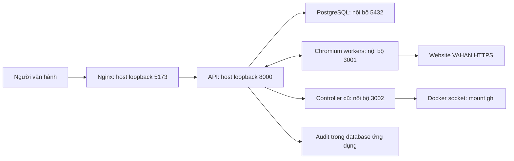
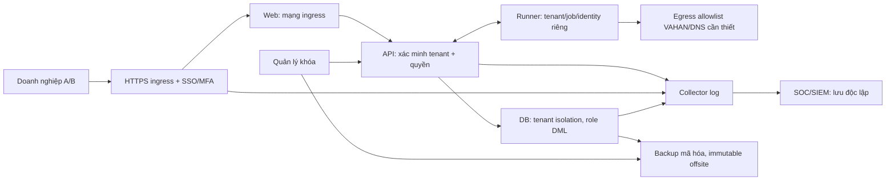

# Đánh giá bảo mật SOC và điều kiện production — VAHAN Automation

Ngày đánh giá: **08/10/2026**, múi giờ Việt Nam. Phạm vi: `/Users/mac/Desktop/vahan-automation`, mã nguồn và stack Docker trên máy hiện tại. **Người dùng đã xác nhận mô hình production là dịch vụ cho nhiều doanh nghiệp.** Báo cáo vì vậy yêu cầu cách ly tenant, quản trị riêng từng khách hàng và bảo vệ tenant trên mọi luồng dữ liệu. SLA, SSO, thời hạn lưu dữ liệu và cách công bố dịch vụ chưa được xác nhận.

## 1. Kết luận để quyết định triển khai

**Chưa đủ điều kiện nghiệm thu production cho nhiều doanh nghiệp; đề xuất NO-GO cho việc cấp quyền khách hàng đến khi các hạng mục P0/P1 được xử lý và kiểm tra lại.** Kiến trúc hiện chưa có ranh giới tenant, admin có quyền toàn hệ thống, dữ liệu báo cáo dùng chung. Hệ thống còn container giữ quyền điều khiển Docker, credential worker dùng chung, database superuser, cảnh báo thư viện chưa xử lý, thiếu giám sát SOC và chưa có bằng chứng khôi phục sau sự cố.

Đánh giá này đã thực hiện kiểm tra trực tiếp và quét thành phần; đây không phải chứng nhận tuân thủ hoặc cam kết hệ thống không còn lỗ hổng. Không thực hiện khai thác phá hoại, thử tải lớn hoặc kiểm thử website VAHAN bên ngoài. Các kiểm tra ứng dụng dùng GET, token sai, storage mock và SQL read-only. Trong công việc đánh giá này không thay đổi cấu hình runtime, không restart container, không chạy migration và không thay đổi tài khoản/dữ liệu production.

**Môi trường có thay đổi trong khi đánh giá:** lúc đầu API còn phát token không hết hạn và database ở revision `0011_ui_contract`. Snapshot cuối lúc **20:48:30** đã xác nhận `tokenTtlSeconds=43200`, `idleTimeoutSeconds=3600`, revision `0012_auth_session_limits` và SHA-256 trùng mã nguồn cho sáu file API được kiểm tra. Ghi nhận giới hạn phiên đã được triển khai; không liệt kê nó là lỗ hổng đang mở. API/web được quét lại theo image mới. Việc triển khai này được quan sát từ môi trường, không phải thay đổi do công việc đánh giá này thực hiện.

Tài liệu đối chiếu: [OWASP ASVS 5.0.0](https://owasp.org/projects/asvs) cho kiểm soát ứng dụng và [NIST CSF 2.0](https://www.nist.gov/cyberframework) cho quản trị, bảo vệ, phát hiện, ứng phó và khôi phục. Các mục tiêu nghiệm thu bên dưới là đề xuất cho hệ thống này, không phải tuyên bố đã hoàn tất mọi yêu cầu của hai bộ tiêu chuẩn.

## 2. Hồ sơ bằng chứng và giới hạn

| Hồ sơ | Nội dung | Cách sử dụng |
| --- | --- | --- |
| [evidence-2026-10-08.json](evidence-2026-10-08.json) | Container, mount, quyền, cổng, HTTP, revision SQL, số liệu tổng hợp, hash mã nguồn/runtime và kiểm tra token | Snapshot runtime; không chứa token, cookie, mật khẩu, nội dung báo cáo hoặc tên tài khoản |
| [scan-results-2026-10-08.json](scan-results-2026-10-08.json) | Cảnh báo High/Critical theo package, phiên bản hiện tại/bản sửa, npm audit, rà soát secret | Backlog vá lỗi; số lượng scanner không phải số đường khai thác đã chứng minh |
| [security-audit.py](../../scripts/security-audit.py) | Công cụ thu thập bằng chứng read-only | Chạy lại trước/sau thay đổi; không tự sửa lỗi và không tự quét CVE |

Snapshot mã nguồn cuối: branch `feat/filter`, commit `2bc878eed2640c3f6560657afee49aef5b956cf5`. Checkout có thay đổi khác đang diễn ra; hash trong bằng chứng xác định sáu file API đã so sánh. Không suy ra toàn bộ repository trùng image chỉ từ sáu hash này.

Đã kiểm tra mã xác thực/phân quyền, HTTP/Socket.IO, lưu trạng thái browser, upload/export Excel, SQL, Docker/Compose, Dockerfile, Nginx, launcher, backup, workflow CI và lịch sử Git local. Trivy 0.74.0 quét các image API/web/PostgreSQL/runner và rootfs của controller cũ. Rootfs controller không gồm mounted volume, symlink, hardlink hoặc special file. Không quét toàn bộ Chromium bằng phương pháp chuyên biệt, không kiểm tra target host Ubuntu/Windows, firewall/EDR/IdP/SIEM bên ngoài, registry hay backup offsite.

Gitleaks 8.30.1 kiểm tra **25 commit local** qua tất cả ref local và **238 file text tracked** trong working tree. Không bao gồm ref remote chưa fetch, mọi file ignored hoặc lịch sử của repository khác. Kết quả không chứng minh chưa từng lộ secret ở các kênh khác.

## 3. Hệ thống quan sát được



Các thành phần dùng chung mạng `vahan-automation_default`. Socket và API runner sử dụng một secret chung. Controller vẫn chạy dù đã bị loại khỏi Compose hiện tại. API phiên bản mới sử dụng pool SQL; controller còn lại cần được loại bỏ bằng một thay đổi triển khai có kiểm soát. Schema không có các cột tenant/organization phổ biến đã kiểm tra; RLS tắt trên bảy bảng nghiệp vụ/identity được kiểm tra. `scope_key` là phạm vi báo cáo, chưa có ACL tenant; không thể dùng nó thay cho ranh giới doanh nghiệp.

Snapshot cuối có 14 container của project, 10 container đang chạy, trong đó có 6 worker; runner 7/8 dừng, runner 9/10 chưa chạy và còn mount OCR host từ cấu hình cũ. Không kết luận trạng thái worker dừng là sự cố: số worker có thể đang được vận hành thay đổi. Database khoảng **5,08 GB**, có 31.208 job COMPLETED, 11.110 NO_DATA và 176.174 audit event; số liệu chỉ là snapshot, không phải kiểm chứng tính đầy đủ của báo cáo.

## 4. Kiểm soát đã có và đã kiểm tra

| Kiểm soát | Bằng chứng | Phạm vi kết luận |
| --- | --- | --- |
| HTTP yêu cầu đăng nhập | `/api/users`, `/api/audit` không token và `/api/jobs` với token sai trả 401; proxy web cũng trả 401 | Những request đã kiểm tra bị từ chối |
| RBAC admin/member | 5 test tại `verification/test_permissions.py` pass, dùng storage mock | Có kiểm tra chặn chức năng quản trị và lệnh socket; không phải thử toàn bộ quyền trên runtime |
| Socket.IO xác thực namespace | `/ui` và `/runner` không chấp nhận credential sai trên runtime | Handshake công khai không đồng nghĩa truy cập namespace đã xác thực |
| Giới hạn phiên | API công bố 12 giờ tuyệt đối/60 phút idle; migration 0012 hiện diện; 7 assertion token local pass | Cơ chế đã triển khai; cần thử idle/logout/role change trên staging và UI thực tế |
| Hash mật khẩu | PBKDF2-HMAC-SHA256 600.000 vòng, salt ngẫu nhiên; hash cả username không tồn tại | Có bảo vệ lưu mật khẩu; vẫn cần chống dò mật khẩu và MFA |
| Mã hóa state browser | `Fernet` tại `api/data.py`; DB lưu `encrypted_state` | Bảo vệ blob state ở DB; API được phép vẫn giải mã và trả state |
| Container API/runner | User `vahan`/`pwuser`, runner có seccomp; không container nào privileged | Một phần hardening; chưa có resource/capability policy đầy đủ |
| Giới hạn đọc file | Upload 50 MB; XLSX giới hạn ZIP expanded 250 MB, 10.000 entry, 500.000 row | Có giới hạn; chưa có quota tổng và kiểm soát thời gian parser |
| Export tránh công thức ngoài ý muốn | Nhãn nguồn được gán cell type text trong `annual_export.py` | Giảm rủi ro formula injection cho export này |
| Cổng và secret file | Web/API bind `127.0.0.1`; PostgreSQL/runner/controller không publish host port; `.docker.env` và API `.env` mode 0600, ngoài Git | Giảm phạm vi tiếp cận trên host; chưa chứng minh mạng production được cấu hình đúng |
| Backup local | 7 database dump; thư mục 0700, dump 0600 | Có bản sao local; chưa có bằng chứng restore thành công/offsite |

Web `.env` mode 0644 chỉ chứa `VITE_API_URL` ở thời điểm kiểm tra; không ghi nhận đây là lộ mật khẩu. Không tìm thấy bằng chứng cho phép truy cập dữ liệu nghiệp vụ bằng request vô danh đã thử, hoặc bằng token UI bị sửa.

## 5. Danh sách rủi ro và yêu cầu khắc phục

Severity mô tả tác động theo bối cảnh quan sát. P0: xử lý trước khi mở rộng truy cập; P1: điều kiện trước nghiệm thu; P2: hoàn thiện có thời hạn. Những mục ghi “chưa xác minh” là khoảng trống bằng chứng, không khẳng định hạ tầng bên ngoài không có kiểm soát.

| ID | Mức / ưu tiên | Phát hiện, bằng chứng | Khắc phục và điều kiện đóng |
| --- | --- | --- | --- |
| SOC-01 | **Critical / P0** | `worker-control` vẫn running; mount ghi `/var/run/docker.sock`; chạy bằng user mặc định của image. Source Compose đã bỏ controller, runtime còn orphan | Xác nhận API mới không cần controller, kết thúc/drain công việc rồi gỡ đúng controller. Đóng khi inventory không còn Docker socket trong bất kỳ container ứng dụng nào. Không phải đã chứng minh RCE; nếu controller bị chiếm, Docker daemon trở thành phạm vi ảnh hưởng. Trên Mac daemon thuộc VM Docker Desktop, quyền truy cập host phụ thuộc các mount được chia sẻ |
| SOC-02 | **High / P0** | Secret runner chung cũng được controller chấp nhận: GET `/workers` trả 200. Cùng credential với hai header identity khác nhau lấy `/runner-state/playwright-1` và `playwright-2` đều 200 | Dùng credential riêng cho từng worker, identity do server ràng buộc với credential; không tin header tự khai. Thu hồi secret cũ theo kế hoạch sau khi worker đổi token. Đóng khi worker A không đọc/ghi state, artifact hoặc kết quả của worker B, cũng không có quyền controller |
| SOC-03 | **High / P1** | Role `vahan` của API có `superuser`, `createRole`, `createDb`, `bypassRls` | Tách role migration, role runtime DML và role backup. Runtime không sở hữu schema/audit, không superuser/CREATEDB/CREATEROLE/BYPASSRLS. Đóng khi thử DML cần thiết thành công và ALTER/DROP/tạo role/xóa audit bị từ chối |
| SOC-04 | **High / P1** | Trivy ghi nhận High/Critical ở cả 5 thành phần; image PostgreSQL/runner và Python cryptography có bản vá chưa áp dụng; xem mục 6 | Triage theo vendor, code path, khả năng tiếp cận và KEV nếu có; rebuild từ base được vá, chốt phiên bản và kiểm tra chức năng. Đóng khi không còn Critical/High có khả năng khai thác chưa xử lý hoặc chưa có ngoại lệ được ký, có owner và ngày hết hạn |
| SOC-05 | **High / P1** | Không thấy rate limit/lockout theo rủi ro hoặc MFA/SSO trong auth API, Nginx và cấu hình stack. Mỗi lần thử mật khẩu sử dụng KDF tốn CPU | Backend giới hạn theo account/IP và tổng tải KDF; gateway bảo vệ thêm, MFA bắt buộc cho admin qua IdP hoặc cơ chế đã kiểm thử. Đóng khi request vượt ngưỡng nhận 429, có log/cảnh báo, không thể bỏ qua qua đường API/socket khác |
| SOC-06 | **High / P1** | Container không giới hạn CPU/RAM; log driver `json-file` không có rotation option ở container. Export có thể nạp tới khoảng 1 triệu dòng và dựng workbook trong RAM; parser có thể xử lý file expanded 250 MB | Đo tài nguyên từng worker/API rồi đặt CPU/RAM/PID limit, log rotation, quota upload/export và concurrency. Parser/export chạy trong worker riêng với timeout có thể kết thúc. Đóng khi thử tải hợp lệ và file giới hạn trên staging không gây OOM, đầy đĩa hoặc mất điều khiển UI |
| SOC-07 | **High / P1** | Audit nằm cùng DB ứng dụng; mutation audit thiếu principal cho login sai, source IP/request ID; GET export không được middleware mutation ghi. Không thấy collector/SIEM/cảnh báo trong repo/stack được kiểm tra | Bổ sung security event có cấu trúc, theo dõi tải/xuất dữ liệu và thay đổi quyền; chuyển log ra nơi ứng dụng không có quyền sửa/xóa; thiết lập rule và trực xử lý. Đóng khi sự kiện giả lập tạo cảnh báo và có ticket/timeline xử lý; xác minh hệ thống SOC bên ngoài nếu đã tồn tại |
| SOC-08 | **High / P1** | Backup local lưu database.dump cùng `.docker.env`, không mã hóa archive ở script; bản mới nhất 07/10 22:43 Việt Nam, khoảng 22 giờ trước snapshot cuối. Chưa thấy bằng chứng restore/offsite/PITR | Backup mã hóa offsite/immutable, tách quản lý key khỏi archive, theo dõi độ mới và restore drill. Đóng bằng restore DB và browser state ở môi trường riêng, kiểm tra dữ liệu và đo RPO/RTO đã được doanh nghiệp chấp nhận |
| SOC-09 | **Medium / P1** | Stack cung cấp HTTP; Nginx thiếu CSP, frame restriction, nosniff/referrer policy. Chưa có endpoint ingress production để xác minh TLS | HTTPS ingress + VPN/access policy; headers áp dụng cả response lỗi; HSTS ở nơi kết thúc HTTPS; CSP thử trên staging. Nếu HTTP được mở cho mạng không tin cậy, nâng rủi ro lên High. Đóng bằng kiểm tra tên miền/cert, route bypass và response thực tế |
| SOC-10 | **Medium / P1** | Engine.IO chấp nhận Origin `https://security-audit.invalid`, phản hồi Access-Control-Allow-Origin và credentials; Socket.IO mặc định `*` | Allowlist chính xác origin dashboard cho transport HTTP và WebSocket, giữ namespace authentication; runner Node thường không gửi Origin nên kiểm tra tương thích. Đóng khi origin ngoài allowlist bị chặn, origin chuẩn/runner hợp lệ vẫn hoạt động. Chưa chứng minh đọc dữ liệu khi không có token |
| SOC-11 | **Medium / P1** | Web, API, database, browser worker và controller ở một Docker network; PostgreSQL SSL off; các rule loopback/local trust, mạng remote SCRAM | Tách ingress/app/database/runner network; runner không truy cập DB/Docker; egress có allowlist và DNS cần thiết. SCRAM cho kết nối app; TLS nếu vượt host/trust boundary; rà soát local trust. Đóng bằng connectivity matrix và thử deny trên staging |
| SOC-12 | **Medium / P2** | Bearer token được lưu `localStorage` trong UI | Ưu tiên session cookie HttpOnly/Secure với CSRF/Origin policy hoặc BFF/SSO phù hợp Socket.IO. Nếu tiếp tục bearer storage, phải chốt rủi ro, CSP, TTL và chính sách thiết bị. Đây là tác động nếu xảy ra XSS, không phải bằng chứng đã tìm thấy XSS |
| SOC-13 | **Low / P2** | `/docs` và `/openapi.json` vô danh trả 200 trên API loopback; server version lộ ở response | Tắt/protect docs ở production và ẩn version; kiểm tra ingress không mở route phụ. Không tự coi schema công khai là bypass auth |
| SOC-14 | **Low / P2** | Gitleaks phát hiện password literal trong `.env.example` hiện tại/lịch sử và key trong manifest extension cũ | Thay password mẫu bằng placeholder + hướng dẫn sinh secret. Giá trị lịch sử không trùng bootstrap password runtime hoặc account active đã kiểm tra; manifest key là public key. Không kết luận secret production hiện bị lộ, không rewrite history hoặc rotate hàng loạt chỉ dựa trên các cảnh báo này |
| SOC-15 | **Critical / P0 — tenant isolation** | Member được đọc/export dataset dùng chung; annual report không có tenant ACL. Admin bỏ qua owner filter và quản trị cả lịch của admin khác; regression test hiện xác nhận hành vi đó. Không tìm thấy tenant model, tenant claim hay tenant RLS | Bổ sung tenant/membership/role riêng; tenant context do server xác minh; bảo vệ mọi API, socket, queue, export và browser state. Không cấp role admin hiện tại cho khách hàng. Đóng bằng bộ thử A/B cho mọi tài nguyên và kiểm tra role database không bypass RLS nếu dùng pooled DB. Chưa kết luận đã xảy ra rò rỉ giữa khách hàng thật |
| SOC-16 | **Medium / P1** | Python dependency có khoảng version, không thấy lockfile chứa hash; base image dùng tag; workflow kiểm tra chức năng chưa có security gate/SBOM/signature. Một số security verification không nằm trong workflow hiện tại | Lock Python có hash, release image theo digest, quét source/dependency/image/secret, phát SBOM và provenance, ký image; đưa quyền/session/password vào CI. Đóng khi PR có kết quả và production deploy đúng digest đã kiểm tra |
| SOC-17 | **Khoảng trống SLA / P1 nếu cần HA** | Một API, một DB primary, một host; restart recovery làm các thao tác browser dở dang FAILED để retry | Chốt SLA/RPO/RTO, thiết kế recovery idempotent; HA/PITR theo SLA. Đóng bằng diễn tập host/DB/API failure trên staging và chứng minh không mất hoặc ghi trùng kết quả |

Docker socket là quyền nhạy cảm theo [hướng dẫn bảo vệ daemon của Docker](https://docs.docker.com/engine/security/protect-access/). `read_only` và `cap_drop` trên controller không giới hạn các thao tác mà một tiến trình có thể gửi qua socket đó. Không khuyến nghị khắc phục chỉ bằng đổi mount socket thành `:ro`.

## 6. Kết quả quét dependency và image

Các số dưới đây là **package/advisory instance**: cùng một CVE xuất hiện ở nhiều package có thể được đếm nhiều lần. Cột unique là advisory khác nhau trong từng thành phần; không cộng thành số lỗ hổng độc lập của toàn hệ thống. Mức scanner cần đối chiếu vendor và điều kiện khai thác.

| Thành phần | Critical instance | High instance | Critical unique | High unique | High/Critical instance có bản sửa |
| --- | ---: | ---: | ---: | ---: | ---: |
| API | 2 | 56 | 2 | 16 | 3 |
| Web/Nginx | 2 | 59 | 1 | 42 | 61 |
| PostgreSQL image | 20 | 126 | 10 | 60 | 80 |
| Browser runner image | 0 | 12 | 0 | 10 | 9 |
| Controller cũ | 2 | 53 | 2 | 13 | 0 |

“Không có bản sửa” không có nghĩa an toàn; cần kiểm tra trạng thái vendor, gỡ component không dùng, giới hạn khả năng tiếp cận và ghi ngoại lệ có ngày đánh giá lại. Tại thời điểm quét, không thực hiện exploit hoặc kết luận mọi cảnh báo có thể khai thác từ Internet.

Npm audit lockfile dashboard có **1 High**: `source-map-js` 1.2.1, advisory [GHSA-68fv-2mgg-jv7q](https://github.com/advisories/GHSA-68fv-2mgg-jv7q), bản vá 1.2.2. Đây là dependency của chuỗi build/Vite; runtime web phục vụ static bằng Nginx. Không có bằng chứng advisory này là đường tấn công vào Nginx đang chạy. Lockfile ứng dụng runner không có advisory npm được trả về, nhưng **runner image vẫn có cảnh báo OS và thư viện npm CLI** ngoài lockfile ứng dụng.

API dùng `cryptography` 46.0.7; range `<47` trong pyproject loại trừ các bản sửa scanner đề xuất. Các advisory PKCS#7/X.509 phải đánh giá đúng code path: chức năng được xem xét trong hệ thống là Fernet, chưa tìm thấy endpoint PKCS#7/X.509 nhận dữ liệu tấn công. Advisory wheel OpenSSL [của nhà duy trì cryptography](https://github.com/pyca/cryptography/security/advisories/GHSA-537c-gmf6-5ccf) ghi mức Moderate, trong khi scanner ghi High; báo cáo giữ số scanner và yêu cầu triage, không tự nâng thành khai thác Fernet đã xác nhận. Việc nâng major phải thử giải mã ciphertext cũ, database migration, session và luồng báo cáo.

Ví dụ vendor package cần xử lý: PostgreSQL image có `libgnutls30` 3.7.9-2+deb12u5; scanner đề xuất deb12u7 cho [CVE-2026-33845 trong Debian Security Tracker](https://security-tracker.debian.org/tracker/CVE-2026-33845). Đây là cảnh báo thư viện trong image, không tự chứng minh PostgreSQL SQL endpoint có RCE.

## 7. Kiến trúc production đề xuất



Chốt phiên bản release bằng digest và Git SHA; ghi migration version, SBOM và kết quả kiểm tra cùng release. Không container nghiệp vụ nào giữ Docker socket. Hạn chế quyền host/Docker admin, SSH qua VPN và MFA; EDR, vá OS và firewall trên máy production cần bằng chứng của đội hạ tầng.

### Ranh giới bắt buộc giữa các doanh nghiệp

Thiết kế identity gồm tenant, user và membership; phân biệt `platform_admin`, `tenant_admin`, operator và viewer. Chọn tenant từ membership đã xác thực ở server, không tin tenant ID truyền qua header/query/body. Tài khoản thuộc nhiều tenant phải chọn một tenant hoạt động; request và job đều giữ context đó. Platform support truy cập dữ liệu khách hàng theo cơ chế được cấp, có thời hạn và audit, thay vì dùng quyền toàn cục mặc định.

| Luồng | Ràng buộc tenant cần có | Thử nghiệm đóng rủi ro |
| --- | --- | --- |
| SQL và báo cáo | Tenant ID trên dữ liệu riêng, membership, unique key/FK có tenant; pooled DB dùng RLS với runtime không bypass, hoặc database riêng mỗi tenant | Tenant A đổi dataset/resource ID của B vẫn bị từ chối; query thiếu tenant không trả dữ liệu B |
| Admin và tài khoản | Tenant admin chỉ quản lý user, role, lịch và cấu hình của tenant mình | Tenant admin A không nâng platform role, reset user B, khóa/xóa tenant B |
| HTTP và export/file | ACL khi list/get/search/history/export/download/delete/restore; cả URL cũ và request background | Không đọc metadata, số dòng, tên file hoặc nội dung B bằng UUID/URL đã biết |
| Socket.IO | Membership tại connect và từng event; room chứa tenant ID; revoke/đổi quyền áp dụng ngay | Không join room B hoặc nhận report/captcha/status B |
| Queue/scheduler/worker | Job gắn tenant; claim/lease/result/upload kiểm tra tenant/job/identity; quota và fairness theo tenant | Worker A không gửi kết quả vào job B; tenant nhiều job không làm tenant khác mất dịch vụ |
| Browser state | Context/cookie/cache riêng theo tenant + worker/session; không dùng một state chung xuyên tenant | Chuyển job sang tenant B không giữ cookie/token/storage của A |
| Log/backup/restore | Tenant label có cấu trúc; khách hàng chỉ đọc log của mình; backup/key và retention theo tenant | Restore/xóa tenant A không thay đổi B; log khách hàng không chứa secret hay thông tin B |

Có thể duy trì kho VAHAN công khai dùng chung nếu doanh nghiệp chốt đây là dữ liệu tham chiếu công khai. Cấu hình crawl, danh tính, credential, lịch chạy, browser state, audit và dữ liệu riêng của khách hàng vẫn phải tách tenant. Không tự gán dữ liệu cũ cho mọi tenant: cần phân loại, kế hoạch backfill và đối chiếu quyền trước migration.

Đối với runtime browser nhạy cảm, ưu tiên pool/context riêng từng tenant để giảm phạm vi ảnh hưởng khi một worker bị chiếm. Với pooled worker, credential phải giới hạn theo job/tenant trong thời gian ngắn, context phải được xóa và kiểm tra trước khi đổi tenant. Chính sách session 12 giờ/idle 60 phút hiện có cần được xác nhận theo khách hàng; có thể dùng thời hạn ngắn hơn cho tenant/platform admin. IdP mỗi khách hàng cần xác minh issuer/audience, mapping tenant và quy trình offboarding.

Cấu hình hardening phải thử với Chromium sandbox và thư mục ghi thực tế: non-root, `no-new-privileges`, capability tối thiểu, rootfs read-only khi phù hợp, tmpfs/cache đúng đường dẫn, limit CPU/RAM/PID. Không áp một mức RAM hoặc số worker tùy ý: đo p95 peak memory khi crawl/export và chọn headroom, sau đó thử đủ tải.

Bảo vệ điểm vào bằng hostname/origin allowlist, body/timeout/concurrency limit, TLS và rate limit. Nếu chuyển sang cookie phải bổ sung CSRF và SameSite, kiểm tra cả HTTP lẫn Socket.IO. Allowlist egress cần bao gồm domain resource thực tế đã được duyệt để không làm hỏng VAHAN hoặc CAPTCHA do người vận hành nhập. Không thêm giải CAPTCHA/bypass unattended như một biện pháp hardening hệ thống.

## 8. Thiết kế vận hành SOC

### Log cần bổ sung

Định dạng JSON: thời gian UTC, event ID, request/correlation ID, service, release digest, principal/role, source IP qua trusted proxy, action, resource ID, outcome, reason code và duration. Chuẩn hóa actor worker theo credential server xác minh; không dùng header identity tự khai làm bằng chứng độc lập.

Ghi login success/failure, MFA failure, session revoke/expiry, thay đổi quyền/khóa tài khoản/reset password, authz deny, runner registration/disconnect/token revoke, upload bị từ chối, export/download, xóa/restore báo cáo, thay đổi lịch/UI Health, backup/restore và triển khai image. Export là GET vẫn cần audit; không phụ thuộc riêng middleware mutation.

Không ghi mật khẩu, Authorization, access/runner token, cookie, browser storage plaintext, encryption key hoặc nội dung CAPTCHA. Log người dùng truyền vào phải giới hạn độ dài và encode để không tạo log giả. Audit bất biến được chuyển ra storage mà runtime role không có quyền UPDATE/DELETE. Tham khảo [OWASP Logging](https://cheatsheetseries.owasp.org/cheatsheets/Logging_Cheat_Sheet.html); yêu cầu log ở đây là thiết kế đề xuất, chưa được triển khai.

### Use case và rule khởi điểm

| Tín hiệu | Rule đề xuất để thử nghiệm | Hành động SOC |
| --- | --- | --- |
| Dò mật khẩu | 5 lần thất bại/account/10 phút hoặc 20/IP/phút; tune theo NAT và người dùng thật | Giới hạn tạm thời, thông báo L1, đối chiếu lần đăng nhập thành công sau đó |
| Lạm dụng quyền | Bất kỳ cấp admin/đổi active/reset mật khẩu admin; authz deny lặp lại | Xác minh change/ticket, thu hồi session nếu không hợp lệ |
| Chiếm worker | Credential worker truy cập identity khác, đăng ký ID lạ, egress ngoài allowlist | Chặn credential/egress, cách ly worker và bảo toàn chứng cứ |
| Can thiệp Docker | Container mới có socket/privileged/host mount hoặc digest không được phát hành | Cảnh báo P1 tới hạ tầng/SOC, đánh giá phạm vi host/VM |
| Xuất dữ liệu bất thường | Export lớn hơn baseline, nhiều export liên tiếp, ngoài giờ hoặc identity mới | Xác minh nghiệp vụ, hạn chế tải và điều tra tài khoản |
| Sửa/xóa dữ liệu | Xóa năm/dataset, sửa SQL schema, audit gap hoặc collector mất heartbeat | Đối chiếu change, bảo toàn log/backup, mở incident |
| Mất khả dụng | API/worker lỗi, memory/disk cao, queue không tiến triển, audit write thất bại | Điều tra hạ tầng và RPA; phân biệt lỗi portal/UI Health với tấn công |
| Backup không đạt | Bản backup quá RPO, thiếu manifest, upload offsite lỗi, restore drill thất bại | Cảnh báo đội vận hành và tạo hạng mục khôi phục |

Thời gian lưu **đề xuất**: 90 ngày searchable, 365 ngày archive có kiểm soát; điều chỉnh theo dữ liệu và chính sách doanh nghiệp. Mục tiêu ban đầu: phát hiện <=5 phút, tiếp nhận P1 <=15 phút, có người chịu trách nhiệm theo ca. Phải xác nhận khả năng trực ngoài giờ; không giả định đã có SOC 24/7.

### Runbook ứng phó

| Sự cố | Khoanh vùng | Bằng chứng và phục hồi |
| --- | --- | --- |
| Tài khoản/token UI bị lộ | Khóa tài khoản/thu hồi toàn bộ session liên quan; bảo toàn job đã tiếp nhận theo chính sách | Lưu log/digest/timeline, xác định export/thay đổi dữ liệu; reset password/MFA và chỉ cấp lại quyền sau xác minh |
| Runner hoặc controller bị chiếm | Chặn worker credential, cô lập network/egress; nếu có Docker socket thì đánh giá daemon và mount host | Thu thập metadata/process/file hash bằng kênh quản trị; rebuild từ image sạch, đổi secret liên quan, không tin container cũ |
| Sai lệch/ransomware database | Ngừng writer bị nghi ngờ theo quyết định incident commander; bảo vệ backup/khóa | Restore vào môi trường riêng, kiểm tra checksum/số dòng/phạm vi báo cáo, so sánh ledger và quyết định cutover |
| DoS hoặc cạn tài nguyên | Áp giới hạn gateway/queue, chặn nguồn đã xác minh; ưu tiên kênh điều khiển | Đo CPU/RAM/disk và log, phục hồi dịch vụ cần thiết; retry idempotent, không gửi lại thao tác browser mù |

L1 phân loại và thu thập; L2 điều tra/cô lập theo quyền; DevOps thực hiện phục hồi; chủ hệ thống quyết định ảnh hưởng nghiệp vụ; đầu mối bảo mật quản lý thông báo và hậu kiểm. Phân công người, quyền hành động và kênh liên lạc trước khi nghiệm thu.

## 9. Backlog triển khai và tiêu chí nghiệm thu

Các mốc là kế hoạch đề xuất tính từ khi bắt đầu remediation, phụ thuộc hạ tầng/IdP/SOC. Không phải cam kết đã triển khai.

| Giai đoạn | Công việc | Owner đề xuất | Kết quả phải giao |
| --- | --- | --- | --- |
| P0 — trước cấp quyền khách hàng | Thiết kế/triển khai tenant isolation; gỡ controller/socket cũ; tách/thu hồi credential worker; bảo toàn backup/release | Backend + DevOps + Product | A/B cross-tenant tests deny trên HTTP/socket/SQL/queue; inventory không socket; cross-worker test deny; credential cũ bị từ chối |
| P1 — ngày 1–3 | Role DB tối thiểu; vá image/dependency sau triage; HTTPS/VPN, origin policy, auth rate limit/MFA | Backend + DevOps + IT/IdP | Negative permission tests, scan và regression, cấu hình gateway/IdP có bằng chứng |
| P1 — ngày 3–7 | Resource/quota/parser isolation; security audit và SIEM rules; backup mã hóa offsite/PITR phù hợp | Backend + SOC + DBA | Kiểm thử abuse, cảnh báo end-to-end, restore drill và số đo RPO/RTO |
| P1/P2 — tuần 2 | CI security gate/SBOM/signature; session storage; docs hardening; diễn tập failure/incident | Engineering + SOC | Release theo digest, ký duyệt ngoại lệ và biên bản nghiệm thu |

RPO <=1 giờ, RTO <=4 giờ là **mục tiêu đề xuất** ban đầu cho dịch vụ, cần chốt theo SLA/hợp đồng của từng khách hàng. Ngày công trong kế hoạch là thứ tự ưu tiên, không bảo đảm tenant migration hoàn thành trong một ngày; hạng mục cách ly tenant phải được ước lượng sau thiết kế và thử migration. Nếu dữ liệu công khai có thể crawl lại và SLA thấp hơn, doanh nghiệp có thể chọn mục tiêu khác bằng quyết định rủi ro rõ ràng.

| Gate nghiệm thu | Tiêu chí đo được | Trạng thái đánh giá |
| --- | --- | --- |
| G1 — quyền hạ tầng | Không Docker socket, privileged hay host mount không cần thiết trong container nghiệp vụ | **Không đạt** |
| G2 — identity và tenant | MFA admin; chống dò mật khẩu; mỗi worker có identity; tenant A không đọc/sửa/quản trị/nhận event của B trên mọi luồng | **Không đạt — chưa có tenant isolation** |
| G3 — database | Runtime không superuser/DDL; migration/backup role riêng; chính sách truy cập/TLS được kiểm chứng | **Không đạt** |
| G4 — bản phát hành | Digest/SBOM/provenance; security và chức năng CI pass; mọi Critical/High đã triage có quyết định | **Chưa đạt** |
| G5 — khả dụng khi bị lạm dụng | Upload/export/socket bị giới hạn; CPU/RAM/PID/log cap; thử staging không OOM/mất điều khiển | **Chưa có bằng chứng** |
| G6 — phát hiện/ứng phó | Log đầy đủ được lưu độc lập; cảnh báo test tới SOC; diễn tập có timeline/người xử lý | **Chưa có bằng chứng** |
| G7 — khôi phục | Restore vào môi trường khác thành công, key khôi phục được quản lý riêng, RPO/RTO đạt mục tiêu | **Chưa có bằng chứng** |
| G8 — cổng truy cập | VPN/HTTPS, hostname/origin, firewall/EDR/patch host; không bypass ingress | **Chưa xác minh môi trường production** |
| G9 — session | Expiry/revoke HTTP và socket; idle polling không gia hạn; reset/role change làm mất quyền đúng | **Có triển khai; cần nghiệm thu hành vi đầy đủ** |
| G10 — RPA/dữ liệu | UI Health fail-closed; CAPTCHA attended; test retry/cancel/no-data, không mất/ghi trùng dữ liệu sau sự cố | **Cần kiểm thử staging với release hardened** |

Bộ thử staging cần bao gồm anonymous/platform admin/tenant admin/operator/viewer và hai tenant A/B; account bị khóa; token hết hạn/thu hồi/sai chữ ký; wrong-origin WebSocket; IDOR HTTP/socket/export/queue xuyên tenant; worker giả danh; malformed upload và ZIP/row/time limit; export đồng thời; SQL thiếu quyền/RLS; dependency upgrade; restore state cũ; restart/failure và retry idempotent. Không chạy kiểm thử phá hoại hoặc load test trên database/website đang phục vụ công việc thật.

## 10. Cách kiểm tra lại và bàn giao

Chạy từ repository:

```bash
python3 scripts/security-audit.py --output /tmp/vahan-security-after.json
```

Script chỉ thu thập metadata, request GET, hash và SQL read-only; vẫn cần quyền quản trị Docker trên máy. Khi deployment đang thay đổi, snapshot có thể phản ánh các thời điểm khác nhau; nên thu thập trong cửa sổ ổn định và đối chiếu image ID trước/sau scan. Không dùng output script làm security approval tự động.

Các hoạt động đã thực hiện trong đánh giá: kiểm tra nguồn và runtime; quét 5 thành phần; npm audit 2 lockfile; Gitleaks lịch sử/source; kiểm tra reuse password lịch sử bằng hash/constant-time comparison, không đăng nhập bằng các password đó; 5 regression quyền pass; 7 assertion token local pass; 2 namespace runtime từ chối credential sai; kiểm tra script Python và diff formatting. Không chạy restore toàn bộ, MFA/SSO, pentest authenticated toàn diện, thử tải hoặc hosted CI.

Tệp thêm trong công việc này là báo cáo, hai hồ sơ bằng chứng và script thu thập. Các biện pháp khắc phục trong bảng chưa được công việc đánh giá này triển khai. Đội engineering/DevOps có thể dùng ID SOC làm task, đóng task bằng bằng chứng gate tương ứng; người chịu trách nhiệm hệ thống ký quyết định go-live và ngoại lệ rủi ro có ngày hết hạn.
