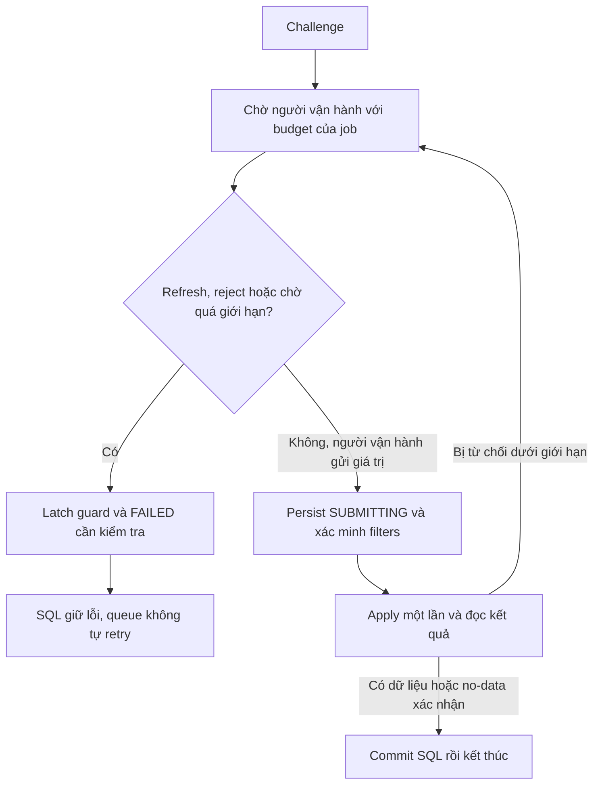

# Review sửa vòng lặp xác minh — 09/10/2026

## Nguyên nhân

`autoSolveCaptcha()` gọi refresh nếu OCR trả chuỗi không đủ 6 ký tự hoặc tiến trình lỗi. Refresh lại gọi `autoSolveCaptcha()`, tạo chuỗi thử không có điểm dừng. Biến `job.retries` chỉ tăng khi VAHAN trả `INVALID_CAPTCHA` sau một lần gửi; lỗi trước khi gửi không làm tăng biến này. Timeout 3 giây của từng tiến trình không giới hạn tổng số vòng lặp.

## Luồng thay đổi

| Bước | Xử lý mới | Trạng thái / dữ liệu |
| --- | --- | --- |
| 1. Nhận challenge | Đọc metadata, ACK backend, chờ thao tác xác minh hợp lệ của người vận hành | WAITING_CAPTCHA; không gọi OCR, auto-refresh hoặc auto-submit |
| 2. Refresh chủ động | Chiếm single-flight và một slot trước khi thao tác trang; tối đa 10 refresh/job | Lần thứ 11 bị chặn trước DOM/request; đổi ID không đặt lại budget |
| 3. Gửi giá trị của người vận hành | Kiểm tra guard/current job, hủy timer chờ, persist SUBMITTING và verified filters trước Apply | Giữ thứ tự ACK → verify → Apply → record click → WAITING_RESULT |
| 4. VAHAN từ chối | Tăng counter trong cùng guard; lần thứ 3 kết thúc job | CAPTCHA_REJECTION_LIMIT; không nới giới hạn cũ từ 3 lên 20 |
| 5. Chờ quá hạn | Deadline cố định 10 phút theo đồng hồ monotonic từ đầu validation; chỉ timer WAITING_CAPTCHA được arm | CAPTCHA_WAIT_TIMEOUT; refresh/ID mới không kéo dài deadline; timer không giết job đang lưu report |
| 6. Chạm một giới hạn | Guard được latch; không cho submit/refresh khi lỗi đang persist; fail hiện hữu ghi lỗi, retire page và giải phóng worker | FAILED với mã lỗi rõ; không coi thành NO_DATA hoặc khẳng định chắc chắn website đã thay CAPTCHA |
| 7. Queue settle | Nhận diện ba mã operator-stop; không checkpoint/final retry; chặn pending target cũ trước claim | Lỗi/attempts thật giữ trong SQL; requiresOperator=true, recoveryPending=false |
| 8. Case khác và phục hồi | Các case khác vẫn chạy, lỗi tạm vẫn dùng policy retry cũ; retry chủ động thành công được reconcile | Cùng case/session/filters; case bị chặn còn hiện Failed; phiên có thể COMPLETED_WITH_ERRORS |

## Review các rủi ro

| Điểm review | Kết luận / giới hạn |
| --- | --- |
| Race timer với submit/cancel/fail | Hủy timer và fence callback theo generation; guard đã trip không thể reset bằng wait/refresh mới. Handler chặn job đang finishing |
| Refresh trùng / mất ACK | Chỉ một refresh vào DOM; lặp cùng ACK không tốn slot mới; ACK thất bại vẫn đi qua failure/reconciliation hiện hữu |
| Reset qua checkpoint/final/process mới | Khi mã dừng đã lưu SQL, query eligibility và policy đều loại bỏ. Queue từ process mới cũng không mở lại case; pending target cũ được đưa về FAILED |
| Tính đúng counters | Không giả tăng failures lên 2 để bỏ checkpoint. Failed vẫn được đếm; phase DONE không có nghĩa mọi case có dữ liệu |
| Timer khi result/save | Timer chờ đã hủy trước submit và finalize; dữ liệu đang commit không bị timeout chờ người vận hành làm hỏng |
| Dữ liệu/bộ lọc | Không đổi thuật toán parse, dữ liệu tháng, State/RTO, session hay transaction main-report. Không có migration schema |
| Phạm vi thay đổi hành vi | Nhánh tự nhận dạng/submit CAPTCHA đã gỡ. Đây là ngắt vòng lặp và xử lý xác minh có người vận hành, không phải tăng khả năng tự giải CAPTCHA |
| Giao diện vận hành | Dashboard hiện chưa có panel nhập CAPTCHA hoàn chỉnh; để tiếp tục khi portal yêu cầu xác minh phải có luồng người vận hành hợp lệ. Không cam kết batch chạy tự động xuyên CAPTCHA |
| Crash trước khi lưu FAILED | Budget local nằm trong job của worker. Nếu process/API lỗi trước khi mã dừng được lưu, cơ chế restart/retry thông thường hữu hạn vẫn áp dụng; không cam kết budget toàn case bền vững trước commit. Nhánh OCR vô hạn không còn trong source |
| Production | Chưa rebuild/restart API hoặc worker đang phục vụ công việc. Kết quả dưới đây là source và fixture test, không phải một phiên portal live |

## Kiểm thử

| Kiểm tra | Phạm vi | Kết quả |
| --- | --- | --- |
| npm run check | Syntax worker/driver/guard | PASS |
| npm run test:lifecycle | Refresh thứ 11, single-flight, lost ACK, fixed deadline, latch, timer cancellation, operator-only challenge, state/Apply ordering | PASS |
| npm run test:main-report-save | Commit SQL trước case tiếp, no-data, export thiếu, cleanup lỗi | PASS |
| pytest test_validation_stop + captcha_refresh_race + captcha_ephemeral | Classification, SQL prefix filter, policy, cancellation/privacy | 13 tests + 8 subtests PASS |
| pytest test_queue_retry_checkpoints | PostgreSQL 17.7 tạm, normal checkpoint/final, operator-stop không retry, queue restart, pending target cũ và retry chủ động | 9 tests PASS |

Database test dùng container riêng trên cổng 55439, tên `vahan_queue_validation_test`, không dùng DB hệ thống. Container được dừng/xóa sau test. Guard tests đã nối vào `test:lifecycle`; Python unit được thêm vào CI platform; integration mới nằm trong suite queue hiện đã có ở CI.
